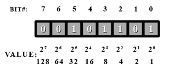
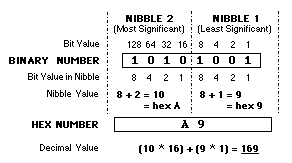

# Intro
## Bits & bytes
Dat een byte uit 8 bits bestaat weet je vast al. Bitoperaties zijn van toepassing op getallen van willekeurige lengte, 
maar voor het gemak werken spreken we hier van bytes. De bits in een byte hebben als waarde (van rechts naar links) 
opeenvolgende machten van 2:

|  |
|:--:|
| *Een byte en waarde van de afzonderlijke bits* |

Bits worden **steeds genummerd vanaf 0 en van rechts naar links**, waarmee de nummering ook overeenkomt met de machten 
van 2. Bit 0 is de **least significant bit (LSB)** en staat helemaal rechts, de uiterst linkse is dan de 
**most significant bit (MSB)** en heeft dan ook de hoogste waarde. Dat is bij decimale getallen niet anders. 

Net als bij decimale getallen kan je *leading zeros*, nullen langs de linkerkant dus, weglaten. Voor de duidelijkheid
schrijf ik ze hier wel om steeds aan volledige bytes te komen, Python doet die moeite echter niet en de meeste code 
snippets zijn rechtstreekse output van de Python-REPL (te herkennen aan de `>>>`). 

Als we met bits en bytes werken is decimale notatie meestal weinig intuitief, maar binaire notatie is nogal omslachtig. 
Een mooi compromis is *hexadecimale* notatie, een byte bestaat dan namelijk mooi uit exact 2 cijfers (elk 4 bits, 
ook wel *nibble* genoemd).

|  |
|:--:|
| *Tussen binair en hexadecimaal kan je makkelijk omzetten* |

Merk op: in de byte `0xff` zijn *alle* bits `1`, in `0x80` enkel de MSB en in `0x88` telkens de MSB van elke *nibble*. 
In `0xfe` is enkel de LSB `0` en in `0x7f` enkel de MSB, ...

## Python
Je kan `bin()` en  `hex()` gebruiken om een getal om te zetten naar een bin/hex-string en `int()` om zo'n string 
te lezen:
```pycon
>>> bin(0xcafe)
'0b1100101011111110'
>>> hex(48879)
'0xbeef'
>>> int('0xbabe')
47806
```

Als je `format()` gebruikt om variabelen in een string te vervangen kan je achter een `:` het gewenste formaat meegeven:
```pycon
>>> print("Decimaal = {i:d}, hexadecimaal = {i:x} en binair = {i:b}".format(i=199))
Decimaal = 199, hexadecimaal = c7 en binair = 11000111
```

# Bitwise operators
## Boolean vs. bitwise operators
De *logische* of *boolean* operatoren AND, OR, NOT en XOR zou je al moeten kennen. Voor de volledigheid herhalen we 
nog eens de waarheidstabel voor allemaal:

|  X  |  Y  | X and Y | X or Y | not X | not Y | X xor Y |  
|:---:|:---:|:-------:|:------:|:-----:|:-----:|:-------:|
|  0  |  0  |    0    |    0   |   1   |   1   |    0    |  
|  0  |  1  |    0    |    1   |   1   |   0   |    1    |  
|  1  |  0  |    0    |    1   |   0   |   1   |    1    |  
|  1  |  1  |    1    |    1   |   0   |   0   |    0    |  

In Python worden deze operatoren in woorden geschreven (`and`, `or`, `not`), in C en afgeleiden als `&&`, `||` en `!`
(XOR valt hier wat uit de boot, maar hebben we straks nog nodig). Je kan ze gebruiken op twee *booleans* , bv. in een 
`if... else`, en ze leveren opnieuw een boolean als resultaat.

Al deze operatoren hebben echter ook een variant die niet op booleans werkt maar op hele bytes (of *int*, of wat dan 
ook - op een binair getal, *quoi*). Deze operatoren noemt men **bitwise operators** of **bitoperaties** omdat ze 
hun bewerking **bit per bit** uitvoeren op 2 willekeurig lange binaire getallen, met uiteindelijk een (meestal even lang)
getal als resultaat. 

De syntax is deze keer in C en Python dezelfde:
- and: `&`
- or: `|` 
- not: `~` 
- xor: `^` 

Bitoperaties zijn belangrijk omdat je er individuele bits in een getal mee kan selecteren. Zo kan een 
IC bijvoorbeeld een *configuratieregister* hebben waar je een bepaalde bit op `1` moet zetten om iets in te stellen, 
omgekeerd kan een (of enkele) bit(s) in een *statusregister* een bepaalde toestand voorstellen die je moet uitlezen. 
Of neem de seriële poort: klinkt allemaal mooi, "bits één voor één doorsturen" - maar hoe *doe* je 
zoiets überhaupt? Wel, met bitoperaties dus.

## Bitwise OR
De eerste operator is de `|` of *bitwise OR*. Als een bit op één van beide inputs `1` is, wordt die bij een `|` sowieso 
ook altijd `1` in het resultaat. 
```pycon
>>> in1 = 0b11001010
>>> in2 = 0b00111100
>>> #   | -----------
>>> out = 0b11111110
>>>
>>> in1 | in2 == out
True
```

### Set bits
De OR kan je de daarom gebruiken om een of meer bits **"aan"** te zetten (*set*), ongeacht hun huidige waarde.
Stel dat je de derde bit (b2) in een register op `1` moet zetten om een component te configureren:
```pycon
>>> have = 0b11001010           # het register nu
>>> want = 0b11001110           # wat ik wil: bit 2 is "aan", de rest blijft ongewijzigd
>>>
>>> need = 0b00000100           # dus maak ik een getal waar ENKEL bit 2 "aan" is
>>>
>>> want == have | need         # en ik gebruik dat met de |-operator om de bit "aan" te zetten
True
```

De waarde van `need` dient dus om enkel díe bits te selecteren die je nodig hebt en de rest buiten schot te laten, 
ze dient als het ware als *masker* dat je over het getal legt. Men noemt dit daarom een **bitmask** of kortweg
**mask**, in het Nederlands dus **masker**.

Merk op dat het resultaat hetzelfde blijft als de bit al "aan" was: 
```pycon
>>> have = 0b11001110           # het register nu: bit 2 is al aan
>>> want = 0b11001110           # wat ik wil is dus wat er al is
>>>
>>> mask = 0b00000100           # ik gebruik dezelfde bitmask om bit 2 te selecteren
>>>
>>> want == have | mask         # en de |-operator geef nog steeds het gewenste resultaat
True
```

### Bits combineren
Een tweede toepassing is het combineren of *plakken* van bits in een ander getal **als je zeker weet dat die bits 
daar momenteel 0 zijn**. 
```pycon
>>> 0xc0f0 | 0x0a0e == 0xcafe   # nullen in het ene getal worden opgevuld met bits van het andere
True
```

Dit voorbeeld is een beetje bij de haren gesleurd, maar straks zien we hoe je met zo'n `|` meerdere bytes achter elkaar 
kan plakken, bv. om een 32-bit waarde te reconstrueren die je in aparte bytes hebt binnengekregen.

## Bitwise AND
Bij een `&` of *bitwise AND* is een bit in het resultaat enkel dan `1` als die bit dat ook op **beide** inputs`is . 
```pycon
>>> in1 = 0b11001010
>>> in2 = 0b00111100
>>> #   & -----------
>>> out = 0b00001000
>>>
>>> in1 & in2 == out
True
```

### Clear bits
Door een bit in het masker `0` te maken, weet je dus dat die met `&` sowieso ook `0` wordt in het resultaat. 
Je kan deze operator bijgevolg gebruiken om bits **"uit"** te zetten (*clear*), ongeacht hun huidige toestand:
```pycon
>>> have = 0b11001110           # het register nu
>>> want = 0b10001110           # wat ik wil: bit 6 is nu "uit", de rest blijft ongewijzigd
>>>
>>> mask = 0b10111111           # ik maak dus een mask met ENKEL bit 6 "uit"
>>>
>>> want == have & mask         # en gebruik de & operator om de bit te "clearen"
True
>>> want == want & mask         # ook hier maakt de begintoestand niet uit, als de bit al 0 is blijft dat zo
True
```

Hetzelfde werkt uiteraard ook voor meerdere bits tegelijk: 
```pycon
>>> 0xbabe & 0xf0f0 == 0xb0b0   # overal waar mijn mask 0 is wordt het resultaat 0, de rest blijft staan
True
```

### Filter bits
Een andere handige toepassing van `&` is het *filteren* van een (of meer) bits door al de rest op `0` te zetten. 
Stel dat bit 3 in het statusregister van een UART aangeeft of er data verstuurd kan worden:
```pycon
>>> uart_reg = 0b11001110       # inhoud van het register
>>> tx_ready = 0b00000100       # ik ben enkel geïnteresseerd in b3
>>>
>>> if uart_reg & tx_ready:     # ik filter de bit uit het register,
...     transmit(data)          # en enkel als die 1 is ga ik data versturen
```

Merk wel op dat de bit hier zijn oorspronkelijke waarde behoudt, in dit geval dus `4`. Omdat elk getal behalve `0` 
evalueert als `True` is dat goed genoeg voor een `if`, als je echter een 0 of 1 nodig hebt moet je nog even 
verder lezen. 

## Bitwise XOR
De `^` of *bitwise XOR* heeft in het resultaat een `1` voor bits die in de twee inputs **verschillend** zijn en 
een `0` voor bits die **gelijk** zijn. 
```pycon
>>> in1 = 0b11001010
>>> in2 = 0b00001100
>>> #   ^ -----------
>>> out = 0b11000110
>>>
>>> in1 ^ in2 == out
True
```

### Toggle bits
Voor zowel *set* als *clear* maakt het niet uit wat de huidige waarde is, het resultaat is sowieso `1` resp. `0`. 
Soms wil je echter een bit "flippen", m.a.w. zijn huidige waarde **veranderen** van `1` naar `0` of omgekeerd. 
Daarvoor kan je XOR gebruiken, bits die in het masker `1` zijn worden in het resultaat dan sowieso gewijzigd 
(*toggle*). 

```pycon
>>> 0x11110000 ^ 0x10000001 == 0x01110001   # MSB en LSB worden getoggled, de rest blijft hetzelfde
True
```

## Bitwise NOT
Net als de boolean `not` of `!` werkt een *bitwise NOT* `~` maar op 1 operand, waarvan dan in het resultaat alle 
bits worden **omgekeerd** (*complement*). Op zich niet moeilijk, ware het niet dat in Python een getal in principe 
"oneindig" lang is en wordt voorafgegaan door oneindig veel nullen. Als je dat dan omdraait krijg je... oneindig veel 
enen, maar die kan je niet meer zomaar weglaten natuurlijk. Bovendien maakt dat het getal negatief (zie 2-complement).
```pycon
>>> ~0b11001010 == 0b00110101               # hmmmmm...
False
>>> bin(~0b11001010)                        # sinds wanneer is `-` een binair cijfer?!?
'-0b11001011'
>>> bin(~0b11001010 & 0xff)                 # aha!
'0b110101'
>>> ~0b11001010 & 0xff == 0b00110101        # thanks for nothing, Python...
True
```
Door het resultaat met een *AND* te masken tot een zinnige lengte krijg je dus het resultaat dat je verwacht en in 
zowat elke andere programmeertaal ook meteen krijgt. 

Een bitwise NOT is trouwens hetzelfde als een XOR met overal een `1` in de mask: 
```pycon
>>> 0xbabeface ^ 0xffffffff == ~0xbabeface  # Ah ja... zucht
False
>>> 0xbabeface ^ 0xffffffff == ~0xbabeface & 0xffffffff
True
```

## Shift left/right:
De laatste operator in ons assortiment heeft voor boolean geen zin en bestaat bijgevolg enkel *bitwise*: 
een *shift* of *bitshift* schuift alle bits in een getal een aantal plaatsen naar links (`<<`) of rechts (`>>`). 
De "lege" plaatsen die daarbij aan de andere kant ontstaan worden gewoon opgevuld met nullen.
```pycon
>>> 0b00010100 << 3 == 0b10100000           # 3 bits naar links verschuiven
True
>>> 0b00010100 >> 2 == 0b00000101           # 2 bits naar rechts verschuiven
True
```

Wie er **langs rechts** uit schuift is gezien, die bits **vallen gewoon weg**. 
Langs links geldt normaalgezien hetzelfde, met uitzondering van Python waar een getal in principe "oneindig" 
lang is dus ಠ_ಠ 
```pycon
>>> 0b00010100 >> 4 == 0b00000001
True
>>> 0b11001010 << 4 == 0b110010100000
True
>>> 0b11001010 << 8 == 0b1100101000000000   # in C of Java zou een `byte` nu leeg zijn
True
>>> len(bin(1 << 1000000000))               # yup, seriously... (+ 2 voor de 0b die bin() toevoegt)
1000000003
```

Merk op dat een **shift 1 plaats naar links overeenkomt met vermenigvuldigen met 2**, een plaats 
**naar rechts met een deling door 2** - voor zolang er geen bits "afvallen" uiteraard. Bijgevolg is een shift van *N*
plaatsen hetzelfde als delen/vermenigvuldigen met *2<sup>N</sup>*.

```pycon
>>> from math import floor
>>>
>>> for i in range(2, 254):
...     assert i << 1 == i * 2
...     assert i >> 1 == floor(i / 2)       # bij oneven getallen valt bit 0 eruit
```

## In-place operators
Net zoals voor `+` en `-` bestaat ook voor bitoperaties een **in-place** variant die de waarde van een variabele in 
één beweging aanpast en weer opslaat.
```pycon
>>> x = 12345
>>>
>>> x += 2      # x = x + 2
>>> x -= 2      # x = x - 2
>>>
>>> x |= 4      # x = x | 0x04 --> bit 2 is nu 1
>>> x &= 253    # x = x & 0xfd --> bit 1 is nu 0
>>> x ^= 0xf0   # x = x ^ 0xf0 --> 4 MSB worden getoggled
>>>
>>> x <<= 2     # x = x << 2 --> alle bits 2 plaatsen naar links (ofwel: x vermenigvuldigd met 4)
>>> x >>= 3     # x = x >> 3 --> alle bits 3 plaatsen naar rechts (of: x gedeeld door 8)
```

## Volgorde van bewerkingen
Bitoperaties hebben net als wiskundige bewerkingen een vaste **volgorde** waarin ze worden uitgevoerd: 
1. not (`~`)
1. shift (`<<`, `>>`)
1. and (`&`)
1. xor (`^`)
1. or (`|`)

Op hun beurt hebben de wiskundige bewerkingen dan weer voorrang op bitoperaties, die voorrang hebben op vergelijkingen 
(`==`, `!=`, `<`, ...) en tenslotte volgen de logische operatoren (`and`, `not`, ...). 
En er is [nog meer...](https://docs.python.org/3/reference/expressions.html)

**Moraal van het verhaal: gebruik liever meteen haakjes dan achteraf te moeten zoeken naar de fout! Beter haakjes 
te veel dan te weinig...**

# Putting things together
Door bitoperaties te combineren kan je nu naar hartelust individuele bits van een getal uitlezen of instellen. 
Meestal leiden er verschillende wegen naar Rome, hier volgen alvast enkele voorbeelden.

## Een bit afzonderen
Met `&` kon je al een bit filteren, vervolgens kan je hem nu shiften om een 0 of 1 als resultaat te krijgen:
```pycon
>>> value = 0x44                # bit 6 en 2 zijn 1
>>> value & 0b01000000          # alle andere bits wegfilteren, de bit behoudt zijn waarde
64
>>> (value & 0b01000000) >> 6   # dus moet je hem nog naar de LSB-positie shiften
1
```

Of enigzins handiger in omgekeerde volgorde (merk op dat `>>` voorrang heeft op `&`):
```pycon
>>> value >> 6 & 1              # eerst de bit naar LSB shiften, dan de rest weg masken
1
```

## Mask like a pro
Voor een *clear* of *toggle* op een enkele bit heb je een mask nodig die behalve deze bit overal 0 is. In plaats van 
dat voluit te schrijven kan je die ene bit beter gewoon op z'n plaats *shiften*. Stel dat je bit 13 wil clearen:
```pycon
>>> noob_mask = 0b0010000000000000
>>> my_mask = 1 << 13
>>> my_mask == noob_mask
True
```

Voor een *set* zag de mask er net omgekeerd uit, maar dat kan je makkelijk oplossen met een NOT:
```pycon
>>> data = 0xf00d
>>> noob_mask = 0b1101111111111111
>>> my_mask = ~(1 << 13)                # heeft weer een oneindige rij enen
>>> data & my_mask == data & noob_mask  # maar dat maakt niet uit om te masken :)
True
```

Dankzij de in-place operators kan je nu enkele bits wijzigen zonder al te veel inspanning:
```pycon
>>> register = 0xdeadbeefbabecafe       # 8 bytes = 64 bit
>>> bin(register)                      
'0b1101111010101101101111101110111110111010101111101100101011111110'
>>>
>>> register >> 54 & 1                  # test bit
0
>>> register |= 1 << 54                 # set bit
>>> register >> 54 & 1
1
>>> register &= ~(1 << 54)              # clear bit
>>> register >> 54 & 1
0
>>> register ^= 1 << 54                 # toggle bit
>>> register >> 54 & 1
1
>>> register ^= 1 << 54                 # toggle again
>>> register >> 54 & 1
0
>>> hex(register)                       # back where we started en andere bits ongewijzigd
'0xdeadbeefbabecafe'
```

## Bytes aan elkaar plakken
Met `|` kon je al bits en bytes bij elkaar plakken, vooropgesteld dat er nullen zijn op de plek waar die bits moeten
komen. Met een shift kan je die plek gewoon zelf maken, bijvoorbeeld om twee bytes achter elkaar te zetten:
```pycon
>>> byte0 = 0xfe                # LSByte
>>> byte1 = 0xca                # MSByte
>>>
>>> hex(byte1 << 8)             # eerst plaats maken / MSByte op z'n plek zetten
'0xca00'
>>> hex(byte1 << 8 | byte0)     # vervolgens kan je de LSByte erbij plakken met OR
'0xcafe'
```

Stel dat je een 32-bit waarde serieel hebt ontvangen in een list van bytes:
```pycon
>>> data = [0xce, 0xfa, 0xbe, 0xba]
>>>
>>> value = data[3] << 24 | data[2] << 16 | data[1] << 8 | data[0]
>>> hex(value)
'0xbabeface'
```

Of in een loop:
```pycon
>>> value = 0
>>> for i in range(4):
...     value |= data[i] << 8 * i
...
>>> hex(value)
'0xbabeface'
```
> NB: de volgorde waarin je de bytes achter elkaar moet zetten kan wel verschillen:
 <https://en.wikipedia.org/wiki/Endianness> 
 
## Bits in- en uitshiften
Tenslotte hadden we in de inleiding beloofd dat je ging leren hoe je data serieel kan versturen en ontvangen dankzij 
bitoperaties, *so without further ado*:
 
```python
from RPi.GPIO import input, output

tx_pin, rx_pin = 14, 15

def shift_byte_out(data):
    """ Serial transmit 1 byte, LSB first """
    for i in range(8):                  
        output(tx_pin, data >> i & 1)
    
def shift_byte_in():
    """ Serial receive 1 byte, LSB first """
    data = 0
    for i in range(8):
        data |= input(rx_pin) << i
    return data
```
En omdat het zo plezant was doen we nog eens goed zot... 
```python
from RPi.GPIO import input, output

tx_pin, rx_pin = 14, 15

def full_duplex_transfer(data):
    """ Serial transmit and receive 1 byte, LSB first, using a single variable """
    for i in range(8):                  # van LSB naar MSB...
        output(tx_pin, data >> i & 1)   # ...bit versturen...
        data &= ~(1 << i)               # ...wissen...
        data |= input(rx_pin) << i      # ...en vervangen 
    return data                         # tadaa! schouderklopje voor onszelf!
```

# Decimale getallen
**We houden dezelfde nummering aan voor decimale cijfers: van rechts naar links en te beginnen bij 0!**
## Floordiv: Shift left/right
Herinner je dat een shift *n* plaatsen naar links overeenkwam met een vermenigvuldiging met 2<sup>n</sup> en 
naar rechts met een deling door 2<sup>n</sup>. Op net dezelfde manier kan je een getal **vermenigvuldigen met 
10<sup>n</sup> om het een decimale plaats naar links te schuiven, en delen door 10<sup>n</sup> voor een decimale 
shift naar rechts**. 

Een **machtsverheffing** doe je met de operator `**` (nee, niet `^` zoals je misschien had verwacht - dat 
is *bitwise XOR*, remember!). 
```pycon
>>> 1234 * 10 ** 3 == 1234000           # *10^3 --> shift 3 plaatsen naar links
True
>>> 1234000 / 10 ** 3 == 1234           # /10^3 --> shift 3 plaatsen naar rechts
True
```

Als we nu nog verder naar rechts zouden shiften krijg je natuurlijk kommagetallen (in Python toch, C & co. zouden bij 
een *int* blijven), we willen echter dat die cijfers "eraf vallen" zoals de bits dat bij een shift doen. 
Dat kunnen we makkelijk verhelpen door in de plaats de **gehele deling** `//` (*floordiv*) te gebruiken:
```pycon
>>> 1234000 / 10 ** 4 
123.4
>>> 1234000 // 10 ** 4 
123
>>> 1234000 // 10 ** 5 
12
```

Ideaal, dat komt dus volledig overeen met een *shift right*, maar dan decimaal! 
Ook hier kan je weer een in-place operator gebruiken:
```pycon
>>> value = 1234
>>> value *= 10 ** 3
>>> value
1234000
>>> value //= 10 ** 3
>>> value
1234
>>> value //= 10 ** 2
>>> value
12
>>> value //= 10 ** 0                   # 0-de macht van elk grondtal = 1 ==> geen "shift"
>>> value
12
```

## Modulo: Filter
Ook cijfers "filteren" kunnen we decimaal, al is de gelijkenis minder treffend. Met de *modulo-operator* 
`%` bereken je de **rest bij deling**, bijvoorbeeld: 
```pycon
>>> 14 // 3                             # gehele deling door 3
4
>>> 14 % 3                              # rest bij deling door 3
2
>>> 4 * 3 + 2 == 14                     # per definitie: deeltal = (quotiënt * deler) + rest 
True
```

Door een getal **modulo 10** te nemen, kan je zo het laatste cijfer (de *eenheden*) eruit **filteren**.
```pycon
>>> value = 42                          # getal met twee cijfers
>>> value % 10                          # eenheden (d0) = rest bij deling door 10 ( = "modulo 10")
2
>>> value // 10                         # tientallen (d1): na gehele deling door 10
4
```

Zo kan je een getal < 100 in 2 cijfers splitsen. Voor een getal met meer dan 2 cijfers heeft wordt het iets lastiger, 
de deling door 10 geeft dan namelijk meer dan enkel de tientallen:
```pycon
>>> value = 1234
>>> value % 10                          # d0
4
>>> value // 10                         # d3 - d1
123
```

## Splitsen en weer samenstellen
Herinner je echter hoe we bit *n* uit een byte konden filteren met `byte >> n & 1`: **eerst *n* plaatsen naar rechts 
shiften en vervolgens de LSB eruit filteren met AND**. Op dezelfde manier kunnen we ook het *n*-de decimale cijfer uit 
een getal halen met `getal // 10 ** n`: **eerst rechts shiften (vermenigvuldigen met 
*10<sup>n</sup>*), dan de eenheden eruit filteren met `% 10`**. Bijvoorbeeld voor d2:

```pycon
>>> value = 45678
>>> value // 10 * 2                     # d1 - d0 zijn "weggeshift"
456
>>> value // 10 * 2 % 10                # d2 is de nieuwe d0 --> die er nu uitfilteren
6
```

Zo kan je ook makkelijk de cijfers (van klein naar groot) overlopen in loop:
```pycon
>>> value = 45678
>>> while value:                        # impliciet: `while value != 0` of in dit geval `value > 0`
...     print(value % 10)               # print laatste cijfer
...     value //= 10                    # shift alles 1 naar rechts
...
8
7
6
5
4
```

Om bits/bytes aan elkaar te rijgen konden we de inverse bewerking gebruiken: eerst weer op z'n plaats shiften 
naar **links** en vervolgens erbij te plakken met een **OR**: `result |= byte << n`.
Om een getal weer samen te stellen uit decimale cijfers kan je de dan eveneens de inverse bewerking gebruiken:
het *n*-de cijfer **vermenigvuldig je met *10<sup>n</sup>*** (equivalent aan een shift met *n* posities naar links), en 
telt de resultaten bij elkaar op (*niet helemaal* equivalent aan een *OR*, maar hier goed genoeg):
```pycon
>>> digits = [8, 7, 6, 5, 4]
>>> result = 0
>>> for n in range(len(digits)):
...     result += digits[n] * 10 ** n
...
>>> value
45678
```

Of voor de echte liefhebbers met een *list comprehension*:
```pycon
>>> value = 2345678
>>> digits = [value // 10 ** n % 10 for n in range(len(str(value)))]
>>> digits
[8, 7, 6, 5, 4, 3, 2]
>>> result = sum([d * 10 ** n for n, d in enumerate(digits)])
>>> result
2345678
>>> result == value
True
```

# Binary Coded Decimals (BCD)
TBA

# 2's complement
TBA
