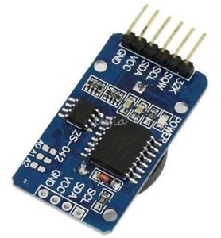
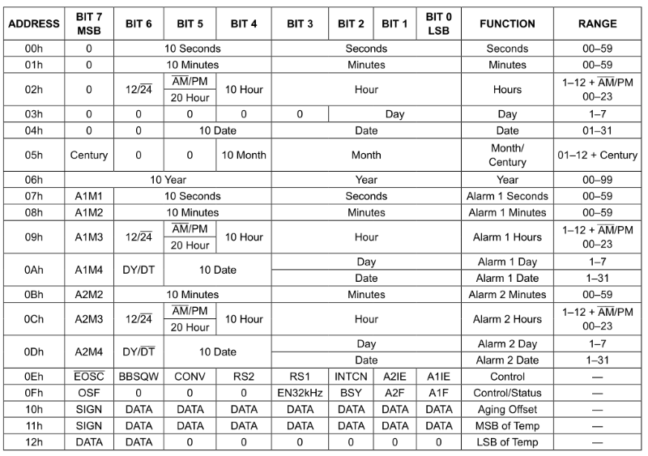
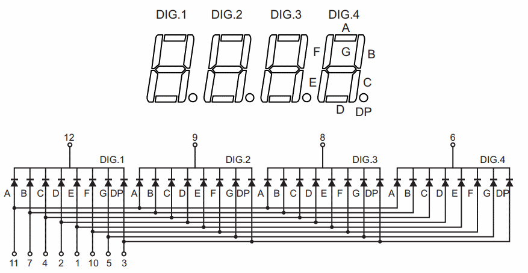
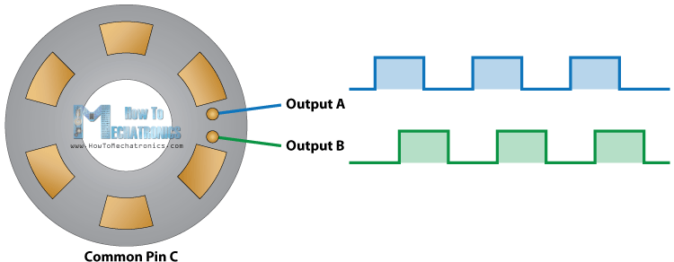
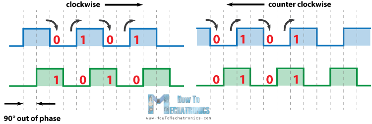
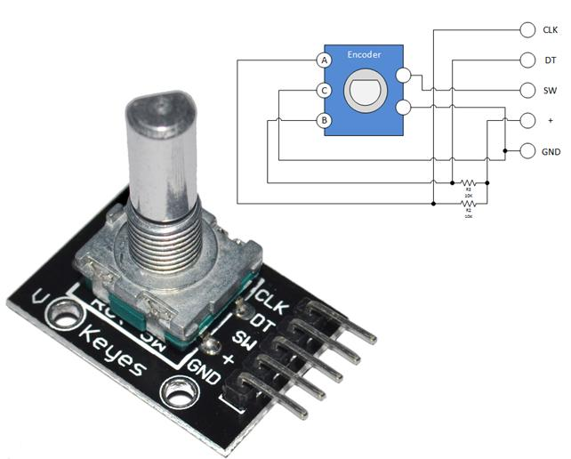
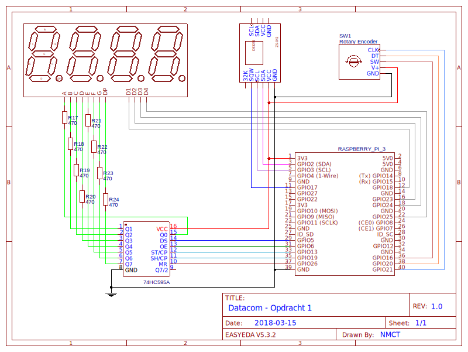

# Opdracht 1: Klok met timer
## Inleiding
Als opdracht tegen het eerste labo na de lentevakantie maak je een klok met timerfunctie a.d.h.v. de DS3231 RTC-module,
een 4x7-segmentdisplay aangesloten via het 74HC595 shiftregister en bediening met een rotary encoder.

### Nodige kennis
- Datacom:
    - Shiftregister &amp; 7-segmentdisplay
    - I<sup>2</sup>C
    - Bitoperaties
    - GPIO event handlers
- Basic Programming
    - Logging
    
---
    
# DS3231 RTC
De Raspberry Pi heeft geen echte klok aan boord zoals een PC dat heeft. Telkens de Pi verbinding maakt met een 
netwerk vraagt hij op regelmatige tijdstippen de correcte tijd op via NTP (*Network Time Protocol*). Daartussen
houdt hij zelf de tijd wel bij maar dat is niet erg nauwkeurig, bijgevolg is er veel *drift* op de klok.

Zonder internetverbinding echter geen NTP en bijgevolg ook geen juiste tijd. Als dat nodig is kunnen we via 
I<sup>2</sup>C echter een externe *Real-Time Clock (RTC)*-module zoals ZS-042 module in jullie kit toevoegen. 
Ook in een PC is de RTC trouwens meestal op die manier via I<sup>2</sup>C/SMBus verbonden. 

|  |
|:--:|
| *ZS-042 module met DS3231 RTC* |

Op de ZS-042 zit een de DS3231 ([datasheet](../datasheets/op1_DS3231.pdf)) van Maxim samen met een batterij om de 
klok te laten doorlopen als de Pi zonder stroom valt. De DS3231 heeft naast de klok ook 2 alarmen die kunnen worden 
ingesteld om een *interrupt* te genereren op de SQW-pin, die je dan op dezelfde manier als een drukknop kan opvangen 
via *event detection* met de GPIO-library. Daarnaast is er ook een temperatuursensor omdat de temperatuur 
invloed heeft op de nauwkeurigheid van het kwartskristal waarmee de klok de tijd bijhoudt.

## Werking
De DS3231 houdt de tijd in BCD-formaat bij in 7 registers (0x0 - 0x6) waarvan je hieronder de layout ziet. Je kan de
registers desgewenst allemaal in een keer lezen/schrijven. 

|  |
|:--:|
| *DS3231 registers* |

De klok werkt dus in feite (zo goed als) decimaal, waarbij 
elke waarde maar net zoveel bits gebruikt als nodig. De tientallen zijn vaak minder dan 4 bits breed, wat 
geen gevolg heeft zolang die bits in het register 0 zijn. Dat is echter niet altijd het geval: register 2 bevat 
naast de uren ook een bit waarmee je kan schakelen tussen 24- en 12-uur (AM/PM)-formaat. Zolang je die 0 houdt is er 
geen probleem. In register 5 geeft de MSB aan wanneer er een eeuw gepasseerd is (er worden maar 2 cijfers voor het jaar
bijgehouden, dus op bv. 01/01/2000 wordt die bit op 1 gezet in de plaats).

## Alarmfunctie 
De DS3231 beschikt over 2 alarmen met elk hun eigen set registers. Als de inhoud van de alarmregisters overeenkomt met 
de registers van de klok gaat het alarm af en wordt de overeenkomstige bit in het `STATUS`-register hoog gezet. 
Die bit blijft hoog tot je hem manueel reset, zo lang kan het alarm natuurlijk niet opnieuw afgaan. Je hem dus best
resetten bij het instellen van het alarm, dan ben je zeker dat het alarm ook zal afgaan.

Bij alarm 2 kan je geen seconden instellen, je moet dus alarm 1 gebruiken voor de opdracht. De eerste bit van elk 
alarmregister is een "mask bit", door die hoog te zetten wordt het register genegeerd bij het bepalen van het alarm. 

|  |
|:--:|
| *DS3231 alarm mask bits* |

Voor de opdracht moet je gewoon alle registers juist zetten en de mask bits 0 laten, je hoeft er dus 
verder geen rekening mee te houden. 

## Interrupts
Als het alarm afgaat wordt in de eerste plaats de `A1F`/`A2F`-bit in het `STATUS`-register (0xF) hoog gezet. 
Zo kan je dus checken wanner het alarm afgaat. Nog beter is van een *interrupt* in te stellen zodat je 
vanzelf op de hoogte gebracht wordt (vgl. inlezen van een knop). Daarvoor moet je eerst de `INTCN` bit in het 
`CONTROL`-register (0xE) aanzetten en dan kan je via de `A1IE`/`A2IE`-bit in hetzelfde register voor welk alarm 
de interrupt moet gebeuren. 

Eens zo geconfigureerd zal de DS3231 de `INT/SQW`-pin (gemarkeerd als SQW op de module) laag trekken via zijn open-drain
output wanneer het alarm afgaat. Je moet die dus verbinden met een pull-up input en daar een event detect opzetten op 
de falling edge, als het alarm afgaat zou dan de callback moeten worden uitgevoerd.

# 4x7-segmentdisplay (SH5461A)
Dit display bestaat uit 4 aparte 7-segmentdisplays, waarvan de *anodes* voor de segmenten *met elkaar zijn doorverbonden*.
De *kathodes* worden per cijfer apart naar buiten gebracht. Door de combinatie van anode en cathode kunnen we dus nog 
steeds elk segment apart aansturen. De pins zijn in dezelfde volgorde genummerd als bij de enkele versie 
(onder links -> rechts, dan boven rechts -> links), maar je kan ook je multimeter gebruiken om uit te vlooien welke pin wat is.

|  |
|:--:|
| *4x7-segmentdisplay* |

De anodes sluiten we op de gekende manier aan met een 74HC5959-shiftregister. De kathodes verbinden we deze keer echter
niet met massa maar met GPIO-pins op de RPi. Standaard brengen we die pins hoog, in dat geval is er geen 
spanningsverschil en vloeit er geen stroom. Vervolgens kunnen we een cijfer klaarzetten in het shiftregister en de 
overeenkomstige kathode laag trekken om het op een van de 4 posities te tonen. Daarna brengen we de kathode weer 
hoog, zetten het volgende cijfer in het shiftregister en brengen de overeenkomstige kathode laag. Zo itereer je continu
over de 4 cijfers, na het 4de cijfer begin je opnieuw van voor af aan. Als je dit snel genoeg doet is het voor het 
menselijk oog niet meer waar te nemen en lijkt het alsof de cijfers gewoon continu branden. 
Men noemt dit ook **multiplexing**.

# Rotary Encoder
De *rotary encoder* lijkt op het eerste zicht op een potentiometer, werkt echter geheel anders. Je kan het verschil 
merken aan het feit dat je de rotary encoder naar beide kanten kan *blijven* draaien, terwijl een potentiometer beperkt
is in bereik. Zowel opbouw als uitgangssignaal zijn dan ook totaal verschillend. 

|  |
|:--:|
| *Rotary Encoder: opbouw* |

De rotary encoder heeft een gemeenschappelijke ingang en twee uitgangen. Bovendien zit in de knop een gewone drukknop 
ingebouwd die op exact dezelfde manier werkt als de bekende drukknop, daarvoor is er dus nog een derde uitgang die 
volledig los staat van de rest. 

De ingangspin is verbonden met een aantal contactzones op een schijf die met de knop meedraait. De uitgangen zijn allebei 
verbonden op een vast punt, met een kleine afstand ertussen. Telkens je de knop een tand verderdraait, 
schuift een contactzone over de pins en maken ze even contact. 
Naargelang de richting verschilt echter de volgorde: in wijzerzin zal uitgang A eerst contact maken en
dan pas uitgang B, in tegenwijzerzin net omgekeerd. Als je de ingang hoog trekt (pull-up) en aan de knop draait, krijg
je dan op de beide uitgangen een blokgolf krijgt die onderling 1/4 periode van elkaar verschillen:

|  |
|:--:|
| *Rotary Encoder: uitgangssignaal* |

## PCB Module
De rotary encoder in jullie kit zit op een PCBtje gemonteerd dat een beetje eigenaardig in elkaar zit: 
 - De ingang `C` is er niet meer, in de plaats zijn er aansluitingen voor V+ en GND 
 - De uitgangen `A` en `B` heten nu `CLK` en `DT`. Hiervoor is er al een pull-up op het bordje, op de RPi moet (mag) je 
 er dus geen meer instellen.
 - De uitgang `SW` is voor de knop, maar hier is er *geen pull-up*. De andere kant is wel verbonden met massa, 
 je moet dus de pin op de Pi zelf nog met een pull-up configureren.

|  |
|:--:|
| *Rotary Encoder module uit de kit* |

### Uitlezen
*In theorie* is het niet zo moeilijk om de encoder in te lezen, kijk eens goed naar de twee blokgolven van daarnet: 
op het moment dat de bovenste een *edge* heeft zijn de twee niveaus op de linker grafiek altijd tegengesteld. Op
de rechter grafiek zijn ze dan net altijd gelijk. Door op elke edge van de ene pin beide pins in te lezen en te 
vergelijken kan je in principe dus te weten komen of er in wijzerzin of tegenwijzerzin gedraaid werd.

In de praktijk valt het natuurlijk weer tegen:
 - de contacten zijn niet perfect maar hebben last van *dender* zoals een drukknop
 - de Pi is er niet noodzakelijk snel genoeg bij om beide pins in te lezen voor de situatie alweer veranderd is
 
Met wat trial en error blijkt volgende strategie wel perfect te werken:
- zet een *event detect* op **beide** pins maar enkel voor de *rising edge* en gebruik voor beide dezelfde *callback*
- lees in de callback **meteen** beide pins in 
- check dan of het pinnummer (argument van de callback) hetzelfde is als de vorige keer dat de callback werd 
opgeroepen -> dat is dender dus kan je negeren
- check of de toestand van **beide** pins dezelfde is als de vorige keer dat de callback werd opgeroepen -> ook negeren
- reageer vervolgens enkel maar op 1 moment van de cyclus: als **beide pins hoog** zijn
- in dat geval bepaalt *de pin waarop het event kwam* de richting 

> Als het niet lukt: **DON'T STRESS** en kom gewoon maandag na de vakantie naar het monitoraat. 't is een rot ding :-)
Het is ook niet erg als het niet perfect werkt. Je kan ondertussen ook gewoon 3 knoppen (left/right/select) aansluiten 
als bediening.

# Python 
## Datum en tijd
Je kan best nooit zelf met tijd gaan werken, dat wordt namelijk als snel 
[erg complex](https://www.youtube.com/watch?v=-5wpm-gesOY). Gelukkig zitten in de `datetime`-module van Python 
[klasses die dat allemaal voor ons doen](https://docs.python.org/3/library/datetime.html#available-types). Een 
`datetime`-object (zelfde naam als de module) geeft een datum incl. tijd weer. Je kan ermee rekenen ook, zo kan je
het verschil tussen 2 data berekenen en krijgt als resultaat een `timedelta`. Die laatste kan je 
dan weer bij een `datetime` optellen om een nieuwe `datetime` als resultaat te krijgen, enz.

```python
from datetime import datetime, timedelta

birthday = datetime(1992, 11, 4)
now = datetime.now()
age = now - birthday
print("You are {} seconds old!".format("age.total_seconds()"))

deadline = now + timedelta(weeks=3)
print("Deadline is {}".format(deadline.isoformat()))
```

Let op: `datetime` heeft een property `day` die de dag van de *maand* aangeeft. De DS3231 refereert naar die waarde als
*date* (1-31), terwijl *day* daar de dag van de *week* (1-7) voorstelt. Om die te bekomen kan je dan weer 
de methode `isoweekday()` van `datetime` gebruiken!

## Logging
Gezien de code als *daemon* op de achtergrond zal draaien, krijg je nergens output te zien. Zorg dus dat je zinvolle 
informatie in een logbestand schrijft (let wel op dat je niet overdrijft en op 10min je SD-kaart volschrijft!)

Logging ken je normaalgezien al van bij Basic Programming. Met `logging.basicConfig()` ben je het snelst vertrokken: 
```python
import logging

logging.basicConfig(level=logging.DEBUG)       
log = logging.getLogger("MyLog")

# log levels 
log.debug("Debug message")
log.info("Informational message")
log.warning("Warning message")
log.error("Error message")
log.critical("Critical message")
```
Voorlopig zie je de log dan gewoon op de console. Eens het programma op de achtergrond draait kan je de log makkelijk
naar een bestand omleiden door een `filename` mee te geven aan `basicConfig()`. Door `level` aan te passen kan
je meteen ook zorgen dat niet alle debugoutput in de logfile komt (als je tenminste zinvol gebruik gemaakt hebt van 
de beschikbare levels).
 ```python
logging.basicConfig(level=logging.INFO, filename='output.log')
```

## Threading
Tot nu toe heb je alleen code geschreven die *sequentieel* werkt: er wordt altijd maar 1 ding tegelijk gedaan. Als je 
echter en mooi resultaat wil bekomen op het 4x7-segmentdisplay, moet je continu de cijfers blijven refreshen. Om dat op
te lossen kan je gebruik maken van *threading* om taken op de achtergrond uit te voeren. Dat kan op 2 manieren: 

Ofwel erf je van de klasse `threading.Thread` en overschrijf je de methode `run()`:
```python
from threading import Thread

class MyThread(Thread):
    def run(self):
        while True:
            self.do_stuff()
            
def main():
    thread = MyThread()
    thread.start()
    
```
Ofwel initialiseer je een `Thread`-object en geef je een functie mee aan het argument `target`:
```python
from threading import Thread

def background_task():
        while True:
            do_stuff()

thread = Thread(target=background_task)
thread.start()
```
Hoe dan ook heb je dan een object dat je kan starten met de methode `start()` en dat dan blijft verdergaan tot de methode
in kwestie eindigt. Helaas is er geen manier om de thread te stoppen, maar dat kan je weer op 2 manieren oplossen: ofwel
hou je in de klasse een *boolean* bij en gebruikt die i.p.v. `True` in de `while`-loop. Dan kan je die property op 
`False` zetten om de thread te laten stoppen. Een tweede mogelijkheid is van een *daemon thread* te maken door de property
`daemon` van het thread-object op `True` zetten, dan stopt de thread vanzelf wanneer de rest van het programma eindigt. 

# Service 
Om je script bij het opstarten automatisch mee te laten starten moet je zelf een *service* maken. Dankzij `systemd` is dat niet meer
zo moeilijk, je hebt gewoon een configuratiebestand met een naam die eindigt op `.service` nodig in `/etc/systemd/system`.
Minimaal voorbeeld van zo een bestand (pas uiteraard aan waar nodig):
```ini
[Unit]
Description=My first service
After=network.target

[Service]
User=me
ExecStart=/home/me/datacom/env/bin/python /home/me/datacom/datacom/opdracht01.py

[Install]
WantedBy=multi-user.target
```
Nadien moet je `systemd` eerst zijn config nog laten herladen, daarna kan je de vertrouwde commando's van `systemctl` 
gebruiken: `start`, `stop`, `enable`, `disable`, `status` (zie cursus CNW). Om te kijken wat er 
eventueel misgaat als de service niet start kan je `journalctl -xe` gebruiken. 
```console
me@my-rpi:~ $ systemctl daemon-reload
me@my-rpi:~ $ systemctl status myclock.service
```

---

# Opdracht
1. Maak een klasse `DS3121` die *minumum* volgende methodes implementeert:
    - `set_datetime(value)` stelt de klok in a.d.h.v. een `datetime`-object
    - `get_datetime(value)` geeft datum en tijd terug als een `datetime`-object
    - `set_timer(value)` stelt Alarm 1 in voor het huidige tijdstip + `value` (type `timedelta`)

2. Maak een klasse `FourSevenSegment` die *minumum* volgende methodes implementeert:
    - `set_raw_data(value)` stelt de segmenten die moeten oplichten rechtstreeks in (dus `value` is 32 bits)
    - `set_value(value)` toont een getal (0 - 9999) op het display

3. Maak een klasse `RotaryEncoder` die *minimum* het volgende implementeert:
    - een property `position` die begint bij 0 en de huidige stand van de knop bijhoudt
    - een functie `on_turn(callback)` die een callbackfunctie instelt om op te roepen als aan de knop gedraaid wordt
    de callback krijgt als argument de huidige positie en de verandering (+1 of -1) mee
    - een functie `on_press(callback)` die een callbackfunctie instelt om op te roepen als aan op de knop gedrukt wordt

4. Maak met deze componenten een klok:
    - door aan de rotary encoder te draaien kan je het display wisselen tussen uur/min, sec, dag/maand en jaar
    >**Als je te veel last hebt met de rotary encoder, sluit dan gewoon 3 drukknoppen aan voor left/right/select**
    - gezien ons display geen `:` in het midden heeft, gebruik je in de plaats maar het middenste DP-segmentje
    - als je de rotary encoder indrukt, kan je een getal van 0-1000 instellen door aan de knop te draaien. De volgende druk 
    op de knop stelt dan een alarm in binnen dat aantal seconden
    - als het alarm afgaat laat je iets gebeuren (LED aan, buzzer, vrede in het midden oosten, ...)

5. Andere vereisten:
    - voorzie zinvolle logging, zorg wel dat overvloedige output enkel op level `DEBUG` komt zodat je daarna je SD-kaartje 
    niet volschrijft met log
    - maak een *service* voor je klok met `systemd` en zorg dat ze automatisch mee opstart

6. Pluspunten:
    - (correct) gebruik van threading
    - gebruik van interrupts voor het alarm 
    - implementatie van de klok met een [finite state machine](https://www.sparkfun.com/news/1801)

# Schakelschema

