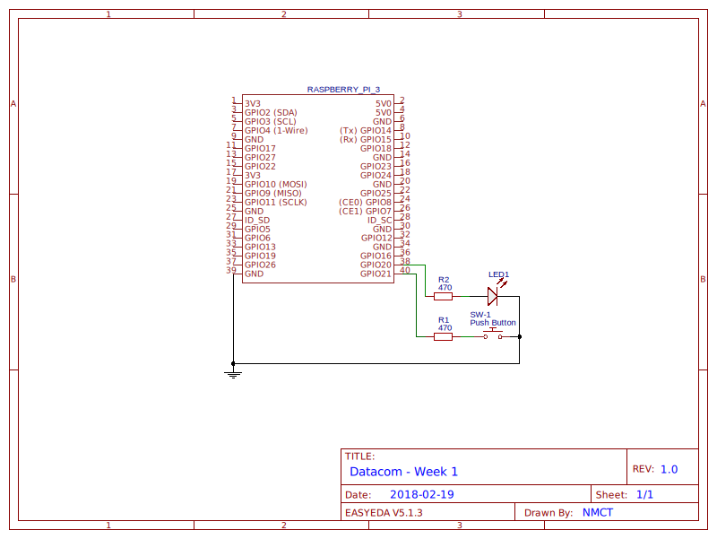

# Week 1: GPIO met de RPi.GPIO library
## Inleiding
Deze week zetten we onze eerste stappen met de RPi.GPIO-library. We lezen een drukknop uit en sturen een LED aan en 
maken kennis met de basisstructuur van scripts met de library.
 
### Doelstellingen
- Python-scripts uitvoeren op de RPi
- Gebruik maken van de RPi.GPIO library
- GPIO-pins aansturen en inlezen

### Voorkennis
- Computer and Networks:
    - Installatie & configuratie Raspbian op micro-SD
    - Basiscommando's Linux
    - Beheer (draadloze) netwerkverbinding van de RPi
- Prototyping
    - Gebruik breadboard & elektronische componenten
    - (Veilig) schakelen van Button en LED
    - GPIO pins & Digital I/O
    - Pull-up/down weerstanden
- Basic Programming 
    - Lists & for-loops
    - Klassen & objecten
    - Public, private & protected members
    - Encapsulation (properties)
    
# De RPi.GPIO-library
## Setup
Om de GPIO-pins te gebruiken moet je eerst de library RPi.GPIO importeren:
```python
from RPi import GPIO
```
Vervolgens moet je kiezen welke pinnummering je wil gebruiken **(steeds verplicht!!!)**
```python
GPIO.setmode(GPIO.BCM)
```
Ook hier moeten we de pin eerst configureren, en dit m.b.v. de functie `GPIO.setup(channel, mode)`. 
De parameter *channel* geeft de pin aan, dit kan zowel een enkel pinnummer zijn als een lijst. 
*mode* is een voorgedefinieerde constante: `GPIO.IN` of `GPIO.OUT`. Bijvoorbeeld:
```python
GPIO.setup(9, GPIO.IN)
GPIO.setup((10, 11, 12), GPIO.OUT)
```
Om een pull-up/down-weerstand te configureren kent setup een parameter *pull_up_down*. 
De waarde daarvan moet een van de constantes `PUD_UP` of `PUD_DOWN` zijn die de module `GPIO` definieert 
(of `None` voor geen van beide). 
```python
GPIO.setup(7, GPIO.IN, pull_up_down=GPIO.PUD_UP)
```
## Pins instellen en uitlezen
Het is natuurlijk properder om de pinnummer in een variabele op te slaan. Vervolgens kan je de pins 
uitlezen met `input(channel)` of instellen met `output(channel, value)`:
```python
btn = 9
GPIO.setup(btn, GPIO.IN, pull_up_down=GPIO.PUD_UP)
value = GPIO.input(btn)
print('The value of pin {0} is {1}'.format(btn, value))

led = 10
GPIO.setup(led, GPIO.OUT)
GPIO.output(led, GPIO.HIGH)
```
In plaats van `GPIO.HIGH` en `GPIO.LOW` kan je ook gewoon een boolean of int (1/0) meegeven als uitgangswaarde. 
Merk op dat je de functie `input()` ook kan gebruiken op een output-pin, om de huidige waarde te kennen:
```python
value = GPIO.input(led)
GPIO.output(led, not value)
```
## Cleanup
Na gebruik moet je de GPIO-library opruimen. Dit doe je met de functie `cleanup(pin)`, ofwel voor een enkele pin
 als je die bv. een andere functie wil geven:
```python
GPIO.cleanup(led)
```
en op het eind van je programma kuis je best gewoon alles op in een keer:
```python
GPIO.cleanup(led)
```

# Python
## Exception Handling
Het kan natuurlijk voorkomen dat je programma ergens tegen een fout aanloopt en stopt. In dat geval wordt de 
cleanup-functie nooit aangeroepen en krijg je bij de volgende keer dat je je script test een warning. We moeten er dus 
voor zorgen dat onze cleanup sowieso wordt opgeroepen op het einde.
Bij Basic Programming heb je geleerd hoe je fouten kan opvangen (*exception handling*):

```python
try:
    ... # dangerous things
except ... as e:
    ... # handle error
finally:
    ... # make sure everything is cleaned up
```

In de finally clause moeten we dus `GPIO.cleanup()` oproepen. Bovendien moet je weten dat de toetsencombinatie 
*<Ctrl+C>*, om het script te stoppen, door Python wordt omgezet in een Exception, nl `KeyboardInterrupt`. Die kunnen we
dus gerust negeren, wat we aangeven door het keyword `pass`. Als je in PyCharm op de stop-knop duwt, 
stuurt die trouwens ook gewoon een Ctrl+C. Dat brengt ons tot volgend stramien, dat we in alle scripts zullen gebruiken.

```python
GPIO.setmode(GPIO.BCM)
try:
    ... # gebruik de library/jouw klassen en functies
except KeyboardInterrupt:
    pass # gewoon negeren. Andere fouten zullen wel nog worden weergegeven
finally:
    GPIO.cleanup() # Library opkuisen
```

## \_\_name__

Als je  een script schrijft met enkel klassen en functies in, gebeurt er natuurlijk helemaal niets als je 
het gewoon uitvoert. Langs de andere kant willen we onze klassen kunnen importeren in andere scripts, en op dat moment
is het niet de bedoeling dat bv. je oefeningen van die week worden uitgevoerd. Dit dillemma kunnen we oplossen met de 
speciale variabele `__name__`. Enkel en alleen als je een script rechtstreeks hebt opgestart, krijgt die de waarde 
`__main__`. Daar kunnen we dus gebruik van maken om in dat geval een functie te starten, die we voor de duidelijkheid
`main` noemen:
```python
def main():
    ... # Plaats hier code volgens het stramien uit het vorige puntje
    
if __name__ == '__main__':
    # Dit wordt enkel uitgevoerd als je het script rechtstreeks start.
    main()  
```

<!-- TODO: herhaling properties -->

---

# Schakelschema


## Werkwijze
