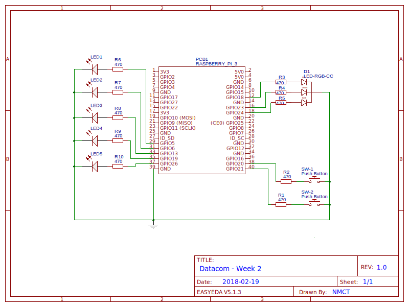

# Week 2: Edge detection, PWM, class inheritance
## Indleidng
We gaan deze week verder met de componenten en klassen van het vorige labo. De Button wordt voorzien van 
'edge detection', zodat we een actie aan het indrukken kunnen koppelen. en LED van het vorige labo. 
### Doelstellingen 
- Gebruik maken van de RPi.GPIO library om overgangen in het signaal te detecteren (edge detection)
- Gebruik maken van de ingebouwde software-PWM om een RGB-led aan te sturen 
- Een collectie pins aansturen m.b.v. loops 
- Zelf exceptions genereren

### Voorkennis
- Vorige lessen Datacommunication:
    - PWM-uitgangen
    - RGB-LEDs
    - Drukknoppen, edge detection, callbacks
- Basic Programming:
    - Class inheritance (overerving)
- Prototyping:
    - Schakelen Button, LED
    - RGB-LEDs
    
### Aandachtspunten

---

# Edge detection 

## Polling
> zie ook <https://sourceforge.net/p/raspberry-gpio-python/wiki/Inputs/>

Vorige week hebben we gezien hoe je een knop kan aansluiten en uitlezen. Ter herinnering:
 - Laat de pin steeds stroom leveren: gebruik de ingebouwde weerstand als **pull-up**
 - Gebruik steeds een weerstand van 470&ohm; in serie voor de veiligheid!
 - Pull-up weerstand wil zeggen dat de logische toestand van de pin omgekeerd is t.o.v. het induwen van de knop.
```python
btn = 21
GPIO.setup(btn, GPIO.IN, pull_up_down=GPIO.PUD_UP)
pressed = not GPIO.input(btn)
```
We hadden daar echter nog het probleem dat we enkel de huidige status van de knop konden inlezen. Zo kunnen we 
bijvoorbeeld wel wachten op het indrukken:
```python
while GPIO.input(channel) == GPIO.LOW:
    time.sleep(0.01)  # wait 10 ms to give CPU chance to do other things
```
Deze manier van werken noemt men *polling*: steeds opnieuw controleren of de gebeurtenis waar we op wachten reeds is 
opgetreden. Wanneer we ondertussen nog andere taken willen uitvoeren, raken we daarmee echter niet verder. Bovendien 
is deze methode erg belastend voor de CPU, die telkens opnieuw moet gaan controleren. Liever zouden we spontaan 
kunnen reageren op het indrukken van de knop.

### Interrupts 

Een *interrupt* is een voorziening om de processor op de hoogte te stellen van een bepaalde gebeurtenis. De CPU zal 
daarop zijn huidige werk onderbreken en een *Interrupt Service Routine (ISR)*, ook wel Interrupt Handler genoemd, 
uitvoeren. Na afloop gaat hij weer verder met de taak waar hij voordien aan werkte. Op deze manier hoeft er geen 
CPU-power verspild te worden met het wachten op gebeurtenissen.

Hetzelfde resultaat als in het vorige puntje kunnen we ook bekomen met de functie `wait_for_edge(channel, edge)` 
de GPIO-library, die daarvoor intern echter wel gebruik maakt van *interrupts*. De parameter `edge` is daarbij 
een constante die aangeeft welke overgang bedoeld wordt: `GPIO.RISING` is een overgang van 0 naar 1, `GPIO.FALLING` 
die van 1 naar 0. Wanneer we beide overgangen willen detecteren kunnen we bovendien gebruik maken van GPIO.BOTH.

```python
btn = 21
GPIO.setup(btn, GPIO.IN, pull_up_down=GPIO.PUD_UP)
GPIO.wait_for_edge(btn, GPIO.FALLING)
print('Button pressed')
```

`wait_for_edge` heeft bovendien een optionele parameter *timeout*, waarmee je kan aangeven hoelang (in milliseconden!) er maximaal dient te worden gewacht.

```python
# wait for up to 5 seconds for a rising edge (timeout is in milliseconds)
channel = GPIO.wait_for_edge(channel, GPIO_RISING, timeout=5000)
if channel is None:
    print('Timeout occurred')
else:
    print('Edge detected on channel', channel)
```
### Events

De GPIO-library referereert naar signaalovergangen als *events*. Als je die wil registreren, moet he dit eerst duidelijk maken via de functie `add_event_detect(channel, edge)`. Vervolgens kan je op eender welk moment controleren of de gebeurtenis in kwestie ondertussen is opgetreden of niet: 

```python
GPIO.add_event_detect(channel, GPIO.RISING)  # add rising edge detection
do_something()
if GPIO.event_detected(channel):
    print('Button released')
```

### Callbacks

Een functie in Python is zgn. 'first class object'. Dat wil niet meer zeggen dan dat je een functie kan kopieren, 
opslaan in een datastructuur, of doorgeven als parameter net als elk ander object. Daarvoor gebruik je simpelweg 
de naam van de functie **zonder haakjes en argumenten**. Wanneer je een functie meegeeft aan een andere functie of 
methode, zodat deze later opgeroepen kan worden, spreekt men van een *callback*-functie. Hiervan maken we gebruik 
om spontaan te reageren op een gebeurtenis: met de functie `add_event_callback(channel, callback)` zorg je ervoor 
dat de functie `callback` wordt opgeroepen van zodra de gebeurtenis optreedt.

De GPIO-libary maakt daarvoor achter de schermen gebruik van *threads*. Dat wil zeggen dat de code ervoor op de 
achtergrond draait, en jou code ondertussen ongestoord kan verderwerken. 

```python
def my_callback(channel):
    print('This is a edge event callback function!')
    print('Edge detected on channel %s'%channel)
    print('This is run in a different thread to your main program')

GPIO.add_event_detect(channel, GPIO.RISING, callback=my_callback)  # add rising edge detection on a channel
...the rest of your program...

```

Zoals je ziet is het een vereiste dat jouw callback-functie een enkele parameter aanvaardt, waarmee de GPIO-library 
het pinnummer meegeeft. Zo kan je dezelfde callbackfunctie recycleren voor meerdere pins. Je kan trouwens ook 
meerdere callbacks op eenzelfde pin registreren:

```python
def my_callback_one(channel):
    print('Callback one')

def my_callback_two(channel):
    print('Callback two')

GPIO.add_event_detect(channel, GPIO.RISING)
GPIO.add_event_callback(channel, my_callback_one)
GPIO.add_event_callback(channel, my_callback_two)
```

Zowel `add_event_detect` als `add_event_callback` hebben nog een bijkomende paramater *bouncetime*, waarmee je 
een aantal milliseconden kan meegeven dat dient om de knop te ontdenderen (debounce). Zoals je weet kan je hetzelfde 
resultaat ook bekomen door een kleine condensator parallel met de knop te plaatsen.
Je kan optioneel ook meteen een calback-functie meegeven aan `add_event_detect`:
```python
# add rising edge detection on a channel, ignoring further edges for 200ms for switch bounce handling
GPIO.add_event_detect(channel, GPIO.RISING, callback=my_callback, bouncetime=200)
```
of
```python
GPIO.add_event_callback(channel, my_callback, bouncetime=200)
```
Wanneer je niet langer wil dat overgangen worden gedetecteerd op een pin, kan je de event detection weer verwijderen:

```python
GPIO.remove_event_detect(channel)

```

# Pulse Width Modulation (PWM)
Net zoals de Arduino beschikt de Raspberry Pi niet over echte analoge uitgangen. Voor de meeste doeleinden kunnen 
we echter analoog gedrag nabootsen door heel snel te wisselen tussen een hoge en lage uitgang, en daarbij het 
tijdsinterval waarop de uitgang hoog is te variëren (PWM). 

Hoe vaak het signaal per seconde van laag naar hoog en weer terug naar laag gaat, noemt men de *frequentie*, 
uitgedrukt in *Hertz* [Hz]. De verhouding tussen de tijd dat de uitgang hoog is t.o.v. het totale tijdsinterval 
noemt men de *duty cycle*, uitgedrukt als percentage [%].

```python
def pwm(channel, frequency, dc):
	while True:
		GPIO.output(GPIO.HIGH)
		time.sleep(dc / frequency / 100)
		GPIO.output(GPIO.LOW)
		time.sleep((100 - dc) / frequency / 100)

```

Op de Arduino wordt PWM gerealiseerd d.m.v. van timers in hardware, deze zijn bijngevolg zeer nauwkeurig. 
Ook de RPi beschikt over zulke timers, deze zijn echter al in gebruik om kloksignalen te genereren voor de 
verschillende databussen die we in de komende lessen zullen zien. De GPIO-library biedt echter de mogelijkheid 
om outputs te voorzien van PWM in software, wat voor de meeste doeleinden zou moeten volstaan. 
Hiervoor gebruiken we de functie `GPIO.PWM(channel, frequency)`:

```python
led = 12
GPIO.setup(led, GPIO.OUT)
pwm = GPIO.PWM(led, 1000)
```

Op deze manier hebben we een software-PWM-object gemaakt met een frquentie van 1kHz (1000Hz). 
Vervolgens kunnen we het signaal starten met de methode `start(dc)`:

```python
pwm.start(50)
```

Nu zal op de pin een blokgolf met duty cycle=50% verschijnen, een aangsloten LED zou bijgevolg met halve intensiteit 
branden. We kunnen de duty cycle uiteraard nog veranderen: 

```python
pwm.ChangeDutyCycle(25)
```
... vermindert de intensiteit tot 1/4. Ook de frequentie kan gewijzigd worden:

```python
pwm.ChangeFrequency(100)
```
Nu krijgt de PWM-golf een frequentie van 100Hz. Na gebruik kunnen we de golf best stoppen om geen onnodige 
CPU-belasting te veroorzaken:

```python
pwm.stop()
```

# Python

## Herhaling: basisstructuur gebruik GPIO-library
We hernemen ter herinnering even de bassistructuur van een script met de RPi.GPIO-library:
```python
from RPi import GPIO

GPIO.setmode(GPIO.BCM)
try:
	GPIO.setup(20, GPIO.OUT)
	GPIO.setup(21, GPIO.IN, pull_up_down=GPIO.PUD_UP)
	value = GPIO.input(21)
	GPIO.output(20, value)
except KeyboardInterrupt:
	pass
finally:
	GPIO.cleanup()
```

## Overerving *(class inheritance)*
Een klasse laten overerven doe je door de basisklasse tussen haakjes achter de klassenaam te zetten: 
```python
class Animal:
    pass

class Mammal(Animal):
    pass

class Cow(Mammal):
    pass
```
Met `isinstance(obj, type)` kan je testen of een object van een bepaalde klasse OF een van de superklassen ervan is:
```pycon
>>> cow = Cow()
>>> mammal = Mammal()
>>> animal = Animal()
>>> isinstance(cow, Mammal)
True
>>> isinstance(cow, Animal)
True
>>> isinstance(mammal, Animal)
True
>>> isinstance(animal, Mammal)
False
```

Als je klassen overerft, krijgt de subklasse alle variabelen en methodes van de superklasse mee. Je kan een methode 
overschrijven (*override*) door ze in de subklasse opnieuw te implementeren.

<!-- TODO: uitbreiden, voorbeelden, super().__init__() -->


## Zelf exceptions genereren 
We hebben reeds gezien hoe je fouten (exceptions) kan opvangen d.m.v. een `try... except...`. Je kan echter ook zelf 
een exception genereren als er iets fout gaat in je programma, namelijk met het keyword `raise`:
```python
def find(item):
    if item is None:
        raise ValueError("Can't search for None!")
        
```
Om een ongeldige parameter aan te geven gebruik je best *ValueError*. Python heeft verder nog een hoop 
Exceptions aan boord die je kan gebruiken: <https://docs.python.org/3/library/exceptions.html>. 
Bij allemaal is de eerste parameter een foutboodschap, soms zijn er ook nog extra parameters. Als je wil kan je ook 
eigen exceptions aanmaken door over te erven van de klasse `Exception` of een subklasse daarvan. Als je buiten de naam
niets wil wijzigen, kan je het keyword `pass` gebruiken.

```python
class PinError(ValueError):
    pass
def read_pin(pin):
    if not 0 <= pin <= 40:
        raise PinError("Invalid pin number!")
        
```

## List comprehensions
Een heel handige functie in Python zijn zgn. *comprehensions*. Daarme kan je bewerkingen op verzamelingen (list, dict) 
uitvoeren en meteen een nieuwe verzameling genereren. Neem bijvoorbeeld volgende code om een reeks buttons te 
initialiseren:
```python
pins = (1, 2, 3, 4, 5)
buttons = []
for pin in pins:
    buttons.append(Button(pin))
```
Dit kan je met een comprehension ook schrijven als:
```python
pins = (1, 2, 3, 4, 5)
buttons = [Button(pin) for pin in pins]
```

Op een gelijkaardige manier kan je ook een `dict` maken, filteren, ... 
Meer info bv. op <https://www.digitalocean.com/community/tutorials/understanding-list-comprehensions-in-python-3>

---

# Schakelschema

