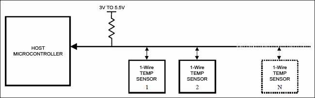
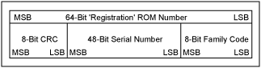
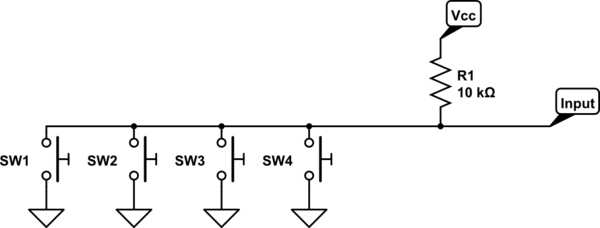
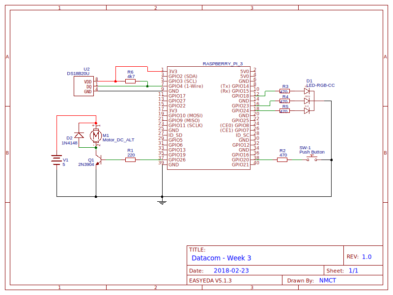

# Week 3: 1-Wire&reg;

## Inleiding
Als eerste voorbeeld van een communicatieprotocol zien we de 1-Wire&reg; bus, in de hoedanigheid van een 
DS18B20-temperatuursensor. Met deze sensor bouwen we een thermostaat waarvan de hysterese wordt gevisualiseerd
d.m.v. een RGB-LED.

### Doelstellingen
- Het concept 'bus' kennen en kunnen definiëren
- Open-drain outputs kennen en begrijpen
- 1-Wire-sensoren correct kunnen verbinden en uitlezen met de Raspberry Pi
- Een actuatorschakeling met hysterese maken
- Een transistorschakeling maken met de RPi

### Voorkennis
- Vorige lessen Datacommunication:
    - PWM-uitgangen1
    - RGB LEDs
    - Drukknoppen, edge detection, callbacks
- Basic Programming:
    - File I/O in Python 
    - Stringfuncties
- Prototyping:
    - Hysterese
    - Transistorschakeling
    
### Aandachtspunten
- Bussen: problemen & oplossingen
- Open-drain/collector uitgangen

---
    
# Bussen
Vaak willen we een groot aantal componenten aansluiten op een systeem - denk bijvoorbeeld aan harde schijven in een PC, 
USB-randapparaten of sensoren in een IoT-device. Als de CPU van dat systeem voor elk component een aparte elektrische
verbinding moet voorzien, wordt de situatie snel onwerkbaar. Voor gelijkaardige componenten zou het voor de hand liggen 
om dezelfde geleider(s) te hergebruiken, maar dat kan natuurlijk niet zonder meer:

**Elektrische problemen**: 
 - elke gebruiker ziet spanningen afkomstig van anderen op de bus verschijnen, uitgangen moeten dus daarop voorzien zijn
 - verschillende gebruikers zouden tegelijkertijd een verschillende spanning op een geleider kunnen zetten,
 met ongedefiniëerde toestanden of zelfs kortsluiting tot gevolg
 - transmissiemedia hebben een *beperkte bandbreedte*. Zeker digitale signalen kunnen daardoor vrijwel onherkenbaar 
 vervormd worden
 - bij het begin, einde, en aansluitpunten van een transmissielijn kunnen *reflecties* ontstaan die het signaal 
 verstoren en de vermogensoverdracht hinderen.
 
**Communicatieproblemen**:
 - gebruikers die tegelijkertijd communiceren, zouden elkaars transmissie kunnen beïnvloeden en verstoren 
 - signalen in een medium hebben een beperkte *propagatiesnelheid*, een door een gebruiker uitgestuurd signaal komt 
 mogelijk pas veel later aan op zijn bestemming
 - een communicatie kan voor alle gebruikers bedoeld zijn (*broadcast*), meestal is dat echter niet zo. In dat geval 
 moet een manier gevonden worden om enkele gebruikers uniek aan te spreken
 - een (kwaadwillige of defecte) gebruiker kan de gedeelde geleider voor alle deelnemers onbruikbaar maken
 
Om met succes meerdere gebruikers dezelfde geleider(s) te laten delen, moeten deze problemen verholpen worden. 
Men spreekt in dat geval van een **bus**, waar ook een *protocol* bijhoort dat afspraken over de communicatie
tussen de verschillende gebruikers vastlegt. 

> Een **bus** is het geheel van een of meer elektrische verbindingen en componenten en een (communicatie)protocol, 
die samenspelen om het mogelijk te maken **meerdere gebruikers** te laten communiceren over een **gedeelde elektrische 
verbinding**.

Vaak wordt het woord bus ook wel gebruikt voor systemen waar de deelnemers verbonden zijn via een hub of switch
en dus geen elektrische verbinding delen, zie bv. USB: Universal Serial *Bus*

# De 1-Wire-bus
1-Wire&reg; is een proprietair bussysteem afkomstig van de chipfabrikant *Dallas Semiconductor*, vandaag 
*Maxim Integrated*, waarvan het patent inmiddels verstreken is. 
Het protocol is ontworpen om over langere afstanden kleine hoeveelheden data te versturen en kan 
makkelijk in kleine, goedkope sensoren ingebouwd worden. 

Een 1-Wire sensor heeft, ondanks wat de naam misschien doet vermoeden, minimaal 2 aansluitpinnen. 
Naast de communicatie (die wel degelijk volledig over een enkele draad verloopt) is er namelijk minumum ook een 
verbinding met massa nodig. In de meeste gevallen wordt ook een aparte voedingsspanning (3 - 5.5V) voorzien, 
al kan in principe de datalijn als voeding dienen (zie onder).

Een 1-Wire netwerk wordt ook weleens MicroLAN genoemd, omdat het protocol is ontworpen om goed te werken over standaard 
Cat. 5 UTP-bekabeling. 

## Protocol
Het 1-Wire-protocol is een Master/Slave protocol, een MicroLAN bestaat dus altijd uit één *master* en een of meerdere 
*slaves*. De master, in ons geval dus de Raspberry Pi, is "baas" over de bus en initieert alle communicatie. 
Op die manier worden conflicten tussen de verschillende slaves vermeden. 

|  |
|:--:|
| *Schematische voorstelling van een 1-Wire MicroLAN* |

Om de verschillende slaves te kunnen 
onderscheiden heeft elke deelnemer een uniek 64-bit adres of *slave ID*. Dit unieke adres wordt tijdens het 
productieproces ingebakken (cf. MAC-adres) en bestaat uit een productcategorie, serienummer en controlegetal.

|  |
|:--:|
| *1-Wire Slave ID* | 

Omdat er maar 1 draad beschikbaar is voor communicatie, moet het protocol vertrouwen op erg  **strikte timing** 
om digitale informatie voor te stellen. Zo'n strikte timing is in software, en zeker in Python, niet te realiseren 
op een multitasking OS als Linux (op een microcontroller zoals de Arduino zou het wel gaan: 
<https://www.maximintegrated.com/en/app-notes/index.mvp/id/162>). Gelukkig voorziet Raspbian een driver die 
het zware werk voor ons doet. 

|  |
|:--:|
| *1-Wire Timingvereisten* | 

# Open-collector outputs 
We zagen eerder dat een het riskant kan zijn om een elektrische verbinding te delen tussen meerdere gebruikers. Stel 
bijvoorbeeld dat we een digitale 0 voorstellen met 0V, en digitale 1 met 3.3V op de geleider. Als nu een deelnemer
3.3V op de bus zet, en tegelijk stuurt een andere deelnemer een 0 door de bus met massa te verbinden, is het
gevolg in het slechtste geval een kortsluiting, en in het beste geval een ongedefinieerde toestand op de bus. 
Dit probleem kunnen we echter makkelijk verhelpen.

|  |
|:--:|
| *Interne schakeling van een open-collector uitgang* |

In plaats van het deelnemers toe te laten zelf een spanning op de bus te leggen, brengen we hem standaard op een 
hoog signaalniveau d.m.v. een **externe pull-up weerstand**. De uitgangen van ICs die op de bus communiceren worden
dan voorzien van een extra transistor waarvan de emitter (of source bij een FET) verbonden is met massa. De basis 
(of gate) is verbonden met de uitgang van de logica en de collector (of drain) met de uitgangspin en dus de bus. 
Deze configuratie noemt men [open-collector- of open-drain outputs](https://en.wikipedia.org/wiki/Open_collector).

## Werking
De bus wordt via een externe weerstand verbonden met de voedingsspanning (in ons geval 3.3V). Aangesloten apparaten 
in rust kunnen we beschouwen als een open circuit (de uitgangstransistor geleidt niet). De bus blijft standaard 
dus op hoog signaalniveau en er vloeit (in theorie) geen stroom.

Om data te verzenden, kan een deelnemer de transistor in geleiding brengen en zo de bus **verbinden met massa**. Op dit 
moment zal er een (via de pull-up weerstand beperkte) stroom vloeien, door pull-up en uitgangstransistor naar massa.
De spanning op de bus bedraagt op dat moment (bijna) 0V, gegeven door de spanningsdeler tussen de externe pull-up 
weerstand en de restweerstand van de transistor in geleiding. 

|  |
|:--:|
| *Meerdere open-collector outputs, hier voorgesteld door schakelaars, op dezelfde bus* |

Wanneer nu een andere deelnemer op het zelfde moment gaat communiceren, kan ook die enkel een verbinding van de bus 
naar massa maken. Elektrisch vormt dit geen enkel probleem, maar de communicatie van beide deelnemers zal uiteraard nog 
steeds verstoord zijn. 

### Voordelen
- **Geen elektrische conflicten**: Meerdere deelnemers kunnen enkel meerdere verbindingen naar massa maken.
- **Flexibele spanning**: Omdat enkel de uitgangstransistor elektrisch met de bus verbonden is, 
is het makkelijk om chips te maken die een verschillende spanning op de bus t.o.v. hun voedingsspanning kunnen tolereren.

### Nadelen
- **Hoog stroomverbruik**: Een laag signaalniveau betekent een constante stroom door de geleider, en ook bij hoog 
signaalniveau zal er nog een kleine *lekstroom* door de transistors vloeien.


# DS18B20 Temperatuursensor
De DS18B20 ([datasheet](https://datasheets.maximintegrated.com/en/ds/DS18B20.pdf)) is een 1-Wire temperatuursensor van 
*Maxim Integrated* die je in verschillende verpakkingen kan aankopen, als los component of in een al dan niet 
waterdichte verpakking. De sensor kan temperaturen meten in een bereik van -55&deg;C tot 125&deg;C, met een 
nauwkeurigheid van &pm;0.5&deg;C.

## Schakeling
De Raspberry Pi voorziet standaard **GPIO.4** voor de 1-Wire-bus, we zijn dus **verplicht deze pin te gebruiken** 
voor de datalijn tenzij we verder aan de configuratie zouden morrelen, wat we dus niet gaan doen.
Verder verbinden we de voedingsspanning met 3.3V (de sensor mag dan wel 5V verdragen, de GPIO pins van onze RPi niet!) 
en de massa met GND.

Om de databus in rust naar een hoog signaalniveau te trekken moeten we tenslotte een **4.7k&ohm; pull-up weerstand** 
schakelen tussen 3.3V en GPIO.4.

|  |
|:--:|
| *Aansluiten van de waterdichte DS18B20-temperatuursensor* |

> NB: Je zou ondertussen moeten weten dat de rode draad de voeding is en de zwarte massa, bijgevolg blijft de gele over
> als datalijn. Als je een losse DS18B20 in TO-92 formaat hebt, vind je de pinout terug in het datasheet.
## Driver activeren
Raspbian voorziet een *device tree overlay* (&ap;driver) voor de 1-Wire bus, maar die moet eerst nog wel 
geactiveerd worden. Dat kan ofwel via `raspi-config`, ofwel in het configuratiebestand `config.txt` op de boot-partitie.

- via `raspi-config`: onder `Interfacing Options` > `1-Wire`
- of op de CLI: `sudo raspi-config nonint do_onewire 0`
- of rechtstreeks in het configuratiebestand:
  - open `/boot/config.txt`
  - zoek naar de regel `#Enable onewire`
  - haal daaronder volgende regel uit commentaar: `dtoverlay=w1-gpio`
  - bewaar je wijzigingen

**In alle gevallen moet je nadien de Pi nog rebooten om de driver te activeren!**

## Uitlezen
*Everything is a file!* In dit geval vinden we wat we zoeken in het sys-filesysteem waar drivers hun ding kunnen doen, 
meerbepaald in de directory `/sys/bus/w1/devices/`:

```console
me@my-rpi:~ $ cd /sys/bus/w1/devices/
me@my-rpi:/sys/bus/w1/devices $ ls -l
total 0
lrwxrwxrwx 1 root root 0 Feb 25 18:00 28-0417b29bccff -> ../../../devices/w1_bus_master1/28-0417b29bccff
lrwxrwxrwx 1 root root 0 Feb 25 17:50 w1_bus_master1 -> ../../../devices/w1_bus_master1
```
Je ziet dat er 2 devices gedetecteerd werden: de master (RPi zelf) en onze temperatuursensor, die wordt weergegeven 
a.d.h.v. zijn adres (ID) in hexadecimale notatie. 

> NB: Als er devices gevonden worden met een ID die voornamelijk uit nullen bestaat, is je sensor wellicht
niet of fout aangesloten!

Elk device heeft een eigen subdirectory waar status en instellingen worden weergegeven als tekstbestanden. Laten we eens
kijken naar de master:
```console
me@my-rpi:/sys/bus/w1/devices $ cd w1_bus_master1/
me@my-rpi:/sys/bus/w1/devices/w1_bus_master1 $ ls -l
total 0
drwxr-xr-x 3 root root    0 Feb 25 17:50 28-0417b29bccff
lrwxrwxrwx 1 root root    0 Feb 25 17:50 driver -> ../../bus/w1/drivers/w1_master_driver
drwxr-xr-x 2 root root    0 Feb 25 17:50 power
lrwxrwxrwx 1 root root    0 Feb 25 17:50 subsystem -> ../../bus/w1
-rw-r--r-- 1 root root 4096 Feb 25 17:50 uevent
-rw-rw-r-- 1 root root 4096 Feb 25 17:50 w1_master_add
-r--r--r-- 1 root root 4096 Feb 25 17:50 w1_master_attempts
-rw-rw-r-- 1 root root 4096 Feb 25 17:50 w1_master_max_slave_count
-r--r--r-- 1 root root 4096 Feb 25 17:50 w1_master_name
-r--r--r-- 1 root root 4096 Feb 25 17:50 w1_master_pointer
-rw-rw-r-- 1 root root 4096 Feb 25 17:50 w1_master_pullup
-rw-rw-r-- 1 root root 4096 Feb 25 17:50 w1_master_remove
-rw-rw-r-- 1 root root 4096 Feb 25 17:50 w1_master_search
-r--r--r-- 1 root root 4096 Feb 25 17:50 w1_master_slave_count
-r--r--r-- 1 root root 4096 Feb 25 17:50 w1_master_slaves
-r--r--r-- 1 root root 4096 Feb 25 17:50 w1_master_timeout
-r--r--r-- 1 root root 4096 Feb 25 17:50 w1_master_timeout_us
```
Merk op dat sommige bestanden read-only zijn, terwijl je andere kan schrijven. De writable bestanden dienen om 
instellingen aan te passen. Van de voor ons interessante bestanden spreekt de naam voor zich:
```console
me@my-rpi:/sys/bus/w1/devices/w1_bus_master1 $ cat w1_master_name
w1_bus_master1
me@my-rpi:/sys/bus/w1/devices/w1_bus_master1 $ cat w1_master_slave_count
1
me@my-rpi:/sys/bus/w1/devices/w1_bus_master1 $ cat w1_master_slaves
28-0417b29bccff
```
Indien er meerdere slaves worden gevonden, komen hun ID's op achtereenvolgende regels in `w1_master_slaves`. 
Als we in de directory van een slave gaan kijken, vinden we naast de naam het bestand `w1_slave` dat de sensordata bevat.
```console
me@my-rpi:/sys/bus/w1/devices/w1_bus_master1 $ cd 28-0417b29bccff/
me@my-rpi:/sys/bus/w1/devices/w1_bus_master1/28-0417b29bccff $ ls -l
total 0
lrwxrwxrwx 1 root root    0 Feb 25 18:31 driver -> ../../../bus/w1/drivers/w1_slave_driver
-r--r--r-- 1 root root 4096 Feb 25 18:31 id
-r--r--r-- 1 root root 4096 Feb 25 18:31 name
drwxr-xr-x 2 root root    0 Feb 25 18:31 power
lrwxrwxrwx 1 root root    0 Feb 25 18:31 subsystem -> ../../../bus/w1
-rw-r--r-- 1 root root 4096 Feb 22 12:27 uevent
-rw-r--r-- 1 root root 4096 Feb 25 18:31 w1_slave
me@my-rpi:/sys/bus/w1/devices/w1_bus_master1/28-0417b29bccff $ cat name
28-0417b29bccff
me@my-rpi:/sys/bus/w1/devices/w1_bus_master1/28-0417b29bccff $ cat w1_slave
20 01 4b 46 7f ff 0c 10 5d : crc=5d YES
20 01 4b 46 7f ff 0c 10 5d t=18750
```
In de laatste regel vind je de gemeten temperatuur, in duizendsten van een graad Celcius, in de 'variabele' `t`; hier 
is het nu dus 18.75&deg;C.

--- 

# Python
## File I/O
We herhalen kort hoe je met Python bestanden kan openen. Het ingebouwde commando `open(path, mode)` geeft je
een zgn. *handle* terug waarmee je, naargelang de gekozen `mode`, kan lezen en/of schrijven naar het bestand. 
Standaard is de mode `'r'`, ofwel tekstbestand lezen, in dit geval kan je de parameter dus ook weglaten. Meer info in de 
[documentatie voor de Python Standard Library](https://docs.python.org/3/library/functions.html#open).

Het [object](https://docs.python.org/3/library/io.html#io.TextIOBase) dat je terugkrijgt heeft een methode 
`read(size)` waarmee je een aantal bytes kan lezen, of het gehele bestand met `size` gelijk aan `None`. Met de methode 
`readline()` kan je het bestand regel per regel verwerken, handiger is echter dat het object zelf ook een 
*iterable* is, je kan het dus rechtstreeks gebruiken in een `for`-loop.
**Na afloop moet je de *handle* naar het bestand weer sluiten met de methode `close()`.** 

```python
myfile = open('myfile.txt')
for line in myfile:
    print(line)
myfile.close()
``` 

## Context Managers
Handig om zeker niet te vergeten het bestand te sluiten is het zogenaamde **context manager protocol**. Een context
manager kan je vergelijken met een `try... finally...`-blok, maar dan zonder dat exceptions worden opgevangen. 
Door een codeblok met het keyword `with <object>` te beginnen, roep je de context manager manager aan. 
Het openen zelf kan in een klap door een `as <name>` toe te voegen:  

```python
path = '/path/to/myfile.txt'

with open(path, 'w') as f:
    f.write('Hello, world!')

# after the with block ends, the file is closed automatically:
assert f.closed
```
> NB: Het object dat je wil gebruiken moet het [protocol wel 
ondersteunen](https://docs.python.org/3/library/stdtypes.html#typecontextmanager). Concreet moet het de methodes 
`__enter__` en `__exit__` implementeren, maar dat is voor onze file handle dus het geval.

## String methods
Als je regels van een tekstbestand inleest, geeft Python ook bijhorende newlines (`\n`) terug. Om die weg te halen  
kan je gebruik maken van de methode [str.rstrip(char)](https://docs.python.org/3/library/stdtypes.html#str.rstrip).

```python
with open('file.txt', 'w') as f:
    lines = [line.rstrip('\n') for line in f]
```

Om in het bestand `w1_slave` de juiste regel te vinden kan je gebruik maken van de methode 
[str.find(sub)](https://docs.python.org/3/library/stdtypes.html#str.find) van de klasse string. De functie geeft ofwel de 
positie van `sub` in de string terug , of `-1` als het niet voorkomt. 


## Unicode voor speciale karakters in strings
Het symbool voor graden (&deg;) behoort niet tot het standaardassortiment van ASCII. Dit kan je oplossen met een 
*escape character* voor Unicode: 
- ofwel met het (hexadecimale) nummer: `\u00b0`
- ofwel, meer leesbaar, met de naam: `\N{DEGREE SIGN}`

---

# Schakelschema


- Begin met het aansluiten van de temperatuursensor
- Werk de klasse OneWire en DS18B20 af
- Sluit dan de RGB-led, transistorschakeling met ventilator, en drukknop aan
- Werk de klasse Thermostat af
