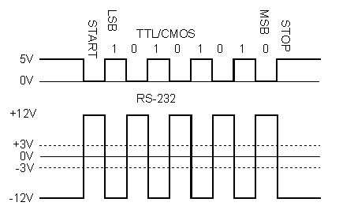
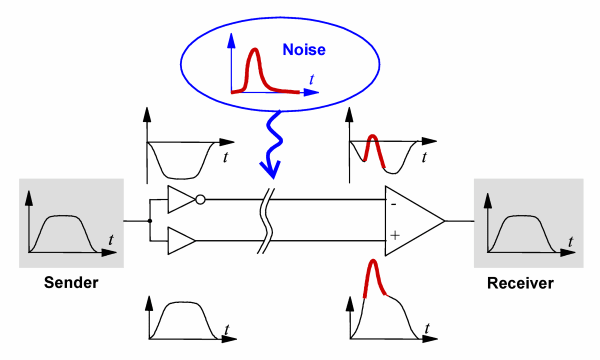
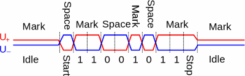
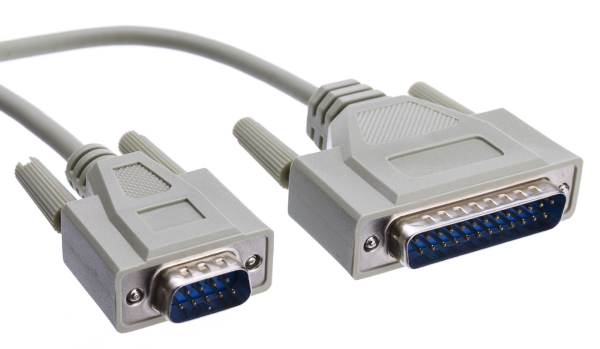
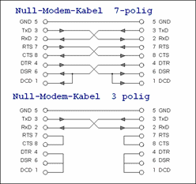
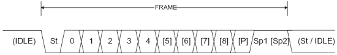
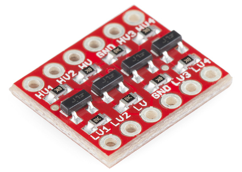
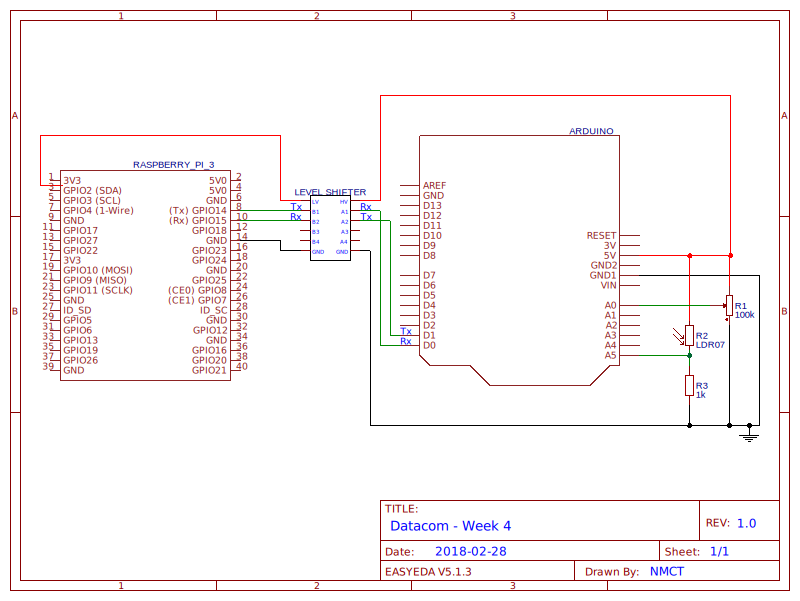

# Week 4: Serial port
## Inleiding
Hoewel de seriële poort, voor het eerst gedefinieerd in 1960 (!), steeds meer verdwijnt uit het dagelijkse gebruik, 
is de nood aan seriële communicatie (en aanverwante technologieën) in de industrie nog steeds erg hoog. Netwerkapparatuur 
(routers, switches, ...) hebben bijvoorbeeld nog steeds een seriële poort voor configuratie. 
Vaak is het ook zo dat de fysieke verbinding vervangen is door b.v. USB maar de logische implementatie gebeurt met een 
virtuele seriële poort, denk b.v. maar aan de Arduino. In het datacenter maakt men vaak gebruik van serial-to-ethernet
converters die de seriële poorten toegankelijk maken via TCP/IP.

Vandaag zullen we de seriële communicatie eens onder de loep nemen. Een voor de hand 
liggende toepassing is b.v. een Raspberry Pi die samenwerkt met een aantal Arduino’s om data te capteren. 
De Pi heeft namelijk geen analoge ingangen, maar kan dan weer goed worden gebruikt als kleine database- en/of webserver. 
De communicatie tussen de Arduino en de Pi kan op verschillende manieren gebeuren, b.v. via I²C, 
de SPI-bus of dus via de seriële poort, die het eenvoudigst is van de drie. 

### Doelstellingen 
-   Data uitwisselen tussen RPi en Arduino via de seriële poort
-   Begrijpen van datacommunicatie protocollen
-   Gebruik van een level shifter

### Voorkennis
- Prototyping:
    - Arduino: Serial (read, write, available), AnalogRead, delay
    - Spanningsdeler 

### Aandachtspunten
- Serieel protocol & instellingen
- Level shifter
- Differential signaling

---
    
# De Seriële poort
De seriële poort is een *asynchrone seriële interface*. **Asynchroon** wil zeggen dat de informatie niet op vooraf 
afgesproken momenten wordt verzonden, er is dus geen synchronisatie- of kloksignaal aanwezig. **Serieel** wil zeggen we 
dat de informatie bit per bit over dezelfde draad wordt verzonden. Dat maakt dat de hardware zeer 
eenvoudig is: één draad om te versturen, eentje om te ontvangen en een gemeenschappelijke massa (ground) volstaan in 
principe voor full-duplexoperatie. 

De chip die zo’n seriële interface aanstuurt noemt men een **UART**: *Universal Asynchronous Receiver/Transmitter*. 
Alhoewel er talloze andere seriële interfaces zijn, wordt deze interface meestal gewoon *serial* genoemd. 

## Hardware (layer 1)
De fysieke laag van de seriële poort werd oorspronkelijk vastgelegd in *Recommended Standard* 232 of **RS-232**. Die 
standaard omschrijft connectors, elektrische eigenschappen van de verbindingen, etc. maar zegt niets over het 
gebruikte protocol. 

### Signaal
Oorspronkelijk werd een een logische 0 of *space* gedefinieerd als 3-15V en een 1 of *mark* als -3 tot -15V, 
signaalniveaus tussen -3 en +3V zijn ongeldig. Al gauw werkten veel devices op -5 en +5V en tegenwoordig wordt vaak 
gewoon hetzelfde protocol op TTL-niveau (0 en 5V) gebruikt. Dat is ook wat wij zullen doen in dit labo, maar daar komt 
nog eens bij dat Arduino en RPi op een verschillende spanning werken. **We zullen dus gebruik moeten maken van een 
*level shifter* die het signaal omzet van 0-3.3V naar 0-5V en vice versa!**

|  |
|:--:|
| *Serial: TTL vs RS-232* |

Merk op dat RS-232 een *mark* (1) voorstelt door een negatieve spanning, en een *space* (0) door een positieve. Daarnaast
is de bus **standaard hoog**, wat in dit geval door de UART zelf geregeld wordt, we moeten dus geen pull-up voorzien
zoals dat bij 1-Wire het geval was.

Gezien het signaal **single-ended** is, d.w.z. dat de informatie als een enkel voltage gecodeerd wordt, moeten zender en 
ontvanger een gemeenschappelijke referentie hebben, meestal gewoon massa. Bij een **differentieel** of **balanced** signaal 
wordt de informatie gecodeerd als het verschil tussen 2 tegengestelde voltages 
(bv. space = +3V en -3V = -6V en mark = -3V en +3V = +6V). Dat maakt de verbinding meteen veel minder gevoelig aan storing:

|  |
|:--:|
| *Bij differential signaling heffen storingen zichzelf op* |

**RS-422** gebruikt een differentieel signaal voor dezelfde seriële verbinding, 
het wordt daarom in veel industriële toepassingen gebruikt. **RS-485** laat daarboven meerdere 
zenders op dezelfde bus toe. Deze bussen kunnen op dezefde manier worden aangestuurd als de seriële poort.

|  |
|:--:|
| *Differential signaling: Serial RS-422/485* |

### Verbinding
Traditioneel werd RS-232 gebruikt voor het verbindan van *data communication equipment* (DCE, bv. een modem) met
*data terminal equipment* (DTE, een computer zeg maar). Daarbij werden DB-9 en DB-29 connectors gebruikt, vandaag tref 
je nog de kleinere DB-9 aan. Netwerkhardware gebruikt meestal gewoon een RJ-45 (Ethernet)connector voor de consolepoort, 
maar dan met een serieel signaal. 

|  |
|:--:|
| *DB-9 en DB-25 connector (male)* |

Naast de essentiële 2 datalijnen en GND definieert de standaard nog een hoop andere 
verbindingen die voor ons niet van belang zijn. Wél belangrijk is dat DCE en DTE een verschillende pinout hebben, wanneer
we twee hosts met elkaar verbinden (DTE <-> DTE) hebben we daarom een "crossed" kabel nodig: **de Tx-pin van de 
zender moet verbonden worden met de Rx-pin van de ontvanger en vice versa**. In de context van de oude seriële poort 
noemt men dat een *null-modemkabel*, verwijzend naar het aantal modems die erbij betrokken zijn. Wij zullen gewoon 
de draadjes op het breadboard moeten kruisen. 

|  |
|:--:|
| *Null-modemkabel* |
## Protocol (layer 2)
Omdat de transmissie asynchroon is en op elk moment kan beginnen, moet de data worden voorafgegaan door een **startbit** 
zodat de andere kant weet dat er bits gaan aankomen. Deze startbit wordt gevormd door de (standaard hoge) bus laag te trekken. 

Vervolgens wordt een aantal **databits** verstuurd, en omdat de seriële poort nog uit de tijd komt dat niet elke computer
met bytes van 8 bit werkte kunnen dat er tussen de 5 tot 9 zijn. Vandaag de dag zal je nog bijna uitsluitend 8 databits 
aantreffen. 

Na de databits kan een optionele **parity-bit** volgen. Dat is een eenvoudige en niet zeer betrouwbare vorm van 
foutcontrole, bekomen door een XOR van de databits. Die pariteitsbit kan *even* of *odd (oneven)* zijn, d.w.z. dat hij 1 
wordt voor een even, dan wel oneven aantal 1-bits in de data. Merk op dat je zodoende wel kan detecteren dat er 1 
bit veranderd is (of beter gezegd, een oneven aantal), maar als er 2 (of een even aantal) bits fout zijn is de pariteit 
dezelfde. Bijgevolg is het nut vandaag eerder beperkt en wordt deze optie niet meer vaak gebruikt. 

Elke byte wordt tenslotte afgesloten met 1, 1.5 of 2 **stopbits** waarop de datalijn hoog blijft (omdat de verbinding 
asynchroon is, is een 'bit' in deze zin gewoon een tijdsinterval - op een synchrone lijn kan je geen 'halve' bits hebben!) 
Dat geeft de ontvanger de tijd om de data te verwerken 
(in de jaren '60 toch) en opnieuw te synchroniseren. Bij gebrek aan kloksignaal moet immers gezorgd worden dat 
de timing van zender en ontvanger niet uit elkaar begint te driften. 

|  |
|:--:|
| *Een frame van de seriële poort: startbit, databits, parity en stopbit(s)* |

Dat geeft ons dus 3 parameters die we moeten instellen aan een UART: 
- aantal **databits**: 5-9
- **parity**: even/odd/none
- aantal **stopbits**: 1, 1.5 of 2 

Over het algemeen kan je 8 databits, no parity en 1 stopbit als gegeven beschouwen, korter genoteerd als 8/N/1 of 8N1.

### Baud rate
RS-232 kan bovendien op verschillende snelheden werken, waar beide kanten het uiteraard eens over moeten zijn, of de 
ontvanger zal op het foute moment bits inlezen en onzin ontvangen. De snelheid wordt uitgedrukt in *baud* of 
symbolen per seconde en noemt men daarom ook wel *baudrate*. De seriële poort kent maar 2 symbolen, mark en space, 
bijgevolg komt de baudrate overeen met de **bruto** bitrate. Dat is echter niet noodzakelijk zo!

Vandaag de dag kan je er zoals gezegd van uitgaan dat telkens 8 databits plus start- en stopbit verstuurt wordt, 
voor de **netto** transmissiesnelheid in **byte**/sec moet je dus de baudrate delen door 10.

Niet zomaar elke baudrate is mogelijk, enkele veelgebruikte zijn:
- 9600 baud (Vandaag standaaard, maar traag. Wordt door vrijwel elke UART ondersteund)
- 19200, 57600, 115200 baud (Merk op: allemaal veelvouden van 9600, wat op zijn beurt een veelvoud was van 300!)
- 64k baud en veelvouden 
- 1M baud en veelvouden 

Niet elke UART ondersteunt alle snelheden, zeker hogere, check dus op voorhand. Het spreekt voor zich dat hoge 
baudrates (100k+) hogere eisen stellen qua elektrische verbinding en nauwkeurigheid van timing.

### Flow control
Een laatste optie die we kunnen instellen is **flow control**. Dat is een mechanisme waarmee zender en ontvanger elkaar
kunnen verwittigen wanneer ze klaar zijn voor datatransmissie. Dat kan zowel in hardware (dus met extra signaaldraden), 
of in software met speciale karakters. 
- **Hardware:**
    - RTS/CTS: Request To Send/Clear To Send pins worden gebruikt om aan te geven dat het apparaat klaar is om data
    te sturen/ontvangen
    - DTS/DTR: Data Set Ready/Data Terminal Ready-lijnen die eigenlijk aangeven dat het apparaat online en klaar is, 
    worden soms misbruikt voor flow control
- **Software:**
    - XON/XOFF: Zijn speciale ASCII-controletekens die als data *van ontvanger naar verzender* worden gestuurd om 
    transmissie te starten/stoppen
    
Flow control was van groot belang om een modem aan te sluiten maar wordt vandaag niet meer veel gebruikt. 
Wij gaan het dus ook niet toepassen, bovenstaande is enkel ter info.

## Toepassingen
Een eerste toepassing is het aansturen van een microcontroller op afstand, zoals we vandaag gaan doen met de Arduino. 
Voor eenvoudige toepassingen (bv. een sensor uitlezen) kan je ook gebruik maken van bv. een 
[Arduino Micro](https://store.arduino.cc/arduino-micro) of [Teensy](https://www.pjrc.com/store/teensy.html), die 
nog eens een stuk kleiner en een beetje goedkoper zijn. Vrijwel alle microcontrollers hebben standaard een UART aan boord.

Draadloze modules zoals bv. de XBee (voor ZigBee) moeten we ook vaak via de seriële pinnen aansluiten. Hetzelfde geldt 
voor vele andere RF-modules, GPS- en 3G/4G-sticks, ook al is de fysieke aansluiting vaak weer via USB. De reden is te 
vinden bij het historische gebruik van RS232 voor modems, wat deze modules eigenlijk ook zijn. Je moet ze vaak 
zelfs met dezelfde commando’s (zgn. AT-commando’s) als modems uit de jaren ‘80 aansturen!

Bijvoorbeeld:
- XBee: <https://www.digi.com/lp/xbee/hardware>
- ESP8266 WiFi module: <https://www.sparkfun.com/products/13678>
- Huawei MU509-C 3G/HSDPA module: <https://techship.com/products/huawei-mu509-c/>
 
# Gebruik
## Windows
Onder windows krijgen seriële poorten de benaming COM gevolgd door een volgnummer, vandaar dat ze soms ook COM-poort 
genoemd worden. Om verbinding te maken kan je o.a. gebruik maken van PuTTY. 

|  |
|:--:|
| *Instellingen voor de seriële poort in PuTTY* |

## Linux 
Onder Linux zijn seriële poorten zogenaamde *character devices*, een speciaal type van, jawel, bestand. Die zijn te vinden 
in `/dev` en herkenbaar aan de letter `c` in de eerste kolom van de output van `ls -l`. 
```console
me@my-rpi:~ $ ls -l /dev/tty*
crw-rw-rw- 1 root tty       5,  0 Feb 22 12:27 /dev/tty
crw--w---- 1 root tty       4,  0 Feb 22 12:27 /dev/tty0
crw--w---- 1 root tty       4,  1 Feb 22 12:27 /dev/tty1
 ...
```
Daar heb je eerst `/dev/tty` (van TeleTYpe - vandaar ook de hoofdletter in PuTTY, trouwens), dat is de console. 
Die met een cijfer achter zijn de *virtuele consoles* (Alt-F1 t.e.m. F10). Seriële poorten krijgen normaal de prefix 
`ttyS` en een volgnummer, maar op de RPi is de situatie een beetje complexer.

Verbinden kan je met bv. `screen` of `minicom`, voor de GUI is er ook een versie van PuTTY.

## Raspberry Pi
Sinds de Pi3 is het gebruik van de seriële GPIO pins niet meer zo eenvoudig. Tot en met
de Pi 2 was er enkel de hardware UART die rechtstreeks met de GPIO pins Tx (GPIO.14) en Rx (GPIO.15) verbonden was. 
Een device dat niet over een netwerkkaart beschikt kon ook via die pinnen inloggen op de Pi dankzij
`getty`. De Tx en Rx pins worden echter ook veel gebruikt door b.v. GPS modules, bluetooth devices, add on boards, 
3G modems, ...

Deze UART is er nog steeds, en is nog steeds te vinden in `/dev/ttyAMA0`. De Pi3 heeft echter ook Bluetooth 
aan boord, en die module maakt nu standaard al gebruik van de UART. De poort die naar de Tx en Rx pin wordt gebracht 
is nu een softwarematige poging om een UART te emuleren, ook wel "mini-UART" genoemd en te vinden in `/dev/ttyS0`. 

Vele applicaties werk(t)en niet meer met die seriële poort, daarnaast is een software-implementatie sowieso 
verre van ideaal. Omdat het een asynchrone verbinding betreft, is een exacte timing namelijk van groot belang. 
Linux is echter een multitasking-OS en heeft dus ook weleens wat anders te doen dan UART te spelen. Staat de Pi wat onder
druk, dan zal de seriële poort niet meer (goed) functioneren. 

Daarnaast is de klokfrequentie van een UART speciaal afgesteld op een geheel veelvoud van de standaard-baudrates, de 
CPU van de RPi echter niet. Dat maakt het onmogelijk om *exact* de juiste baudrate te bekomen, tenzij men de 
klokfrequentie van de CPU aanpast - naar beneden welteverstaan, dus met een (klein) verlies aan performance. 

Gelukkig is het verschil voor lage baudrates niet té groot en hoeven we het ons voorlopig niet aan te trekken, hou het 
echter wel in het achterhoofd als je bv. een 3G-module wil aansluiten. Als je geen Bluetooth nodig hebt, kan je de 
seriële poorten ook gewoon omwisselen en zo de oude situatie herstellen.

### Configuratie
Sinds Raspbian Jessie staat de GPIO Serial Port standaard disabled. Via `raspi-config` kan je de seriële poort enablen, 
of je kan ook weer gewoon rechtstreeks `/boot/config.txt` aanpassen met `enable_uart=1`. Daarmee wordt ook meteen
de klokfrequentie van de CPU aangepast.

Standaard kan je de poort nu gebruiken om op in te loggen, als we ze willen gebruiken voor andere toepassingen 
moeten we dat uitschakelen. Om in te loggen op een console gebruikt Linux `getty`, en die service moeten 
we stoppen op de seriële poort:
```console
me@my-rpi:~ $ sudo systemctl stop serial-getty@ttyS0.service
me@my-rpi:~ $ sudo systemctl disable serial-getty@ttyS0.service
``` 

De seriële console is standaard ook nog eens enabled in `/boot/cmdline.txt`, daar moet je volgende tekst weghalen: 
`console=serial0,115200`. Dan kan je rebooten en zou je de seriële poort moeten zien verschijnen:
```console
me@my-rpi:~ $ ls -l /dev/ttyS*
crw--w---- 1 root dialout   4,  1 Feb 22 12:27 /dev/ttyS0
```
Merk op dat het bestand eigendom is van de groep `dialout`, om de poort te kunnen gebruiken moet je dus lid 
zijn van die groep. Controleer:
```console
me@my-rpi:~ $ groups
adm dialout cdrom sudo audio video plugdev games users input netdev gpio i2c spi
```

### Symlinks
Dankzij eerder vermelde veranderingen kan software dus niet zomaar uitgewisseld worden tussen een Pi 2 en 3, we zouden
telkens de naam van de seriële poort moeten aanpassen. Vandaar dus dat veel software plots niet meer werkt(e). 

Dit probleem kan makkelijk opgelost worden door een symbolic link (symlink) te gebruiken die altijd verwijst
naar de correcte seriële poort. Raspbian voorziet zulke symlinks al in `/dev/serial*`:
```console
me@my-rpi:~ $ ls -l /dev/serial*
lrwxrwxrwx 1 root root 7 Feb 22 12:27 /dev/serial0 -> ttyS0
lrwxrwxrwx 1 root root 7 Feb 22 12:27 /dev/serial1 -> ttyAMA0
```
Symbolic links herken je aan de letter `l` in de eerste kolom en aan de pijl die aangeeft waar de link naar verwijst.

### Seriële poorten omwisselen
Eventueel kunnen we de GPIO seriële pinnen laten verwijzen naar de hardware UART en de (software) mini-UART toekennen 
aan de Bluetooth-module. Daarvoor is er weer een *device tree overlay*, zoals altijd te activeren in `/boot/config.txt`:
```console
dtoverlay=pi3-miniuart-bt
```
Na een reboot: 
```console
me@my-rpi:~ $ ls -l /dev/serial*
lrwxrwxrwx 1 root root 7 Feb 22 12:27 /dev/serial0 -> ttyAMA0
lrwxrwxrwx 1 root root 7 Feb 22 12:27 /dev/serial1 -> ttyS0
```
Als je geen Bluetooth nodig hebt, kan je in de plaats ook gewoon de overlay `pi3-disable-bt` gebruiken en daarmee
de situatie van de Pi 2 herstellen.

### Overzicht configuraties
*Steeds in `/boot/config.txt`:*

**1) Geen seriële poort nodig, wel Bluetooth:** Ofwel `enable_uart=1` weer in commentaar plaatsen of op 0 zetten, 
dan werkt de Pi weer op de normale klokfrequentie.
```console
# serial port
enable_uart=0
```
**2) Wel seriële poort, geen Bluetooth:** Zowel Bluetooth als de mini-UART uitschakelen en de hardware UART toekennen 
aan de GPIO pins.
```console
# serial port
enable_uart=0
dtoverlay=pi3-disable-bt
```
**3) Allebei, Bluetooth krijgt de hardware UART en de seriële poort de mini-UART:** 
```console
# serial port
enable_uart=1
```

**4) Allebei, Bluetooth krijgt de mini-UART en de seriële poort de echte:** 
```console
# serial port
enable_uart=1
dtoverlay=pi3-miniuart-bt
```

## Python
### PySerial
In Python kan je de package *PySerial* installeren om makkelijk een seriële poort te openen:
```console
me@my-rpi:~ $ source datacom/env/bin/activate
(env) me@my-rpi:~ $ python -m pip install pyserial
  [...]
(env) me@my-rpi:~ $ python -m serial.tools.list_ports       # om eens te testen
/dev/ttyAMA0
/dev/ttyS0
2 ports found
```
Hetzelfde kan in PyCharm via `File > Settings > Project: Datacommunication-I > Project Interpreter`. Klik rechts op
het plusteken om packages te zoeken en installeren.

Om een seriële poort te openen met default settings (9600 8/N/1):
```pycon
>>> import serial
>>> ser = serial.Serial('/dev/ttyS0')  # open serial port
>>> print(ser.name)         # check which port was really used
>>> ser.write(b'hello')     # write a string
>>> ser.close()             # close port
```
Zie ook <https://pythonhosted.org/pyserial/shortintro.html>.

De werkwijze verschilt verder niet veel van hoe je een tekstbestand bewerkt. De klasse Serial heeft ook een Context 
Manager, je kan dus weer `with` gebruiken:
```python
from serial import Serial, PARITY_NONE

# simple echo server
with Serial('/dev/ttyS0', 115200, bytesize=8, parity=PARITY_NONE, stopbits=1) as port:
    while True:
        line = port.readline()
        port.write(line)
```

Volledige documentatie: <https://pythonhosted.org/pyserial/pyserial_api.html>
## Arduino
We herhalen nog kort hoe je met de Arduino-library de seriële poort gebruikt. 

*Opgelet!*
- *de Arduino werkt op 5V, gebruik steeds een level shifter tussen RPi en Arduino!*
- *de Arduino gebruikt dezelfde UART en pins ook voor communicatie met de PC. Telkens als je een sketch uploadt, zal 
je de draadjes op pin 0 en 1 even moeten verwijderen!*

```cpp
void setup() {
    Serial.begin(9600);
}

void loop() {
    // simple echo server
    if (Serial.available()) {
        String line = Serial.readString();
        Serial.println(line);
    }
}
```
<https://www.arduino.cc/reference/en/language/functions/communication/serial/> 

## Serial over USB
Je kan de Arduino natuurlijk ook via USB verbinden met de RPi en gebruik maken van de virtuële seriële poort, net zoals
we dat onder Windows deden. Die seriële poort vind je normaalgezien terug als `/dev/ttyACM0`. Anders kan je in de 
*driver messages* vinden wat de naam is: `dmesg | grep tty`.

Om de Arduino te programmeren kan je via `apt` de package `arduino` installeren, dan heb je (via de GUI) dezelfde 
IDE ter beschikking die je al kent van bij Prototyping.

# Level Shifter
De *(logic-)level shifter* is een module die we kunnen gebruiken om componenten die op een verschillende spanning werken 
**digitaal** met elkaar te verbinden. Om in twee richtingen te kunnen omzetten hebben we een *bidirectionele* variant nodig. 
Intern bestaat de level shifter uit een **transistorschakeling**, denk aan hoe we een transistor gebruikten om een motor op 
een hogere spanning te kunnen aandrijven dan de RPi verdraagt. Een bidirectionele shifter zal natuurlijk wel wat 
ingewikkelder in elkaar zitten, met meerdere transistors. 


|  |
|:--:|
| *Voorbeeld van een level shifter* |

Level shifters komen in varianten met een verschillend aantal aansluitingen, die van ons zijn 4 bits (m.a.w. je kan er
4 datalijnen mee omzetten). De ene kant is **low voltage (LV)**, de andere kant **high voltage (HV)**, je kan Pi en 
Arduino dus NIET van kant wisselen! Aan de LV en HV aansluitingen moet je de respectievelijke voedingsspanning aansluiten, 
in dit geval dus 3.3V van de Pi en 5V van de Arduino. Verder heeft elke kant een aansluiting voor de overeenkomstige 
**massa (GND)** die je moet verbinden. Tenslotte zijn er aansluitingen voor de datalijnen, aangeduid met 
LV*x* en HV*x* op de foto en op het schema met A*x* en B*x*. Daar hebben we er dus maar 2 van nodig, welke je daarvoor 
gebruikt maakt verder niet uit.

# Logic Analyzer
Met de logic analyzer kunnen we visualiseren wat er juist op de poort gebeurt. Installeer de software via 
<https://www.saleae.com/downloads>. 

---

# Opdracht
1) Schakeling 
    - eventueel moet je nog pin headers op de lever shifter solderen
    - verbind RPi (Tx=GPIO.14, Rx=GPIO.15, 3.3V en GND) met de LV-kant van de level shifter
    - verbind de Arduino (Rx=0, Tx=1, 5V en GND) met de HV-kant van de level shifter
    - vergeet niet dat je Rx en Tx onderweg moet kruisen!
2) Configuratie
    - enable de mini-UART (via `raspi-config` of in `/boot/config.txt`)
    - pas `/boot/cmdline.txt` aan zodat de console niet meer via serial toegankelijk is 
    - reboot!
    - installeer de package `pyserial` op de RPi (makkelijkst via PyCharm, vergeet anders niet eerst je *venv* te activeren)
3) Test-applicatie
    - werk voorlopig op 9600 baud
    - schrijf een Arduino-sketch die om de seconde de tekst `NMCT` doorstuurt
    - vervolledig de functie `serial_read()` die een regel van de seriële poort leest en print op de console
4) Configuratie wijzigen
    - pas je code aan om met een hogere baud rate te werken (bv. 115200) &amp; test opnieuw
    - schakel Bluetooth uit en gebruik de hardware-UART voor de GPIO pins. Controleer met 'ls -l /dev/serial*'. Test je 
    applicatie opnieuw.
5) Sensordata 
    - sluit een analoge sensor aan de Arduino aan (bv. potentiometer)
    - lees de sensorwaarde uit en stuur die door i.p.v. de tekst `NMCT`
    - vervolledig de functie `analog_print()` die de waarde (0-1023) correct afdrukt op de console
6) Een eenvoudig protocol
    - sluit een tweede sensor aan (bv. spanningsdeler met LDR)
    - breid de Arduino-sketch uit zodat je eerst een commando inleest van de seriële poort: `READ <pin>` leest de waarde 
    van analoge pin *&lt;pin&gt;* en stuurt die door (&lt;pin&gt; = 0 t.e.m. 5)
    - vervolledig de functie analog_read() die de waarde van &lt;pin&gt; opvraagt bij de Arduino en afdrukt op de console
    - return die waarde ook (als *int*!)
7) Klasse ArduinoSerial
    - initialiseer een `Serial`-object in de init-functie en hou het bij in een membervariablele
    - a.d.h.v. de functie uit het vorige puntje zou je makkelijk de methode `analog_read()` moeten kunnen vervolledigen
    - CHALLENGE: breid het protocol uit. Pas sketch en klasse aan zodat je het volledige gamma ANALOGREAD, DIGITALREAD, 
    ANALOGWRITE en DIGITALWRITE kan sturen om uit te voeren op de Arduino

# Schakelschema
**Let op: de pinout van de level shifter komt niet noodzakelijk overeen! Check de markeringen op *jouw* levelshifter!**


