# Week 5: SPI en ADC
## Inleiding
Vorige week hebben we via de seriële poort een Arduino aangesloten om analoge metingen te doen met de RPi. Als je 
enkel analoge metingen wil kunnen doen, is dat echter een beetje *overkill*: we kunnen namelijk ook gewoon 
rechtreeks een Analoog/Digitaal-Converter aan de RPi hangen. Eén zo'n ADC is de MCP3008 met SPI-interface, die we deze 
week gaan aansluiten. 

### Doelstellingen
- Bitoperaties om registerwaardes te manipuleren
- Gebruik van de SPI-bus
- Analoog-digitaal conversie
- Servomotor aansturen met PWM

### Voorkennis
- Prototyping:
    - Analoog-digitaal conversie
    - Regel van 3
- Bitoperaties: zie [apart document](bitoperaties.md)!

### Aandachtspunten
- SPI-bus en gebruik `spidev`
- Push-pull uitgangen 
- Omzetten ADC-meting -> spanning/percentage/...
- Servo aansturen met PWM-signaal

---


# Analoog-digitaal conversie
In de *echte wereld* is alles **analoog**: de spanning tussen twee punten kan in principe eender welke waarde aannemen, 
met oneindig veel cijfers na de komma. Je kan ook op elk mogelijk moment meten en je zal steeds een resultaat bekomen.

Voor een computer is dat anders. Ten eerste werken die op een bepaalde klokfrequentie en kan hun toestand per klokcyclus 
maar 1 keer veranderen. Ten tweede kan geen enkele computer oneindig veel cijfers na de komma voorstellen - daarvoor zou
je oneindig veel bits nodig hebben. We zullen dus compromissen moeten sluiten als we de analoge wereld in onze computer
willen krijgen. 

Ten eerste moeten we de realiteit op welbepaalde momenten gaan meten of *bemonsteren*, in het Engels 
*sampling*. Als je dat vaak genoeg doet (Nyquist-frequentie, zie theorie) gaat er daarbij **geen informatie verloren**. 
Er is namelijk maar één golf die mooi door alle meetpunten gaat waar geen frequenties inzitten die groter zijn dan het 
dubbele van de samplefrequentie (*sample rate*). De ADC die we dit labo gebruiken kan 200k samples/sec meten, we 
kunnen er dus signalen met een bandbreedte < 100kHz mee digitaliseren.

| 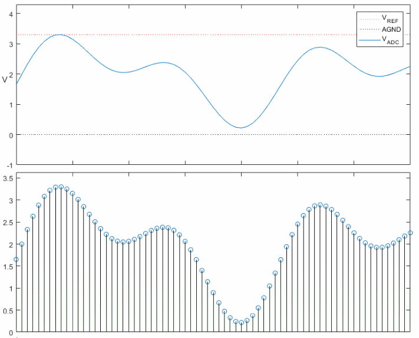 |
|:--:|
| *ADC: Analoog signaal (boven) en sampling (onder)* |

Deze metingen of *samples* moet je dan telkens onderbrengen in een getal van een **beperkt aantal bits**: *quantisatie*. 
Daarbij moet er dus worden afgerond, en hoe kleiner het aantal bits, hoe groter natuurlijk de afrondigsfout. 
Het aantal bit waarmee wordt gecodeerd noemt men de *resolutie* van de ADC. 
Onze ADC heeft een resolutie van 10 bit en produceert dus een meetresultaat tussen 0 en 1023 (2<sup>10</sup> -1). 
Voor een referentiespanning van 3.3V is elke tussenstap dan 3300mV / 1024 = 3.22mV, wat men ook wel eens de 
grootte van de laatste bit (LSB) noemt. 

| 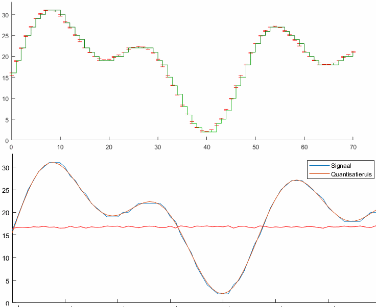 |
|:--:|
| *ADC: Quantisatie met 5 bit & afrondingsfout (boven) en eindresultaat = ingangssignaal + ruis (onder)* |

In de praktijk komt dat erop neer dat je door het quantiseren **ruis** introduceert in het resultaat. 
Hoe hoger de resolutie, hoe minder ruis in de meting en hoe groter de theoretisch mogelijke *signal-to-noise ratio (SNR)*. 

# SPI-bus
De *Serial Peripheral Interface* (SPI) is een *synchrone, seriële, master/slave interface* tussen ten minste twee 
devices. SPI werd ontwikkeld in de late jaren '80 door Motorola en is ondertussen een veel gebruikte interface, 
hoewel er geen officiële standaard voor bestaat. 

**Synchroon** betekent dat frequentie van de verschillende devices wordt gesynchroniseerd of gelijkgesteld met elkaar 
via een extern kloksignaal, in dit geval geleverd door de master. 

**Serieel** houdt nog steeds in dat de data bit per bit na elkaar over één draad wordt verstuurd. De communicatie is 
full-duplex, er kan dus tegelijk data ontvangen en verstuurd worden, waar in dit geval aparte geleiders voor gebruikt worden. 

Het **master/slave**-concept ken je al van bij 1-Wire: er is altijd één master met eventueel meerdere slaves, waarbij de 
master altijd de transmissie moet initiëren zodat er geen conflicten kunnen ontstaan. Om de slaves te onderscheiden wordt
er bij SPI echter geen gebruik gemaakt van adressen, per slave is er een **aparte geleider** die de master gebruikt om
de slave te activeren. Dat vormt een **nadeel voor het aansluiten van een groot aantal slaves**. Langs de andere kant 
is het handig voor devices die maar af en toe moeten werken, de lijn kan dan tevens dienst doen als *sleep*- of
 *shutdown*-signaal.

| 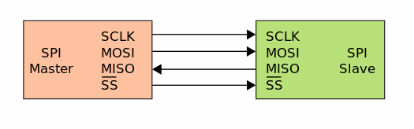 |
|:--:|
| *SPI-bus tussen master en slave* |

De SPI-bus bestaat dus uit vier draden en wordt daarom ook wel een vierdraads seriële bus genoemd.  
Meerdere slaves kunnen gebruikt worden door het gebruik van de slave select lijn.

De vier gebruikte lijnen zijn:
- **SCLK**: Serial CLocK - kloksignaal, ook wel SCK
- **MOSI**: Master Out Slave In - data van master naar slave
- **MISO**: Master In Slave Out - data van slave naar master
- **SS**: Slave Select, ook wel CE (Chip Enable) of CS (Chip Select). 

In principe is per slave een aparte SS nodig en over het algemeen is die **active low**, d.w.z. in rust allemaal hoog 
en om een slave te activeren trekt de master de overeenkomstige SS laag. Dat wordt aangeduid met een 
**horizontale streep** boven de letters (alternatieve notatie voor logische NOT).

| 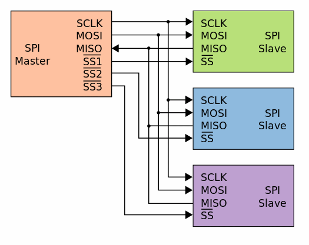 |
|:--:|
| *SPI-bus met slaves* |

## Werking 
Bij het begin van een transmissie trekt de master **één van de SS/CS/CE-lijnen laag** om de overeenkomstige slave te 
activeren. Om te kunnen communiceren moet de **master vervolgens een kloksignaal voorzien** op de SCK-lijn. 
Daarmee kan dan full-duplex data overgedragen worden: op de **leading edge** zet de master een bit klaar op MOSI,
en de slave eentje op MISO. Op de **trailing edge**, in de helft van de cyclus, wordt die bit dan door de andere kant 
ingelezen. 
> Welke edge (*rising* of *falling*) de *leading edge* is hangt er van af. Bovendien kan het kloksignaal bij SPI ook 
nog eens geïnverteerd worden - dat heb je dus als er geen echte standaard is. Hoe dan ook, het concept
blijft hetzelfde - versturen op de ene edge, inlezen op de andere. De rest is voor ons momenteel niet belangrijk. 

| 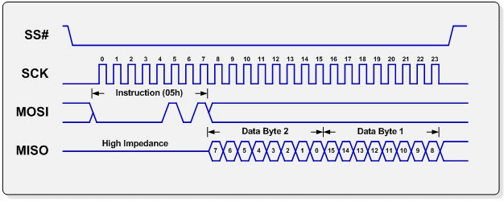 |
|:--:|
| *Tijdsdiagram: voorbeeld van een SPI-transmissie* |

Een tranmissie is **altijd full-duplex** - voor elke ontvangen bit wordt er eentje verstuurd en omgekeerd, ook als 
eigenlijk maar simplex communicatie nodig is. 
Vaak, zoals ook straks met de MCP3008, valt er namelijk niets full-duplex te versturen - de master 
stuurt een commando en de slave kan pas daarna antwoorden met het resultaat. Straks zal je zien dat we daarom nullen 
blijven doorsturen tot alle data ontvangen is. In dat geval worden deze bits op het tijdsdiagram meestal
aangeduid als *don't care* (X).

De transmissie kan blijven doorgaan tot alle data verstuurd is, afhankelijk van het protocol van de slave. 
Nadien stopt de master het kloksignaal en trekt de *slave select*-lijn weer hoog. 
Als er maar één slave is, kan diens slave-select signaal eventueel gewoon met massa verbonden worden *als de slave dat 
ondersteunt* (niet altijd het geval!).

### Push-pull outputs
Bij de 1-Wire bus hebben we kennisgemaakt met *open-collector outputs*. Herinner je dat we een externe pull-up moesten
aansluiten om de bus in rust hoog te brengen, slaves konden die dan via hun uitgangstransistor naar massa trekken. Zo 
werden elektrische conflicten vermeden. 

Voor de SPI-bus gebruikt men echter conventionele **push-pull uitgangen**. Die kan je voorstellen als bestaande uit 
twee transistors met omgekeerde polariteit, bv. NPN en PNP. 

| 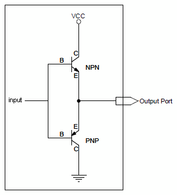 |
|:--:|
| *Conceptuele voorstelling van een push-pull uitgang* |

De werking van de NPN-transistor ken je al: door spanning aan de basis aan te leggen gaat de transistor in geleiding en 
kan stroom *van Collector naar Emitter* vloeien. De **PNP-variant werkt net omgekeerd** en gaat in dat geval in sper.
Wanneer de *input* op het schema dus hoog is, wordt de *output* verbonden met V<sub>CC</sub> terwijl de weg naar massa 
wordt geblokkeerd. Het is als het ware een *actieve pull-up* en resulteert in een hoog niveau op de bus.

Als de *input* daarentegen laag (0) is, gaat de bovenste transistor in sper en verdwijnt de pull-up naar V<sub>CC</sub>. 
De PNP-transistor onderaan gaat nu echter wél in geleiding, wat stroom toelaat *van Emitter naar Collector* te vloeien. 
De output-pin is nu dus verbonden met massa en de bus blijft laag. 

Push-pull schakelingen van twee transistors worden niet alleen gebruikt voor digitale uitgangen maar ook als versterker
voor analoge signalen. De ene transistor versterkt dan de positieve helft van de golf, de andere de negatieve en achteraf
worden de twee samengevoegd. 

Herinner je dat er over een transistor ook in geleiding nog een kleine spanning staat. Voor een versterker die 
het signaal onvervormd versterkt of een uitgang die volledig naar 0/V<sub>CC</sub> kan gaan komt er dus nog iets meer 
bij kijken.

| 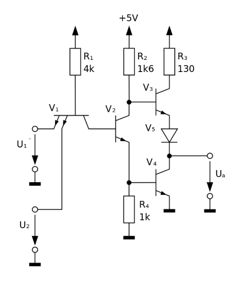 |
|:--:|
| *Uitgangsschakeling van een TTL-chip (ter illustratie)* |

Met push-pull uitgangen krijg je een veel zuiverder signaal op de bus, bijgevolg kan SPI veel hogere snelheden aan dan 
bv. 1-Wire (meestal meerdere MHz, maar het protocol legt zelf geen snelheden vast). Het nadeel is dus dat je elektrische 
conflicten krijgt als de ene "pullt" terwijl de andere "pusht". Vandaar dat SPI aparte lijnen voor verzenden/ontvangen 
heeft en het *slave select*-mechanisme nodig is om conflicten op de bus te vermijden.

Bijgevolg is SPI:
- de **snelste** van de bussen die we dit semester tegenkomen
- het **minst geschikt voor grote aantallen slaves** op dezelfde bus

## Raspberry Pi
De BCM2837 van de Raspberry Pi 3 beschikt over 3 SPI-controllers, waarvan eentje echter al gebruikt wordt voor de 
SD-kaart. 

| 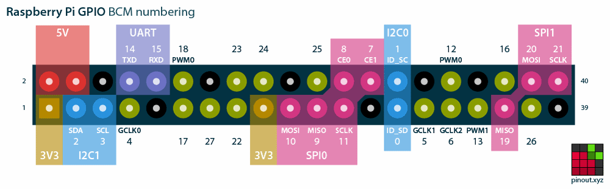 |
|:--:|
| *Raspberry Pi 3 pinout: SPI in het roze* |

Via `raspi-config` kan je enkel de eerste (SPI0) activeren, wat voor ons ruimschoots volstaat. Zoals gewoonlijk kan 
hetzelfde in het configuratiebestand (`/boot/config.txt`):
```console
dtparam=spi=on
```
Na een reboot heb je een SPI-bus op volgende pins (normaalgezien ook zo aangeduid op het breakout board):
- **SCLK**: BCM.11
- **MOSI**: BCM.10
- **MISO**: BCM.9
- **SS/CE/CS**: BCM.8 (CE0) en BCM.7 (CE1), er kunnen standaard dus twee slaves aangesloten worden.

Meer details op <https://www.raspberrypi.org/documentation/hardware/raspberrypi/spi/README.md>.
 
Als je ooit de tweede bus nodig zou hebben kan dat ook weer met een *device tree overlay* in hetzelfde bestand. 
Daarbij moet je aangeven hoeveel SS pins je wil gebruiken (1, 2, of 3), bv.:
```console
dtoverlay=spi1-1cs
```
Meer over het activeren van SPI1 op <http://terminal28.blogspot.be/2016/05/enabling-spi1-on-raspberry-pi-bzero23.html>.

## Python
In Python kunnen we gebruik maken van de package [spidev](https://pypi.python.org/pypi/spidev), normaalgezien is die 
al geïnstalleerd. Anders kan je dat opnieuw via PyCharm (Settings &gt; Project: Interpreter) of op de console: 
```console
me@my-rpi:~ $ source datacom/env/bin/activate
(env)me@my-rpi:~ $ python -m pip install spidev
```
In de package zit een klasse `SpiDev` die je moet instantiëren. Vervolgens kan je met de methode `open(bus, device)` een
slave kiezen. *Bus* is het nummer van de SPI-bus, in ons geval dus 0. *Device* is het nummer van de SS/CE/CS-lijn, 
standaard heb je op de RPi pins 8 en 9 (BCM) ter beschikking als CE0 en CE1. 
Terzijde: ook een SPI-device vind je weer als een bestand in Linux, in dit geval `/dev/spi<port>.<device>`.
```python
import spidev

spi = spidev.SpiDev()
spi.open(0, 0)        # Bus SPI0, slave op CE 0 
```
Nu heb je volgende methodes van `SpiDev` ter beschikking:
```python
bytes_in = spi.readbytes(n)         # leest n bytes en geeft die terug in een `list`
spi.writebytes(bytes_out)           # verstuurt bytes uit de `list` bytes_out
bytes_in = xfer(bytes_out)          # verstuurt de bytes in `bytes_out` en ontvangt er evenveel in `bytes_in`. 
                                    # tussen elke byte wordt SS/CE/CS kort gedeactiveerd.
bytes_in = xfer2(bytes_out)         # idem, maar tussen de bytes in blijft SS/CE/CS actief
```

# MCP300x
De MCP3004 en 3008 ([datasheet](../datasheets/w05_MCP3008.pdf)) zijn resp. 4- en 8-kanaals, 10-bit 
Analoog/Digitaal-Convertors (ADC) met SPI-interface, ontworpen door Microchip.
Aan deze ICs kunnen we dus 4 of 8 analoge sensoren aansluiten waarvan de ADC de spanning uitleest en omzet naar een 
10-bits digitaal getal dat we via de SPI-bus kunnen uitlezen. 

|  |
|:--:|
| *MXP3004/3008: blokschema en pinout* |

## Werking
Op het blokschema kan je de werking van deze *successive approximation ADC* zien:
De control logic van de chip verwacht een instructie van de master en selecteert daarop een analoog kanaal. De 
spanning op dat kanaal wordt dan vastgehouden in een *sample and hold*-circuit en de waarde van het 
*successive approximation register (SAR)* wordt geïnitialiseerd met de **MSB op 1 en al de rest 0**. De digitale waarde
zit zo dus in het midden van het mogelijke bereik.

Vervolgens wordt de waarde in het SAR door een *Digitaal/Analoog-converter (DAC)* weer omgezet naar een analoge spanning, 
rekening houdend met de referentiespanning V<sub>REF</sub>. 
Het resultaat wordt door een *comparator* vergeleken met de ingangsspanning en de uitgang daarvan bepaalt de nieuwe waarde 
van de bit in het register: als de ingangsspanning nog hoger is, moet deze bit zeker al 1 blijven. Is de ingangsspanning 
echter lager, zitten we met ons voorlopig resultaat te hoog en wordt deze bit een 0.

Vervolgens wordt hetzelfde proces doorlopen met de tweede bit, en zo verder tot de waarde in 
het SAR overeenkomt met (de digitale voorstelling van) de ingangsspanning. Het resultaat wordt tenslotte door de 
control logic uitgelezen en serieel op de SPI-bus gezet m.b.v. het *shift register* (waarover volgende week meer).

| 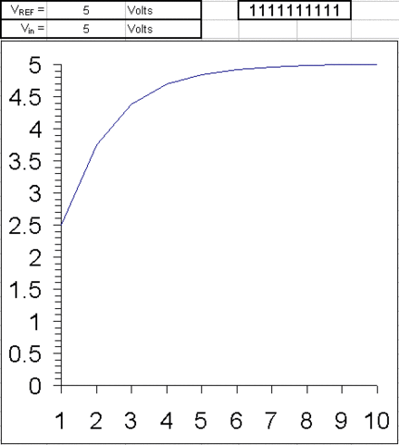 |
|:--:|
| *Verloop van het SAR-proces voor verschillende ingangsspanningen* |
 
## Pinout
- **CH0 - CH7:** Analoge ingangen. De MCP300x kan zowel de spanning op een kanaal uitlezen (*single ended*) als het 
verschil tussen twee (*differential*)
- **V<sub>DD</sub>:** Voedingsspanning (3.3-5V)
- **V<sub>REF</sub>:** *Referentiespanning* waarmee de spanning aan de analoge ingangen wordt vergeleken. Als je bv. 
een sensor hebt die 0-1V levert, kan je hier 1V aanleggen om toch van de volle resolutie van de ADC te kunnen profiteren. 
- **AGND:** *Analog ground*, massa voor het analoge gedeelte.
- **CLK:** *Kloksignaal* voor de SPI-bus
- **D<sub>OUT</sub>:** *Data OUT*, vanuit het zicht van de MCP welteverstaan, m.a.w. Master In, Slave Out (MOSI)
- **D<sub>IN</sub>:**  *Data IN* gezien vanuit de MCP, m.a.w. Master Out, Slave In (MISO)
- **CS/SHDN:** *Chip Select* (ook wel *Chip Enable*) voor de SPI-bus. Als de chip niet geslecteerd is schakelt hij 
zichzelf uit, de pin kan dus dubbel dienst doen als *SHutDowN*.
- **DGND:** *Digital ground*, massa voor het digitale gedeelte. 

> Microcontrollers en andere ICs trekken zeer onregelmatig stroom (met grote pieken bij elke klokpuls), wat storing 
(ruis) veroorzaakt op voedingsspanning en massa. Men voorziet daarom aparte V+ en GND pins voor het analoge en 
digitale gedeelte zodat beide delen indien nodig helemaal elektrisch gescheiden kunnen blijven. Wij verbinden ze echter
gewoon samen.

## Protocol
Communicatie met de MCP300x is in principe vrij eenvoudig: we sturen 4 *configure* bits die aangeven welke spanning 
moet worden gemeten, en daarop krijgen we 10 bits terug met de waarde. Meer commando's zijn er niet.

Van de 4 configure bits geeft de eerste (MSB) aan of we een enkele spanning (*single-ended* = 1) of het verschil 
(*differential* = 0) tussen twee ingangen willen meten. De resterende 3 bits duiden dan de ingang(en) aan (*channel*), 
in single ended mode dus gewoon het nummer 0-7. 

| S/D |  D2 |  D1 |  D0 |     mode     | input |
|:---:|:---:|:---:|:---:|:------------:|:-----:|
|  1  |  0  |  0  |  0  | single-ended |  CH0  |
|  1  |  0  |  0  |  1  | single-ended |  CH1  |
|  1  |  0  |  1  |  0  | single-ended |  CH2  |
|  1  |  0  |  1  |  1  | single-ended |  CH3  |
|  1  |  1  |  0  |  0  | single-ended |  CH4  |
|  1  |  1  |  0  |  1  | single-ended |  CH5  |
|  1  |  1  |  1  |  0  | single-ended |  CH6  |
|  1  |  1  |  1  |  1  | single-ended |  CH7  |

In differential mode kan je 2 aangrenzende pins kiezen en telkens het verschil in twee richtingen meten:

| S/D |  D2 |  D1 |  D0 |     mode     |    input   |
|:---:|:---:|:---:|:---:|:------------:|:----------:|
|  0  |  0  |  0  |  0  | differential |  CH0 - CH1 |
|  0  |  0  |  0  |  1  | differential |  CH1 - CH0 |
|  0  |  0  |  1  |  0  | differential |  CH2 - CH3 |
|  0  |  0  |  1  |  1  | differential |  CH3 - CH2 |
|  0  |  1  |  0  |  0  | differential |  CH4 - CH5 |
|  0  |  1  |  0  |  1  | differential |  CH5 - CH4 |
|  0  |  1  |  1  |  0  | differential |  CH6 - CH7 |
|  0  |  1  |  1  |  1  | differential |  CH7 - CH6 |

Een commando naar de MCP300x moet eerst worden voorafgegaan door een 
*startbit* (=1), vervolgens worden de 4 configuratiebits gestuurd. Na ontvangst heeft de ADC even tijd nodig om zijn 
werk te doen, de volgende bit wordt er dus nog niets teruggestuurd. Daarna komt eerst nog een *null-bit* (=0) en 
vervolgens wordt het resultaat teruggestuurd in 10 databits. Dat ziet er dan zo uit:

| 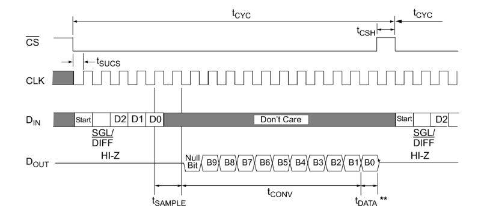 |
|:--:|
| *Communicatie met de MCP300x: tijdsdiagram* |

Merk op dat de SS/CE/CS-lijn gedurende de hele operatie **actief blijft**.

### Communicatie met de Raspberry Pi

Herinner je dat SPI full-duplex is: er wordt telkens een bit verstuurd op de *leading edge* en eentje ingelezen op de 
*trailing edge* van elke klokcyclus. De RPi werkt over SPI echter niet per bit maar met volledige bytes. 
Even optellen:
- 1 startbit (Tx)
- 4 configuratiebits (Tx)
- 1 klokcyclus wachten
- 1 null-bit (Rx)
- 10 bits resultaat (Rx)

Maakt samen 17 bits, of net te veel voor 2 bytes, dus moeten we per meting telkens **3 bytes (B0-B2) versturen en 
ontvangen**. 

|  |
|:--:|
| *Communicatie met de MCP300x in bytes* |

We versturen 3 bytes:
- B0 met enkel maar de startbit als LSB, deze byte is dus altijd `1` 
- B1 *begint* met de 4 configuratieebits: single/diff als MSB en dan 3 bits voor het kanaal. De overige 4 bit 
maken niet meer uit en laten we 0
- B3 dient enkel nog om de transmissie gaande te houden en mag gewoon `0` blijven

> **Commandobyte (B1) samenstellen:** Stel dat je kanaal 3 wil uitlezen, single-ended dus S/D = 1. 
> - De S/D-bit is b7, die zet je meteen op de juiste plek in de byte: `0b10000000` = `0x80` (= `1 << 7`). 
> - Het kanaal is gewoon het getal `3`, maar dan in b6-b4. We moeten het getal dus 4 bits naar links shiften: `3 << 4`. 
> - Het resultaat voeg je toe aan de byte met `|` (OR): `0x80 | 3 << 4`

En ontvangen 3 bytes:
- B0 die niets bevat dat ons interesseert 
- B1 die de 2 *MSBs* van het resultaat heeft als zijn 2 *LSBs* 
- B2 met de resterende 8 bits van het resultaat 

> **Om de 10-bit meting terug te halen:** 
> - eerst moet je de twee LSBs uit B1 filteren, we kunnen er namelijk niet zomaar van uit gaan dat de andere bits 0 zijn: 
`B1 & 3`. 
> - Die twee bits zijn b9 en b8 van de meting, vervolgens schuif je die dus naar de juiste plek, : `(B1 & 3) << 8`. 
> - nu zijn de 8 LSB nul en kan je met een OR de resterende bits (van B2) erin plakken: `(B1 & 3) << 8 | B2`

De CS (SS/CE)-lijn moet je niet zelf activeren, dat regelt `spidev`. Merk wel op dat de lijn in het tijdsdiagram 
gedurende de hele operatie actief blijft, je **moet dus de methode `xfer2()` gebruiken die de lijn actief houdt.**.
```python
bytes_in = spi.xfer2(bytes_out)  #  bytes_in/out zijn er in ons geval dus 3, SS blijft de hele tijd hoog
```

# Servomotor
Ter herinnering: servo's verwachten een PWM-signaal met een periode van **20ms**, waarbij de breedte van de puls 
varieert **van 1 tot 2ms**. Je kan erven van de klasse `PwmPin` van week 3 om dit te implementeren. 

| 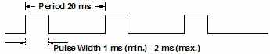 |
|:--:|
| *PWM-controlesignaal voor een servomotor* |

De servo zal een pulsbreedte tussen 1 en 2ms omzetten in een hoek tussen -90&deg; en +90&deg;.

---

# Opdracht
> De tekst tussen """ in het begin van een klasse/functie is een *docstring*, daarmee kan je automatisch documentatie 
genereren. Hier is de bedoeling vooral dat *:param <name>:* en *:return:* verduidelijken wat de inhoud van 
de parameters is en wat de functie zou moeten teruggeven.
1) Schakeling 
    - verbind de MCP3008 met SPI0 van de RPi (SCLK, MOSI, MISO en CE0)
    - verbind AGND en DGND met massa, V<sub>DD</sub> en V<sub>REF</sub> met 3.3V
    - sluit een trimmer aan op CH0 van de ADC
2) Configuratie
    - enable SPI via `raspi-config` of in `/boot/config.txt`
    - reboot!
    - `spidev` zou al moeten geïnstalleerd zijn, je kan dat makkelijkst checken via PyCharm 
    (`Settings > Project ...: > Interpreter`)
3) Testapplicatie 
    - vervolledig de functie `read_trimmer` om ch0 uit te lezen:
        - initialiseer een SpiDev-object
        - open bus 0, device 0 
        - stel de commandobyte samen (niet zo moeilijk gezien het CH0 is!)
        - maak een list met de 3 commandobytes, verstuur die en krijg 3 bytes terug
        - haal daar de meetwaarde (0-1024) uit en druk ze af
        - verfieer dat de waarde klopt door aan de trimmer te draaien!
4) Meetwaarde omzetten
    - vervolledig de functie `value_to_volt` om een 10-bit meting om te zetten naar een spanning van 0 tot 3.3V
    - vervolledig de functie `value_to_percent` om een 10-bit meting om te zetten naar percentage van 0 tot 100, 
    rond af tot 1 cijfer na de komma
    - test beide functies weer a.d.h.v. de trimmer
5) Klasse voor de ADC
    - vervolledig de init-functie: 
        - maak een spi-object en hou het bij in een membervariabele
        - open `bus, device` 
    - vervolledig de functie read_channel om een willekeurig kanaal in te lezen 
        - de meeste code heb je daarnet al voor `read_trimmer` geschreven, je moet enkel nog zorgen dat 
        het kanaalnummer mee in het commando geraakt
    - sluit om te kunnen testen een tweede analoge sensor (bv. lichtsensor + spanningsdeler) aan op een ander kanaal
    - CHALLENGE: implementeer ook differentiele metingen
6) Servomotor
    - sluit een servomotor aan (gebruik een aparte bron voor de voeding)
    - vervolledig de klasse `ServoMotor`:
        - roep de init-functie van de superklasse aan met de juiste PWM-frequentie
        - vervolledig de methode `set_angle()` zodat de duty cycle correct wordt ingesteld voor een hoek 
        tussen -90&deg; en 90&deg;
    - vervolledig te functie `value_to_angle` die een analoge waarde van de ADC (0-1023) omzet naar een hoek 
    tussen -90&deg; en 90&deg;
    - schrijf code om klasse en functie te testen - vergeet niet dat je het PWM-signaal moet aanhouden tot de servo
    op positie is (bv. met een `sleep()`)
    
# Schakelschema


