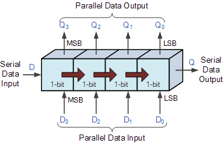
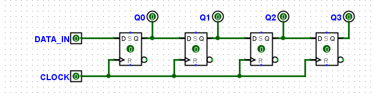
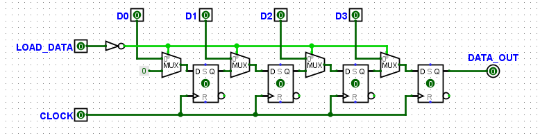
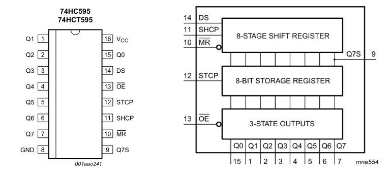
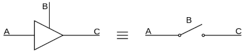
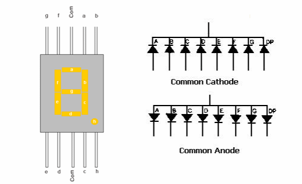
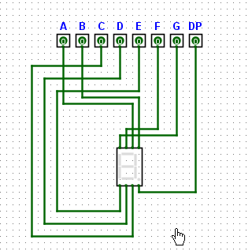
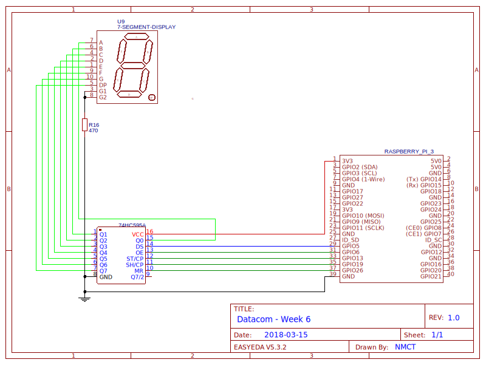
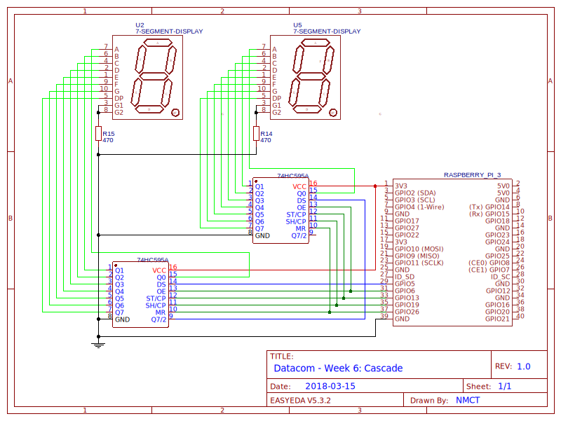

# Week 6: Shift Register en 7-Segment Display
## Inleiding
In de vorige lessen hebben we al uitvoerig kennis gemaakt met seriële communicatie, maar tot dusver hebben we altijd
gebruik gemaakt van libraries die het omzetten van parallel naar serieel voor ons deden. Deze week sluiten we een 
*shiftregister* aan waar we zélf serieel data naar moeten doorklokken. Op die manier zie je hoe dat in z'n werk gaat 
en bovendien is het een handige manier om een (of meer) 7-segmentdisplay(s) aan te sluiten zonder daarvoor meteen alle
GPIO-pins te moeten opofferen. 

### Doelstellingen 
- Werking en gebruik van een shiftregister
- Aansturen van een 7-segment display
- Gebruik van bitoperaties om over bits te itereren

### Voorkennis
- Vorige practica:
    - Bitoperaties: masks, set bits, shift
    - Seriële communicatie

### Aandachtspunten
- Bitoperaties: itereren over een byte
- Splitsen van decimale getallen in cijfers

---

# Shiftregisters
Een *shiftregister* vormt de basis voor alle seriële interfaces omdat het parallele data kan omvormen naar serieel en 
omgekeerd. Er bestaan verschillende types, maar allemaal hebben ze gemeenschappelijk dat ze zijn opgebouwd uit een 
aantal **1-bit geheugencellen *(flip-flops)* achter elkaar** waar bits 1-per-1 kunnen **doorschuiven** op het ritme 
van een **kloksignaal**. 
Hieronder zie je de conceptuele voorstelling van een *universeel shiftregister* dat zowel van serieel naar parallel kan 
omzetten als omgekeerd.
 
|  |
|:--:|
| *Universeel shiftregister* |
 
Voor een seriële interface zijn vooral twee soorten van belang:

**Serial In/Parallel Out (SIPO)** shiftregisters krijgen een seriële stroom van bits binnen die worden opgeslagen 
en via een aantal uitgangen parallel worden uitgelezen. Zo'n register zal dus langs ontvangstzijde nodig zijn om data te
in te lezen en als bytes door te geven aan het systeem. Dit soort register gaan we ook vandaag gebruiken. 

|  |
|:--:|
| *SIPO shiftregister* |

**Parallel In/Serial Out (PISO)** shiftregisters kunnen parallel met een aantal bits "geladen" worden, die vervolgens
via de seriële uitgang naar buiten geshift worden. Zo'n register zal dus langs de verzendkant gebruikt worden. Omdat 
de parallele ingangen conflicten zouden kunnen veroorzaken zit het iets ingewikkelder in elkaar, er moet namelijk 
gekozen worden tussen parallel inlezen of doorshiften.

|  |
|:--:|
| *PISO shiftregister* |

> Om zelf met deze logische schakelingen te experimenteren, kan je het 
[bijgevoegde bestand](circuits/week06_shiftregister.circ) openen met 
[LogiSim Evolution](https://github.com/reds-heig/logisim-evolution).

# 74HC595
De 74HC595 ([datasheet](../datasheets/w06_74HC595.pdf)) is een high-speed 8-bit serial in/parallel out (SIPO)
shiftregister met extra storage register en 3-state outputs. Het beschikt m.a.w. over 1 ingang voor seriële data
en 8 parallelle uitgangen die gekoppeld zijn aan een extra register waarin een byte kan worden opgeslagen
terwijl de volgende in het shiftregister binnenkomt. 

|  |
|:--:|
| *74HC595: pinout en blokschema* |

## Pinout
- **Q0 - Q7**: Parallel Data OUT (let op, Q0 zit apart aan de rechterkant!)
- **D<sub>S</sub>**: Serial Data IN, op deze pin komen de bits die achtereenvolgens in het register worden
geshift.
- **Q7S**: Serial Data OUT, hier wordt de laatste bit "naar buiten geshift", kan dus dienen om meerdere shiftregisters
achter elkaar te hangen in *cascade*
- **OE (active low)**: Output Enable, door deze *hoog* te trekken worden de uitgangen uitgeschakeld (high-Z)
- **SH<sub>CP</sub>**: SHift register CoPy, bij elke **rising edge** op deze pin wordt een nieuwe bit op D<sub>S</sub> 
ingelezen en alle andere een positie verder geshift
- **ST<sub>CP</sub>**: STorage register CoPy, bij een **rising edge** op deze pin wordt de huidige inhoud van het 
*shift register* gekopieerd naar het *storage register*
- **MR (active low)**: Master Reset, als deze pin **laag** getrokken wordt, wordt de inhoud van het *shift register* gewist.
Om ook het *storage register* te wissen moet er daarna nog een rising edge op ST<sub>CP</sub> verschijnen!
*Let op: je **moet** deze pin **hoog** trekken als je wil dat het shift register iets doet!*

## Gebruik
|  |
|:--:|
| *Werking 74HC595: initialiseren, byte binnenshiften & bewaren, output enable/disable, reset* |

**Initialisatie**: voor je iets kan doen met het shiftregister moet je *master reset* (MR, active low) hoog trekken,
anders blijft de chip constant in reset-mode en gebeurt er niets. Alle andere ingangen blijven laag.

**Bits doorklokken**: bij elke *rising edge* op SHCP wordt de waarde van DS ingelezen en opgeslagen als b0 
van het shiftregister. De overige bits schuiven allemaal 1 plaats op en de waarde van b7 verhuist naar de uitgang Q7S.
Om een bit door te sturen moet je die dus eerst klaarzetten op DS, vervolgens SHCP van laag naar hoog brengen en even 
wachten voor je hem weer laag brengt in afwachting van de volgdende bit.

```python
output(DS, bit)                 # bit klaarzetten
output(SHCP, HIGH)              # rising edge - we gaan ervan uit dat de pin altijd LOW wordt achtergelaten!
time.sleep(1 / FREQUENCY / 2)   # halve klokcyclus wachten
output(SHCP, LOW)               # falling edge - zorg dat de pin altijd weer LOW eindigt
time.sleep(1 / FREQUENCY / 2)   # tweede helft van de klokcyclus 
```

> Over het algemeen is Python traag genoeg, en de 74HC595 snel genoeg, dat je geen `sleep` nodig hebt tussen de outputs.
Voor de veligheid kan je ze beter wel zetten, er is een constantee `DELAY` voorzien in de opgave waarmee je achteraf 
makkelijk met de klokfrequentie kan experimenteren. 

**Storage register**: de inhoud van het shiftregister komt niet rechtstreeks op de uitgangen omdat je de bits daar dan 
ook zou zien "voorbij shiften" (zie animatie SIPO register boven), wat niet in alle gevallen wenselijk is. 
Daarom is er een apart "storage register" tussen de twee, waar je met een klokpuls op STCP de huidige toestand in kan
kopiëren om hem op de uitgangen te zetten. Dat gaat analoog aan het pulsen van SHCP:
```python
output(STCP, HIGH)              # rising edge - we gaan ervan uit dat de pin altijd LOW wordt achtergelaten!
time.sleep(1 / FREQUENCY / 2)   # halve klokcyclus wachten
output(STCP, LOW)               # falling edge - zorg dat de pin altijd LOW eindigt
time.sleep(1 / FREQUENCY / 2)   # tweede helft van de klokcyclus 
```
**In principe moet je dus telkens 8 bit doorklokken, en vervolgens kopiëren naar het storage register.** Om te 
experimenteren kan je dat natuurlijk ook al eerder eens doen.

**Reset**: als de MR-pin laag wordt, wordt de volledige inhoud van het *shift register* gewist, maar niet het *storage 
register*! Om dat ook te wissen moet je de (lege) inhoud ook weer kopiëren met een puls op STCP.

**Output Enable**: De 74HC595 is voorzien van **3-state outputs**, d.w.z. dat de uitgangen in een staat van 
*hoge impedantie (hi-Z)* kunnen geplaatst worden, zeg maar afgekoppeld. Daarvoor moet je de OE-pin **hoog** brengen.

|  |
|:--:|
| *3-state of tri-state outputs kan je beschouwen als uitgangen met een extra schakelaar die de uitgang afkoppelt van de bus* |

## Cascadeschakeling
De laatste bit, die in principe zou wegvallen, wordt na een puls op SHCP ter beschikking gesteld op de uitgang Q7S. Die kan je verbinden met
de ingang (DS) van een volgend shiftregister, en op die manier een *cascade* (waterval) schakeling maken om zo één groot 
register te maken. MR, OE, SHCP en STCP kan je gewoon doorverbinden en bespaart op die manier dus mogelijks een hele hoop 
pins. 

Het geheel werkt dan echt als één groot register, i.p.v. om de 8 bits moet je dus maar **om de 16 (of 24, 32, ...) bits
een puls op STCP** geven om meteen de hele rits in alle registers te kopiëren!

# 7-Segmentdisplay
Een 7-segmentdisplay is een display dat bestaat uit 8 segmenten :-). Achter elk segment zit een LED verwerkt die je apart kan 
laten branden, er is dus voor elk een aparte pin. De resterende twee pins worden door alle segmenten gedeeld. Er bestaan twee 
types displays, die met gemeenschappelijke *anode* en die met gemeenschappelijke *kathode* (remember 
KNAP! *Kathode Negatief Anode Positief*). De 7 segmenten worden in wijzerzin genummerd van A tot F, het punt 
rechts onderaan wordt aangeduid als DP.

**Let op: de meeste (en onze) 7-segmentdisplays bestaan enkel uit LEDs, weerstanden moeten nog extern worden 
aangesloten!** 

|  |
|:--:|
| *7-segmentdisplay: Common Anode vs. Common Cathode* |

**Common cathode**-displays werken de gekende manier, je brengt de uitgang waar het segment mee verbonden is **hoog** 
om het te laten branden en de stroom vloeit via de gemeenschappelijke kathode terug naar massa (vergeet geen weerstand!).

**Common anode** versies worden daarnetegen via hun anode met de voedingsspanning verbonden, om een segment te laten 
branden breng je dan de overeenkomstige uitgang **laag** zodat de stroom *naar* de GPIO-pin (of in dit geval shiftregister) 
kan vloeien.

De displays in jullie kit (5161AS, [datasheet](../datasheets/w06_5161AS.pdf)) zijn er 
normaalgezien van de strekking *common cathode*, maar vergelijk voor de zekerheid het typenummer dat erop is gedrukt 
en zoek zo nodig het datasheet op of vraag hulp.

In principe moet je **per segment een aparte weerstand** voorzien om te stroom te beperken. Als je de weerstand namelijk 
op de gemeenschappelijke pins zet, beperk je ook de stroom voor alle segmenten samen. Bijgevolg verschilt de intensiteit
van elk segment naargelang hoeveel er in totaal branden. Om niet te veel tijd te verliezen werken we **in het labo met 
één weerstand** op de gemeenschapelijke kathode, indien je echter een 7-segmentdisplay in een project verwerkt kan je 
best 8 aparte weerstanden voorzien.

## Aansturing
Een 7-segmentdisplay werkt denkbaar eenvoudig, voor elk segment is er gewoon een pin:

|  |
|:--:|
| *Werking 7-segmentdisplay* |

De kunst zit 'm eerder in het omzetten van een getal naar de juiste combinatie van segmenten, dus dat lichten we even toe.
Om te beginnen moet je weten welke bit in het shiftregister overeenkomt met welk segment. Ofwel kan je 
de juiste pinnummering uitvlooien en zorgen dat A - F in de juiste volgorde verbonden is met Q0 - Q6, en DP met Q7. 
Ofwel kan je het display lukraak verbinden en achteraf uitzoeken welke bit welk segment doet oplichten. Hoe dan ook, 
vervolgens maak je best **voor elk segment een mask**. Stel dat segment A t.e.m. C mooi op nummer zit, maar daarna gaat
het fout en D hangt op Q7 en E op Q4:
```python
A = 1 << 0                      # << 0 is overbodig maar zo lijnt het mooi uit :)
B = 1 << 1
C = 1 << 2
D = 1 << 7
E = 1 << 4
...
DP = 1 << 5                     # en voor het puntje maken we natuurlijk ook een mask
```
Met deze masks is het veel makkelijker om een cijfer te vormen, voor een keer valt er
namelijk niets te berekenen maar moet je manueel een *look-up table* (LUT) samenstellen.
```python
SEGMENTS = {                 
    0: A | B | C | D | E | F,
    1: B | C ,
    ...
}
```
Vervolgens kan je met de LUT makkelijk getallen opzoeken:
```python
shiftreg.write_byte(SEGMENTS[7])  # stuurt de (hopelijk) juiste bits voor het cijfer 7
``` 
> Merk op dat je deze `dict` precies gebruikt alsof het een `list` was, wat veel efficiënter zou zijn. Maar
deze manier maakt de code wel leesbaarder en overzichtelijker om bv. een bepaald cijfer in de LUT te verbeteren...

---
# Opdracht
1. Schakeling 
    - verbind het shiftregister (DS, SHCP, STCP, MR, OE) met de Raspberry Pi
    - verbind de uitgangen (Q0 - Q7) van het shiftregister met de ingangen (A t.e.m. G + DP) van het 7-segmentdisplay. 
    Je hoeft niet noodzakelijk dezelfde volgorde te gebruiken.
    - plaats een weerstand tussen de GND-pins van het 7-segmentdisplay en massa. 
    **Let op dat je niet 1 van beide pins rechtstreeks verbindt!**
2. Basisfunctionaliteit
    - `__init__`: 
        - stel alle pins in als uitgang 
        - zet alle pins op `LOW`
        - zet vervolgens de MR-pin `HIGH`, anders zal het register niets doen
    - `write_bit`:
        - zet de waarde van de bit (`value`) klaar op de DS-pin
        - geef een klokpuls op SHCP om de bit door te klokken: `LOW` -> sleep(DELAY) -> `HIGH` -> sleep(DELAY)
    - `copy_to_storage_register`:
        - geef op dezelfde manier een klokpuls op STCP
    - Nu kan je al eens testen door manueel een paar bits door te klokken en op te slaan
3. Bytes doorklokken: `write_byte`
    - gebruik bitoperaties om b7-b0 van `value` te overlopen en telkens door te sturen via `write_bit`
    - Let op: je moet de bits van MSB naar LSB overlopen - dus niet gewoon copy/paste van het 
    [voorbeeld](bitoperaties.md#bits-in--en-uitshiften)! Hint: Maak een *mask* en shift die i.p.v. de byte zelf. 
    - Test of de methode werkt zoals verwacht
4. 7-segmentdisplay
    - pas de variabelen `A` - `F` en `DP` aan zodat ze overeenkomen met de juiste uitgang van het shiftregister.
    - nu kan je de cijfers in `SEGMENTS` vervolledigen door de juiste segmenten te combineren met een *OR*
    - test uit of alle cijfers kloppen
5. Klasse `SevenSegment`
    - methode `show_segments` 
        - `value` is een byte die overeenkomt met de segementen die moeten oplichten
        - in `self.shreg` zit al een `ShiftRegister`-object (zie gegeven `__init__`) om te gebruiken
        - klok de byte door en sla hem op 
        - zet de uitgangen aan, implementeer daarvoor de property `output_enabled` van `ShiftRegister`
    - methode `show_number`:
        - `value` is een getal tussen 0 en 0xF, haal de overeenkomstige byte op uit `SEGMENTS` 
        - als `with_dp` `True` is moet je daaarin ook nog de bit voor het puntje (DP) aanzetten
        - nu kan je `show_segments` gebruiken om het cijfer op de display te tonen
6. CHALLENGE: Cascadeschakeling
    - werk samen met een klasgenoot zodat je 2 shiftregisters en displays kan gebruiken, of vraag een extra aan de docent.
    - schakel de registers in cascade (zie [schema](#cascade-met-2-displays)). *Tip: werk best big-endian (eerste shiftregister voor de tientallen, 
    tweede voor de eenheden), dat maakt de code makkelijker.*
    - vervolledig de klasse `SevenSegmentCascade`:
        - begin om te testen met de methode `show_list` die gewoon achtereenvolgende bytes uit een `list` doorstuurt 
        - vervolledig dan `show_hex_digits`
        - voor `show_decimal_digits` moet je `value` in decimale cijfers kunnen splitsen: zie bijgewerkt 
        [document bitoperaties](bitoperaties.md#decimale-getallen).
7. Afwerking    
    - vervolledig de resterende methodes van de klasse `ShiftRegister`

# Schakelschema


## Cascade met 2 displays

