# Week 7: I<sup>2</sup>C en IMU
## Inleiding
De I<sup>2</sup>C-bus is de meest gebruikte bus voor het aansluiten van sensoren en het verbinden van uiteenlopende 
ICs in een systeem. Deze week maken we kennis met het protocol en sluiten een *Inertial Measurement Unit* aan waarmee
we de oriëntatie van een device kunnen bepalen.

### Doelstellingen 
- Werking en gebruik van de I<sup>2</sup>C-bus
- Manipuleren van registers
- Werken met 2-complement

### Voorkennis
- Vorige practica:
    - Bitoperaties

### Aandachtspunten
- I<sup>2</sup>C protocol 
- I<sup>2</sup>C lees- en schrijfoperaties

---
    
# I<sup>2</sup>C
De *Inter-Integrated Circuit (I<sup>2</sup>C, I-squared-C)*-bus is een **synchrone, multi-master/multi-slave, tweedraads
seriële bus** bus ontwikkeld in 1982 door Philips (nu NXP). Hij werd ontwikkeld en nog steeds gebruikt voor het 
aansluiten van relatief trage externe ICs aan een microcontrollers op hetzelfde PCB of over korte afstanden. Sinds de 
jaren '90 zijn er van verschillende fabrikanten heel diverse ICs op de markt met I<sup>2</sup>C-interface en sinds 2006
zijn voor het gebruik geen licentierechten meer verschuldigd. 

|  |
|:--:|
| *I<sup>2</sup>C bus* |

I<sup>2</sup>C heeft twee draden, een **kloksignaal (SCL)** voor synchronisatie en een **bidirectionele datalijn (SDA)**. 
Het kloksignaal heeft standaard een frequentie van **100kHz**, latere versies brachten ook snelheden van 400kHz en 1MHz.

Om meerdere devices te kunnen aansluiten wordt met **open-collector (a.k.a. open-drain) outputs** gewerkt, beide zijn 
dus **hoog in rust** en kunnen door een device enkel laag getrokken worden. We hoeven geen externe pull-up weerstand
aan te sluiten maar gebruiken de in de GPIO-pins ingebouwede. In principe zijn ook meerdere masters op 
dezelfde bus mogelijk, dit wordt echter door weinig devices ondersteund. 

Om slaves op de bus van elkaar te onderscheiden wordt gewerkt met **7-bit adressen**, in latere versies zijn ook 
10 bits mogelijk maar ook dit wordt weer door weinig chips ondersteund. Dat maakt 127 mogelijke adressen, waarvan er 
nog een aantal gereserveerd ziin, dus veel te weinig om een uniek adres voor elke chip te voorzien, 
Het adres zal dus afhangen van het model van de IC en is te vinden in het datasheet. 
Vaak zijn er een paar adressen waar je tussen kan kiezen door een of meer pins van de chip hoog/laag te verbinden, 
zo kan je eventueel toch meerdere devices van hetzelfde type aansluiten. 

## Protocol
De bus is in rust hoog, voor communicatie wordt **door de master een kloksignaal gegenereerd op SCL**. Een transmissie
begint vervolgens steeds met een **START**-conditie en eindigt met een **STOP**-conditie. 

Datatransfers gebeuren **steeds per byte**, serieel met de **MSB eerst**. De eerste byte bevat het 7-bits slave-adres, 
aangevuld met de **R/W**-bit als LSB die aangeeft of het een lees- (1) of schrijfoperatie (0) betreft. 
Deze en alle volgende bytes worden telkens door de ontvanger  bevestigd met een *acknowledge* (**ACK**), 
of bij een storing met een **NAK**. 
Er is in principe geen beperking op het aantal bytes in een transmissie, in de praktijk soms wel. 
Na de afsluitende stopconditie eindigt de bus weer met een hoog niveau op beide lijnen.

|  |
|:--:|
| *I<sup>2</sup>C protocol* |

### START- en STOP-condities
Net als het kloksignaal worden de START/STOP condities steeds gegenereerd door de master. Deze condities
zijn **te herkennen aan een transitie op SDA terwijl SCL hoog is**. SDA gaat dan **van hoog naar laag voor een START** 
en **van laag naar hoog voor een STOP**. 
Die volgorde is ook logisch als je weet dat de bus in rust hoog is dankzij de open-collector outputs!

|  |
|:--:|
| *I<sup>2</sup>C: START en STOP* |

### Data en ACK/NAK
Voor het overige zijn er **enkel transities op SDA terwijl SCL laag is**, uiteraard om het onderscheid te kunnen maken 
met START/STOP. Databits worden bijgevolg op SDA gezet na de *falling-* en ingelezen na de *rising edge* van SCL.
Een 1 wordt voorgesteld door SDA hoog te laten, een 0 door de lijn laag te trekken. 

|  |
|:--:|
| *I<sup>2</sup>C: transmissie van 1 byte* |

Na elke byte moet de ontvanger **bevestigen met een extra bit**, daarvoor moet de master dus nog een extra klokpuls 
genereren. De slave zal dan **SDA laag trekken voor een ACK** of, indien er iets is misgegaan, **hoog voor een NAK**. 
Ook deze transitie moet weer gebeuren terwijl SCL laag is! 

### Samengevat
- START > Adres + R/W > ACK > DATA > ACK > ... > ACK > STOP
- **enkel** START en STOP hebben een transitie op SDA terwijl SCL hoog is
- in rust is de bus hoog, bijgevolg: SDA 1->0 == START, SDA 0->1 == STOP
- databits en ACK hebben hun transities terwijl SCL laag is
- na elke byte volgt ACK/NAK; SDA 0 == ACK, 1 == NAK
- na de laatste ACK volgt een STOP

## Communicatie met I<sup>2</sup>C-devices
Na de START-conditie stuurt de master het adres van een slave, aangevuld met de R/W-bit. Wanneer een slave op de bus 
zijn adres herkent, zal hij daarop reageren met een ACK. Vrijwel alle I<sup>2</sup>C-devices zijn opgedeeld in een 
aantal **8-bit registers** waar je naar kan schrijven en/of uit lezen. De tweede byte zal dus bestaan uit het 
registeradres dat je wil aanspreken, waarop de slave weer bevestigt of dat adres geldig is met een ACK of NAK. 

### Schrijven naar een (of meer) registers 
Schrijven naar een register is eenvoudig. Na het slave- en registeradres volgt een derde byte met de waarde die in het 
register moet komen, die ook weer bevestigd wordt met een ACK. Daarna kan de master eventueel nog meer bytes sturen, 
die dan naar de opeenvolgende registers worden geschreven. Om de transmissie te beëindigen genereert de master na de 
laatste ACK een STOP-conditie, waardoor de bus weer in rusttoestand (hoog) eindigt.

|  |
|:--:|
| *I<sup>2</sup>C schrijfoperatie* |

### Lezen uit (een) register(s)
Het lezen van data van een device is iets complexer. We moeten immers van start gaan met een schrijfoperatie zodat we 
eerst het registeradres dat we willen inlezen kunnen doorsturen. De master stuurt dus eerst het slave-adres met een 
write-bit (0), gevolgd door het registeradres dat moet worden ingelezen. 

Daarna stuurt de master een **repeated start**, dat is een START die volgt op een vorige START zonder dat er tussenin
een STOP is geweest. Vervolgens stuurt de master nogmaals het slave-adres, maar nu aangevuld met een read-bit (1).
Daarna zal de slave antwoorden met de gevraagde data. Het is nu de beurt aan de master om elke byte te
bevestigen met een ACK. Door een NACK te sturen, geeft de master aan dat dit de laatste byte was die hij wil
ontvangen. Daarna beëindigt hij zoals altijd de transmissie met een STOP-conditie.

|  |
|:--:|
| *I<sup>2</sup>C leesoperatie* |

## Toepassingen
Geheugenmodules (DIMMs) gebruiken I<sup>2</sup>C om hun parameters (timing e.d.) aan het systeem kenbaar te maken 
(SPD, *Serial Presence Detect*). HDMI-, DVI- en VGA-kabels bevatten een I<sup>2</sup>C-bus om hetzelfde te doen voor
beeldschermen (EDID, *Extended Display Identification Data*).

De **SMBus** (System Management Bus) is een uitbreiding op I<sup>2</sup>C met een beperkt aantal mogelijke transacties 
en striktere timing- en spanningsvereisten om betere interoperabiliteit tussen verschillende fabrikanten te verzekeren.
Het werd ontwikkeld door Intel en is vandaag op elk moederbord terug te vinden, o.a. PCI en PCI-Express voorzien een 
SMBus op hun pins.

## Raspberry Pi
Zoals gewoonlijk moet de I<sup>2</sup>C-controller van de RPi eerst geactiveerd worden via `raspi-config` of 
in `/boot/config.txt`: 
```console
dtparam=i2c_arm=on
```
> NB: I<sup>2</sup>S staat daar in `config.txt` vlak onder maar heeft er niets te maken! 
Het is een seriële interface voor geluid.

Na een reboot zou in `/dev` bus `i2c-1` moeten verschijnen:
```console
me@my-rpi:~ $ ls -l /dev/i2c*
crw-rw---- 1 root i2c 89, 1 Mar 24 01:39 /dev/i2c-1
```
Merk op dat het weer om een *character device* gaat en dat de groep `i2c` eigenaar is. Bijgevolg moet je daar lid van
zijn, dus controleer in geval van problemen:
```console
me@my-rpi:~ $ groups
me adm dialout cdrom sudo audio video plugdev games users input netdev gpio i2c spi nmct-box webdev
```

## Linux CLI
Linux heeft standaard support voor I<sup>2</sup>C en heeft ook een aantal tools daarvoor in de package `i2c-tools` die 
normaalgezien al geïnstalleerd is. Met `i2cdetect` kan je zien welke adressen op de bus reageren met een ACK. Met 
`i2cdump` kan je de volledige registerinhoud van een slave zien en met `i2cget` en `i2cset` kan je ook 
registers lezen en schrijven. 

> De tools vragen normaal altijd eerst om bevestiging, gebruik argument `-y` om dat te vermijden.
```console
me@my-rpi:~ $ apt list i2c-tools
Listing... Done
i2c-tools/stable,now 3.1.2-3 armhf [installed,automatic]

me@my-rpi:~ $ i2cdetect -y 1
     0  1  2  3  4  5  6  7  8  9  a  b  c  d  e  f
00:          -- -- -- -- -- -- -- -- -- -- -- -- --
10: -- -- -- -- -- -- -- -- -- -- -- -- -- -- -- --
20: -- -- -- -- -- -- -- -- -- -- -- -- -- -- -- --
30: -- -- -- -- -- -- -- -- -- -- -- -- -- -- -- --
40: -- -- -- -- -- -- -- -- -- -- -- -- -- -- -- --
50: -- -- -- -- -- -- -- -- -- -- -- -- -- -- -- --
60: -- -- -- -- -- -- -- -- 68 -- -- -- -- -- -- --
70: -- -- -- -- -- -- -- --

me@my-rpi:~ $ i2cdump -y 1 0x68
No size specified (using byte-data access)
     0  1  2  3  4  5  6  7  8  9  a  b  c  d  e  f    0123456789abcdef
00: ff 7f 81 4f c2 04 fa 12 03 2f 04 2a 28 6e 4d 93    .??O?????/?*(nM?
10: 4c 00 00 00 00 00 00 00 00 00 00 00 00 00 00 00    L...............
20: 00 00 00 00 00 00 00 00 00 00 00 00 00 00 00 00    ................
30: 00 00 00 00 00 00 00 00 00 00 00 00 00 00 00 00    ................
40: 00 00 00 00 00 00 00 00 00 00 00 00 00 00 00 00    ................
50: 00 00 00 00 00 00 00 00 00 00 00 00 00 00 00 00    ................
60: 00 00 00 00 00 00 00 00 00 00 00 40 00 00 00 00    ...........@....
70: 00 00 00 00 00 68 00 00 00 00 00 00 00 00 00 00    .....h..........
80: ff 7f 81 4f c2 04 fa 12 03 2f 04 2a 28 6e 4d 93    .??O?????/?*(nM?
90: 4c 00 00 00 00 00 00 00 00 00 00 00 00 00 00 00    L...............
a0: 00 00 00 00 00 00 00 00 00 00 00 00 00 00 00 00    ................
b0: 00 00 00 00 00 00 00 00 00 00 00 00 00 00 00 00    ................
c0: 00 00 00 00 00 00 00 00 00 00 00 00 00 00 00 00    ................
d0: 00 00 00 00 00 00 00 00 00 00 00 00 00 00 00 00    ................
e0: 00 00 00 00 00 00 00 00 00 00 00 40 00 00 00 00    ...........@....
f0: 00 00 00 00 00 68 00 00 00 00 00 00 00 00 00 00    .....h..........

me@my-rpi:~ $ i2cget -y 1 0x68 0x75    # register 0x75 v/d MPU5060 (WHO_AM_I) bevat het i2c adres
0x68
```

## Python
De I<sup>2</sup>C-controller van de Raspberry Pi ondersteunt de SMBus-uitbreidingen, in Python kan je de package `smbus` 
gebruiken om makkelijk met I<sup>2</sup>C-devices te communiceren.

```python
from smbus import SMBus

i2c = SMBus()                                                       # initialize library
i2c.open(1)                                                         # open bus 1

value = i2c.read_byte_data(slave_address, register_address)         # read single register
i2c.write_byte_data(slave_address, register_address, value)         # write single register

values = i2c.read_i2c_block_data(slave, register, count)            # read multiple registers
i2c.write_i2c_block_data(slave, register, values)                   # write multiple registers
```
De variabele `values` in de twee laatste regels is een `list` van opeenvolgende registerwaardes.

# Inertial Measurement Unit
Een *Inertial Measurement Unit (IMU)* is een module om beweging en/of oriëntatie in 3D te bepalen. 
Daarvoor wordt gebruik gemaakt van een of meer sensoren die telkens een resultaat voor de 3 assen (X, Y, Z) geven.
Ze worden o.a. gebruikt in smartphones, vlieg- en ruimtetuigen (raketten, satellieten, landers), game controllers, ... 

IMUs worden ingedeeld naargelang het aantal *degrees of freedom (DOF)*: een accelerometer geeft 3 assen, door daar een 
gyroscoop aan toe te voegen heb je een *6-DOF IMU*, en met nog een magnetometer erbij krijg je een *9-DOF IMU*. Deze 
sensoren zijn zogenaamde *Micro Electro-Mechanical Systems (MEMS)* die werken met minuscule mechanische 
componenten op een chip.

| 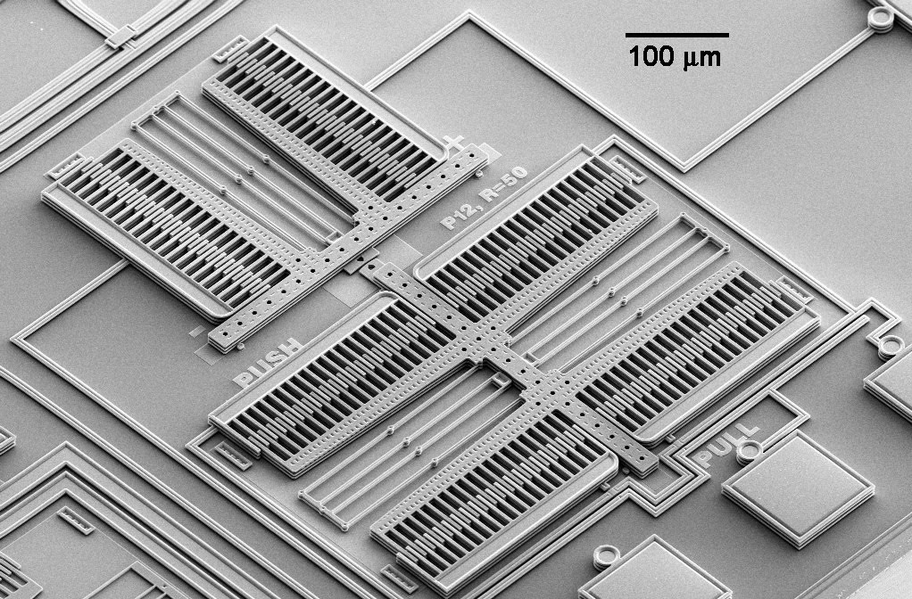 |
|:--:|
| *MEMS: Microscopische mechanische componenten op een chip* |

## Accelerometer
Een accelerometer meet **versnelling** in 3 dimensies, uitgedrukt in **m/s<sup>2</sup>**. 
Je kan er m.a.w. een verandering in beweging mee registreren (constante beweging kan je niet zomaar registeren: 
in een rijdende auto voel je niet of je beweegt of niet).

Een MEMS-accelerometer bestaat uit een aantal vaste platen met daartussen een bewegende massa die is opgehangen aan een 
soort veersysteem en daardoor in 1 richting kan verschuiven. Vaste plaat en bewegende massa vormen samen een condensator
waarvan de capaciteit door de sensor kan worden gemeten. 

|  |
|:--:|
| *MEMS Accelerometer* |

In rust is de capaciteit constant. Wanneer de sensor versnelling ondervindt zal de positie van de bewegende 
massa echter verschuiven t.o.v. de plaat en verandert hun onderlinge afstand. Bijgevolg verandert de capaciteit van de 
condensator en kan de sensor aan de hand daarvan de versnelling berekenen. Een accelerometer bevat 3 zulke
opstellingen, een voor elke dimensie.

Versnelling wordt of ook wel uitgedrukt in **g-krachten**: 1g = 9.81m/s<sup>2</sup>, waarbij
9.81 de *gravitatieconstante* van de aarde is. Dat komt omdat zwaartekracht ook een soort versnelling is, die je 
bijgevolg eveneens kan meten met de accelerometer. In stilstand zal de acceleratie op het geheel van de drie assen 
altijd gelijk aan 1g zijn, enkel in vrije val zal je overal een 0 meten. Daarmee kan je dus de oriëntatie van een 
device t.o.v. de grond bepalen, alleen komt daar aardig wat wiskunde aan te pas. Het nadeel is dat je met een 
accelerometer geen rotatie rond de as van de zwaartekracht kan meten. Als je de
module draait terwijl ze plat op tafel ligt zal je zien dat de meting onveranderd is. Bijgevolg kunnen we de
oriëntatie maar in 2 richtingen met zekerheid bepalen.

## Gyroscoop
Een gyroscoop meet **hoeksnelheid** of **veranderingen in oriëntatiehoek**, opnieuw in 3 dimensies en uitgedrukt 
in **&deg;/s**. Voor een MEMS-gyroscoop gebruikt men een gelijkaardige opstelling als voor de accelerometer, maar
dan met een massa die kan draaien i.p.v. schuiven.

| 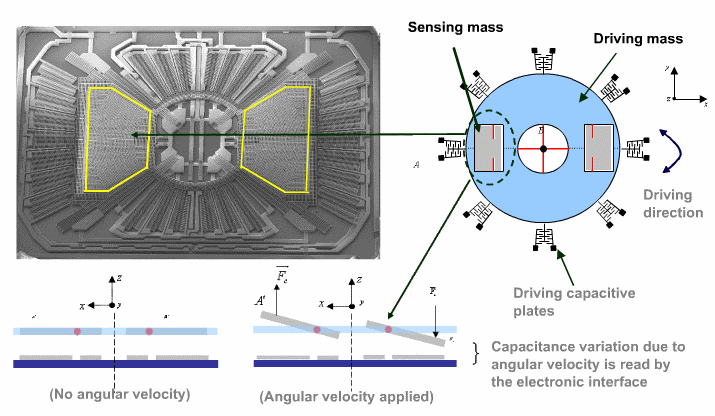 |
|:--:|
| *MEMS Gyroscoop* |

Als de beginoriëntatie bekend is, kan je door continu de verandering erbij te tellen ook de huidige oriëntatie bepalen. 
Met de combinatie van accelerometer en gyroscoop kan je in principe dus de huidige oriëntatie en positie bepalen,
als van beide de beginwaarde gekend is. Het spreekt voor zich dat dit niet voor de hand ligt omdat eventuele fouten zich 
blijven opstapelen (*drift*), maar toch is men er op die manier in geslaagd 
[mensen op de maan te zetten](https://en.wikipedia.org/wiki/Apollo_PGNCS)!

## Magnetometer
Zolang we echter hier op aarde blijven kunnen we nog een derde hulpmiddel toevoegen om de huidige oriëntatie te bepalen
en de nauwkeurigheid te verbeteren: een magnetometer meet in de 3 richtingen de **sterkte van het magnetisch veld**, 
uitgedrukt in (micro- of nano-) **Tesla**. Met een magnetometer kunnen we dus een kompas toevoegen aan de meting en wordt het 
geheel nog een stuk betrouwbaarder.

# MPU-6050
Op de GY-521 module uit de kit zit de MPU-6050 ([datasheet](../datasheets/w07_MPU6050.pdf),
[registers](../datasheets/w07_MPU6050-registers.pdf)), een *6-DOF IMU* van TDK/InvenSense waarop nog een extra magnetometer 
kan worden aangesloten. Dezelfde fabrikant levert met de MPU-9250 ook een 9-DOF IMU gevormd door de combinatie van 
MPU-6050 en magnetometer in 1 chip. De MPU6050 beschikt daarnaast over een *Digital Motion Processor (DMP)* die een groot
deel van de wiskunde uit handen kan nemen en bv. rechtstreeks een positie in 3D kan teruggeven. Helaas heeft deze 
DMP een firmware nodig die closed-source is en die we in Python niet meteen op de chip krijgen. 

Deze module kunnen we dus gebruiken om zowel de versnelling als de oriëntatie te bepalen, bovendien zit er een 
temperatuursensor in. De metingen worden gedigitaliseerd met een 16-bit ADC waarvan het bereik kan worden ingesteld
 (+/- 2 tot 16g voor de accelerometer, 250 -200 &deg;/s voor de gyro) naargelang het beoogde doel. 
Je kan de chip ook laten detecteren wanneer hij in vrije val is en daarop een *interrupt*-signaal laten genereren op
de voorziene pin. Dat kan je dan op de RPi inlezen en verwerken op dezelfde manier als het indrukken van een knop.

## Meetresultaten inlezen
De MPU6050 digitaliseert de metingen met een 16-bit ADC, elke waarde neemt dus 2 registers in beslag en wordt in "big endian"
formaat opgeslagen: het eerste register bevat telkens de LSB, het tweede de MSB. Je zal de 2 gelezen bytes dus in de
juiste volgorde moeten combineren tot een 16-bit meetresultaat. 

| 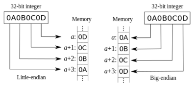 |
|:--:|
| *Little- vs big-endian* |

Omdat de waarde ook negatief kan zijn wordt ze opgeslagen in *2-complement*, en in Python is dat een beetje 
lastig omzetten dankzij de "oneindig" lange getallen. De makkelijkste manier is:
- check of de sign-bit (MSB) 1 is
- zo ja, trek dan 2<sup>N</sup> van af van het getal om het negatief te maken, met N = #bits (in dit geval dus 16)
```pycon
>>> n = 16
>>> value = 0xf00f
>>> value               # waarde zonder 2-complement
61455
>>> value & 0x8000:     # check sign bit
True
>>> value -= 2 ** n     # sign=1, dus negatief maken
>>> value
-4081
```
> TIP: je kan de calculator van Windows gebruiken in “Programmer”-mode om getallen in 2-complement te zien.

Nu heb je een getal tussen -32768 en 32767, wat uiteraard niet de juiste meetwaarde kan zijn. Er is nog een 
schaalfactor die je in rekening moet brengen, afhankelijk van het ingestelde bereik. Standaard staat de `(A)FS_SEL` 
flag (*full-scale range*) op 0 en is dus het kleinste bereik ingesteld.

Voor een consistent resultaat is het belangrijk dat alle meetwaarden (3 assen accelero + 3 assen gyro) van dezelfde 
meting zijn. De makkelijkste manier om dat te verzekeren is door ze allemaal ineens uit te lezen. Gezien de temperatuur
tussen de twee gesandwiched zit moeten we die ook meteen meenemen. Dat wil zeggen dat we in totaal 7 (3 + 3 + 1) 
meetresultaten van 16 bit moeten lezen, oftewel 14 registers van 8 bit te beginnen vanaf 0x3B (MPU6050_REG_ACCEL_OUT).
```python
data = i2c.read_i2c_block_data(self.address, MPU6050_REG_ACCEL_OUT, 14)  
```

## Registers
De MPU6050 heeft zo veel registers dat de layout niet in het [datasheet](../datasheets/w07_MPU6050.pdf) staat maar een
apart [document](../datasheets/w07_MPU6050-registers.pdf) krijgt! Gelukkig hebben we er niet veel nodig om de 
basisfuncties te implementeren.

### Power management
Bij het opstarten staat de sensor standaard in "sleep" mode en voert geen metingen uit. Om hem wakker te maken moet je
de `SLEEP`-bit in het register `PWR_MGMT1` uitzetten. Je kan meteen ook het veld `CLKSEL` op 001 zetten, die klok is 
iets nauwkeuriger. 

| 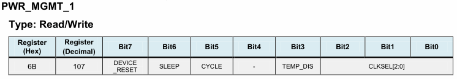 |
|:--:|
| *PWR_MGMT_1 register* |

> De andere bits in dit register moeten sowieso ook 0 zijn/blijven, je moet je dus niets aantrekken van de huidige inhoud.
 
### Accelerometer
De accelerometer is te configureren via register 0x1C: 

| 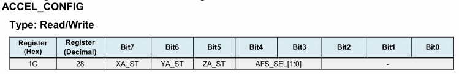 |
|:--:|
| *ACCEL_CONFIG register* |

Bit 7-5 in `ACCEL_CONFIG` zijn voor een self-test en moeten dus 0 blijven, met bit 4-5 kan je het meetbereik instellen: 

| 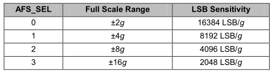 |
|:--:|
| *Accelerometer: meetbereik en schaalfactor* |

De metingen komen in 0x3B - 0x40:
 
| 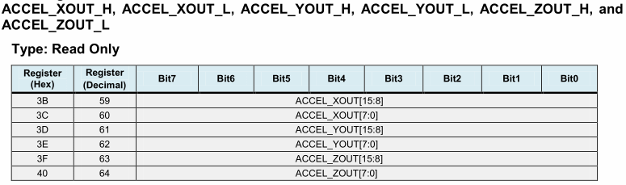 |
|:--:|
| *Accelerometer: meetresultaten* |

### Gyroscoop
De gyroscoop is te configureren via register 0x1B:

| 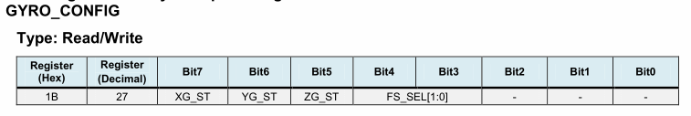 |
|:--:|
| *GYRO_CONFIG register* |

Bit 7-5 in `GYRO_CONFIG` zijn voor een self-test en moeten dus 0 blijven, met bit 4-5 kan je het meetbereik instellen: 

| 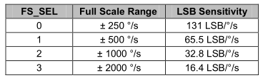 |
|:--:|
| *Gyroscoop: meetbereik en schaalfactor* |

De metingen komen in registers 0x43 - 0x48:

| 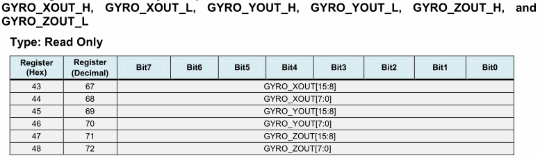 |
|:--:|
| *Gyroscoop: meetresultaten* |

### Temperatuur
De temperatuur zit tussen accelerometer en gyroscoop in registers 0x41 - 0x42. 

| 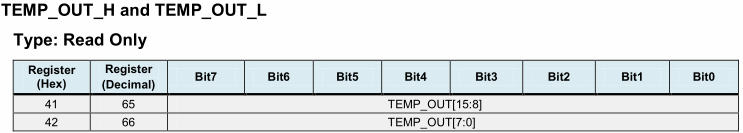 |
|:--:|
| *Temperatuurregisters* |

Er valt niets aan in te stellen, maar het omrekenen is net iets specialer. Uit het datasheet:
> Temperature in degrees C = (TEMP_OUT Register Value as a signed quantity) / 340 + 36.53

Er is dus niet alleen een schaalfactor van 340, maar ook nog een offset van 36.53 die je er achteraf moet bijtellen! 
De temperatuur ligt wellicht het meest voor de hand om te zien of je omzetting van big-endian en 2-complement juist is.

## Werkwijze
1. Initialiseren:
    - haal het ding uit sleep mode (je mag daarvoor gewoon het hele register overschrijven)
2. Uitlezen:
    - haal in één trek de 14 registers op (gebruik `read_i2c_block_data`)
    - combineer telkens 2 registers tot een 16-bit waarde
    - check de sign-bit van die meetwaarde en maak het getal negatief als die 1 is
    - pas de juiste schaalfactor toe
    - (enkel voor temperatuur) tel er de offset bij

---

# Opdracht 
1. Schakeling
    - sluit de accelerometer aan op de I<sup>2</sup>C-pins van de Raspberry Pi
2. Configuratie Linux
    - activeer I<sup>2</sup>C via `raspi-config` of in `/boot/config.txt`
    - reboot
    - check of de sensor gedetecteerd wordt met `i2cdetect`
    - bekijk de registerinhoud met `i2cdump`
3. Python test
    - vervolledig de functie `check_connection`: lees het `WHO_AM_I`-register uit en check of de waarde ervan 
    overeen komt met het I<sup>2</sup>C-adres. Als dat zo is kan je ervan uitgaan dat dit inderdaad een MPU6050 is
4. Klasse MPU6050
    - alle nodige registeradressen, constantes, ... zijn voorzien bovenaan het bestand
    - `setup()` haalt de sensor uit sleep mode
    - `get_raw_data()` leest de 14 register met meetresultaten uit en geeft die terug als `list`
    - `restore_2omplement(msb, lsb)` haalt uit 2 bytes opnieuw het juiste gehele getal
    - `get_measurements()` geeft de 7 meetwaarden terug, je kan daarvoor het gegeven type `Measurement` gebruiken
    - maak zo nodig nog extra methodes voor tussenstappen om het overzichtelijk te houden
5. Maak properties om het meetbereik van gyroscoop en accellerometer in te stellen
    - zorg uiteraard dat het resultaat van `get_measurements()` blijft kloppen in elk bereik
6. CHALLENGE: probeer uit de meetwaarden van beide sensoren de oriëntatie van de sensor te berekenen
    - zie bv. <https://view.officeapps.live.com/op/view.aspx?src=http://www.cs.unca.edu/~bruce/Fall13/360/IMU_Wk8.pptx>

# Schakelschema
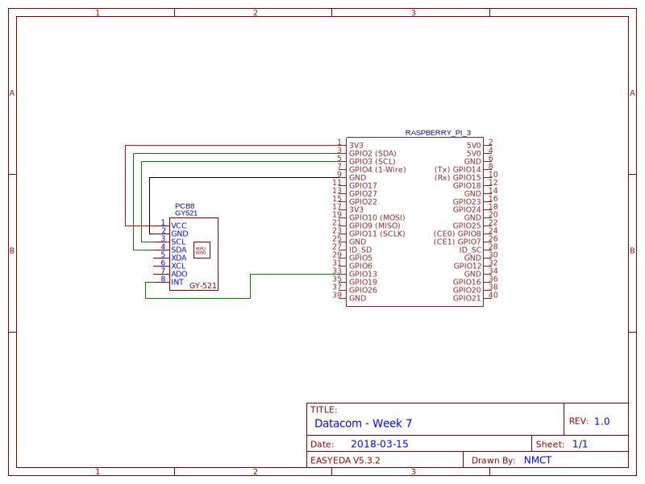
