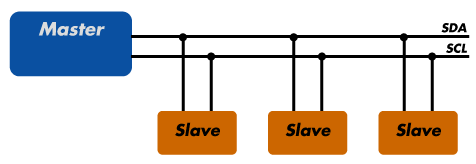
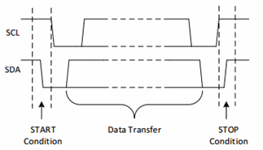
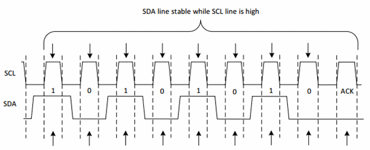
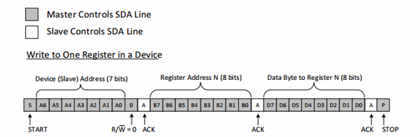
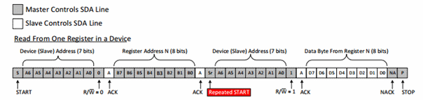
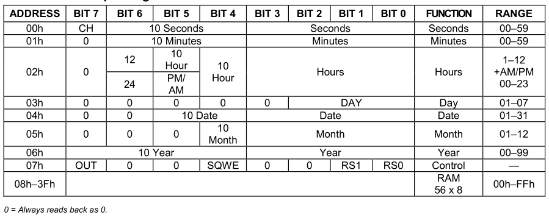

# Week 7: I<sup>2</sup>C en RTC
## Inleiding
De I<sup>2</sup>C-bus is de meest gebruikte bus voor het aansluiten van sensoren en het verbinden van uiteenlopende 
ICs in een systeem. Deze week maken we kennis met het protocol en sluiten een *Inertial Measurement Unit* aan waarmee
we de oriëntatie van een device kunnen bepalen.

### Doelstellingen 
- Werking en gebruik van de I<sup>2</sup>C-bus
- Manipuleren van registers
- Werken met 2-complement

### Voorkennis
- Vorige practica:
    - Bitoperaties

### Aandachtspunten
- I<sup>2</sup>C protocol 
- I<sup>2</sup>C lees- en schrijfoperaties

---
    
# I<sup>2</sup>C
De *Inter-Integrated Circuit (I<sup>2</sup>C, I-squared-C)*-bus is een **synchrone, multi-master/multi-slave, tweedraads
seriële bus** bus ontwikkeld in 1982 door Philips (nu NXP). Hij werd ontwikkeld en nog steeds gebruikt voor het 
aansluiten van relatief trage externe ICs aan een microcontrollers op hetzelfde PCB of over korte afstanden. Sinds de 
jaren '90 zijn er van verschillende fabrikanten heel diverse ICs op de markt met I<sup>2</sup>C-interface en sinds 2006
zijn voor het gebruik geen licentierechten meer verschuldigd. 

|  |
|:--:|
| *I<sup>2</sup>C bus* |

I<sup>2</sup>C heeft twee draden, een **kloksignaal (SCL)** voor synchronisatie en een **bidirectionele datalijn (SDA)**. 
Het kloksignaal heeft standaard een frequentie van **100kHz**, latere versies brachten ook snelheden van 400kHz en 1MHz.

Om meerdere devices te kunnen aansluiten wordt met **open-collector (a.k.a. open-drain) outputs** gewerkt, beide zijn 
dus **hoog in rust** en kunnen door een device enkel laag getrokken worden. We hoeven geen externe pull-up weerstand
aan te sluiten maar gebruiken de in de GPIO-pins ingebouwede. In principe zijn ook meerdere masters op 
dezelfde bus mogelijk, dit wordt echter door weinig devices ondersteund. 

Om slaves op de bus van elkaar te onderscheiden wordt gewerkt met **7-bit adressen**, in latere versies zijn ook 
10 bits mogelijk maar ook dit wordt weer door weinig chips ondersteund. Dat maakt 127 mogelijke adressen, waarvan er 
nog een aantal gereserveerd ziin, dus veel te weinig om een uniek adres voor elke chip te voorzien, 
Het adres zal dus afhangen van het model van de IC en is te vinden in het datasheet. 
Vaak zijn er een paar adressen waar je tussen kan kiezen door een of meer pins van de chip hoog/laag te verbinden, 
zo kan je eventueel toch meerdere devices van hetzelfde type aansluiten. 

## Protocol
De bus is in rust hoog, voor communicatie wordt **door de master een kloksignaal gegenereerd op SCL**. Een transmissie
begint vervolgens steeds met een **START**-conditie en eindigt met een **STOP**-conditie. 

Datatransfers gebeuren **steeds per byte**, serieel met de **MSB eerst**. De eerste byte bevat het 7-bits slave-adres, 
aangevuld met de **R/W**-bit als LSB die aangeeft of het een lees- (1) of schrijfoperatie (0) betreft. 
Deze en alle volgende bytes worden telkens door de ontvanger  bevestigd met een *acknowledge* (**ACK**), 
of bij een storing met een **NAK**. 
Er is in principe geen beperking op het aantal bytes in een transmissie, in de praktijk soms wel. 
Na de afsluitende stopconditie eindigt de bus weer met een hoog niveau op beide lijnen.

|  |
|:--:|
| *I<sup>2</sup>C protocol* |

### START- en STOP-condities
Net als het kloksignaal worden de START/STOP condities steeds gegenereerd door de master. Deze condities
zijn **te herkennen aan een transitie op SDA terwijl SCL hoog is**. SDA gaat dan **van hoog naar laag voor een START** 
en **van laag naar hoog voor een STOP**. 
Die volgorde is ook logisch als je weet dat de bus in rust hoog is dankzij de open-collector outputs!

|  |
|:--:|
| *I<sup>2</sup>C: START en STOP* |

### Data en ACK/NAK
Voor het overige zijn er **enkel transities op SDA terwijl SCL laag is**, uiteraard om het onderscheid te kunnen maken 
met START/STOP. Databits worden bijgevolg op SDA gezet na de *falling-* en ingelezen na de *rising edge* van SCL.
Een 1 wordt voorgesteld door SDA hoog te laten, een 0 door de lijn laag te trekken. 

|  |
|:--:|
| *I<sup>2</sup>C: transmissie van 1 byte* |

Na elke byte moet de ontvanger **bevestigen met een extra bit**, daarvoor moet de master dus nog een extra klokpuls 
genereren. De slave zal dan **SDA laag trekken voor een ACK** of, indien er iets is misgegaan, **hoog voor een NAK**. 
Ook deze transitie moet weer gebeuren terwijl SCL laag is! 

### Samengevat
- START > Adres + R/W > ACK > DATA > ACK > ... > ACK > STOP
- **enkel** START en STOP hebben een transitie op SDA terwijl SCL hoog is
- in rust is de bus hoog, bijgevolg: SDA 1->0 == START, SDA 0->1 == STOP
- databits en ACK hebben hun transities terwijl SCL laag is
- na elke byte volgt ACK/NAK; SDA 0 == ACK, 1 == NAK
- na de laatste ACK volgt een STOP

## Communicatie met I<sup>2</sup>C-devices
Na de START-conditie stuurt de master het adres van een slave, aangevuld met de R/W-bit. Wanneer een slave op de bus 
zijn adres herkent, zal hij daarop reageren met een ACK. Vrijwel alle I<sup>2</sup>C-devices zijn opgedeeld in een 
aantal **8-bit registers** waar je naar kan schrijven en/of uit lezen. De tweede byte zal dus bestaan uit het 
registeradres dat je wil aanspreken, waarop de slave weer bevestigt of dat adres geldig is met een ACK of NAK. 

### Schrijven naar een (of meer) registers 
Schrijven naar een register is eenvoudig. Na het slave- en registeradres volgt een derde byte met de waarde die in het 
register moet komen, die ook weer bevestigd wordt met een ACK. Daarna kan de master eventueel nog meer bytes sturen, 
die dan naar de opeenvolgende registers worden geschreven. Om de transmissie te beëindigen genereert de master na de 
laatste ACK een STOP-conditie, waardoor de bus weer in rusttoestand (hoog) eindigt.

|  |
|:--:|
| *I<sup>2</sup>C schrijfoperatie* |

### Lezen uit (een) register(s)
Het lezen van data van een device is iets complexer. We moeten immers van start gaan met een schrijfoperatie zodat we 
eerst het registeradres dat we willen inlezen kunnen doorsturen. De master stuurt dus eerst het slave-adres met een 
write-bit (0), gevolgd door het registeradres dat moet worden ingelezen. 

Daarna stuurt de master een **repeated start**, dat is een START die volgt op een vorige START zonder dat er tussenin
een STOP is geweest. Vervolgens stuurt de master nogmaals het slave-adres, maar nu aangevuld met een read-bit (1).
Daarna zal de slave antwoorden met de gevraagde data. Het is nu de beurt aan de master om elke byte te
bevestigen met een ACK. Door een NACK te sturen, geeft de master aan dat dit de laatste byte was die hij wil
ontvangen. Daarna beëindigt hij zoals altijd de transmissie met een STOP-conditie.

|  |
|:--:|
| *I<sup>2</sup>C leesoperatie* |

## Toepassingen
Geheugenmodules (DIMMs) gebruiken I<sup>2</sup>C om hun parameters (timing e.d.) aan het systeem kenbaar te maken 
(SPD, *Serial Presence Detect*). HDMI-, DVI- en VGA-kabels bevatten een I<sup>2</sup>C-bus om hetzelfde te doen voor
beeldschermen (EDID, *Extended Display Identification Data*).

De **SMBus** (System Management Bus) is een uitbreiding op I<sup>2</sup>C met een beperkt aantal mogelijke transacties 
en striktere timing- en spanningsvereisten om betere interoperabiliteit tussen verschillende fabrikanten te verzekeren.
Het werd ontwikkeld door Intel en is vandaag op elk moederbord terug te vinden, o.a. PCI en PCI-Express voorzien een 
SMBus op hun pins.

## Raspberry Pi
Zoals gewoonlijk moet de I<sup>2</sup>C-controller van de RPi eerst geactiveerd worden via `raspi-config` of 
in `/boot/config.txt`: 
```console
dtparam=i2c_arm=on
```
> NB: I<sup>2</sup>S staat daar in `config.txt` vlak onder maar heeft er niets te maken! 
Het is een seriële interface voor geluid.

Na een reboot zou in `/dev` bus `i2c-1` moeten verschijnen:
```console
me@my-rpi:~ $ ls -l /dev/i2c*
crw-rw---- 1 root i2c 89, 1 Mar 24 01:39 /dev/i2c-1
```
Merk op dat het weer om een *character device* gaat en dat de groep `i2c` eigenaar is. Bijgevolg moet je daar lid van
zijn, dus controleer in geval van problemen:
```console
me@my-rpi:~ $ groups
me adm dialout cdrom sudo audio video plugdev games users input netdev gpio i2c spi nmct-box webdev
```

## Linux CLI
Linux heeft standaard support voor I<sup>2</sup>C en heeft ook een aantal tools daarvoor in de package `i2c-tools` die 
normaalgezien al geïnstalleerd is. Met `i2cdetect` kan je zien welke adressen op de bus reageren met een ACK. Met 
`i2cdump` kan je de volledige registerinhoud van een slave zien en met `i2cget` en `i2cset` kan je ook 
registers lezen en schrijven. 

> De tools vragen normaal altijd eerst om bevestiging, gebruik argument `-y` om dat te vermijden.
```console
me@my-rpi:~ $ apt list i2c-tools
Listing... Done
i2c-tools/stable,now 3.1.2-3 armhf [installed,automatic]

me@my-rpi:~ $ i2cdetect -y 1
     0  1  2  3  4  5  6  7  8  9  a  b  c  d  e  f
00:          -- -- -- -- -- -- -- -- -- -- -- -- --
10: -- -- -- -- -- -- -- -- -- -- -- -- -- -- -- --
20: -- -- -- -- -- -- -- -- -- -- -- -- -- -- -- --
30: -- -- -- -- -- -- -- -- -- -- -- -- -- -- -- --
40: -- -- -- -- -- -- -- -- -- -- -- -- -- -- -- --
50: -- -- -- -- -- -- -- -- -- -- -- -- -- -- -- --
60: -- -- -- -- -- -- -- -- 68 -- -- -- -- -- -- --
70: -- -- -- -- -- -- -- --

me@my-rpi:~ $ i2cdump -y 1 0x68
No size specified (using byte-data access)
     0  1  2  3  4  5  6  7  8  9  a  b  c  d  e  f    0123456789abcdef
00: 80 00 00 00 00 00 00 00 00 00 00 00 00 00 00 00    ?...............
10: 00 00 00 00 00 00 00 00 00 00 00 00 00 00 00 00    ................
20: 00 00 00 00 00 00 00 00 00 00 00 00 00 00 00 00    ................
30: 00 00 00 00 00 00 00 00 00 00 00 00 00 00 00 00    ................
40: 00 00 00 00 00 00 00 00 00 00 00 00 00 00 00 00    ................
50: 00 00 00 00 00 00 00 00 00 00 00 00 00 00 00 00    ................
60: 00 00 00 00 00 00 00 00 00 00 00 00 00 00 00 00    ................
70: 00 00 00 00 00 00 00 00 00 00 00 00 00 00 00 00    ................
80: 00 00 00 00 00 00 00 00 00 00 00 00 00 00 00 00    ................
90: 00 00 00 00 00 00 00 00 00 00 00 00 00 00 00 00    ................
a0: 00 00 00 00 00 00 00 00 00 00 00 00 00 00 00 00    ................
b0: 00 00 00 00 00 00 00 00 00 00 00 00 00 00 00 00    ................
c0: 00 00 00 00 00 00 00 00 00 00 00 00 00 00 00 00    ................
d0: 00 00 00 00 00 00 00 00 00 00 00 00 00 00 00 00    ................
e0: 00 00 00 00 00 00 00 00 00 00 00 00 00 00 00 00    ................
f0: 00 00 00 00 00 00 00 00 00 00 00 00 00 00 00 00    ................

me@my-rpi:~ $ i2cget -y 1 0x68 0x00                    # secondenregister
0x80
me@my-rpi:~ $ i2cset -y 1 0x68 0x00 0x00               # clock halt uit
me@my-rpi:~ $ i2cget -y 1 0x68 0x00                   
0x00
me@my-rpi:~ $ i2cget -y 1 0x68 0x00                   
0x01
me@my-rpi:~ $ i2cget -y 1 0x68 0x00                    # de klok tikt!
0x02
```

## Python
De I<sup>2</sup>C-controller van de Raspberry Pi ondersteunt de SMBus-uitbreidingen, in Python kan je de package `smbus` 
gebruiken om makkelijk met I<sup>2</sup>C-devices te communiceren.

```python
from smbus import SMBus

i2c = SMBus()                                                       # initialize library
i2c.open(1)                                                         # open bus 1

value = i2c.read_byte_data(slave_address, register_address)         # read single register
i2c.write_byte_data(slave_address, register_address, value)         # write single register

values = i2c.read_i2c_block_data(slave, register, count)            # read multiple registers
i2c.write_i2c_block_data(slave, register, values)                   # write multiple registers
```
De variabele `values` in de twee laatste regels is een `list` van opeenvolgende registerwaardes.

# Real-time clock (RTC)
De Raspberry Pi heeft geen echte klok aan boord zoals een PC dat heeft. Telkens de Pi verbinding maakt met een 
netwerk vraagt hij op regelmatige tijdstippen de correcte tijd op via NTP (*Network Time Protocol*). Daartussen
houdt hij zelf de tijd wel bij maar dat is niet erg nauwkeurig, bijgevolg is er veel *drift* op de klok.

Zonder internetverbinding echter geen NTP en bijgevolg ook geen juiste tijd. Als dat nodig is kunnen we via 
I<sup>2</sup>C echter een externe *Real-Time Clock (RTC)*-module zoals ZS-042 module in jullie kit toevoegen. 
Ook in een PC is de RTC trouwens meestal op die manier via I<sup>2</sup>C/SMBus verbonden. 

De DS1307 is ook RTC van dezelfde fabrikant, maar dan zonder alarmfunctie. In de plaats zijn er nog 56 registers die je
als geheugen kan gebruiken. De chip wordt dikwijls uitgebreid met een batterij zodat de klok blijft verdertikken als 
de stroom wegvalt en ook het geheugen bewaard blijft. 

Op de onderstaande tabel zie je de verschillende registeradressen terug van de DS1307. Merk op dat je in
de range van 08h-3Fh data kan wegschrijven en lezen, dat is het RAM-geheugen.

|  |
|:--:|
| *DS1307 register layout* |

De eerste keer dat je de klok gebruikt zal je wel de tijd en datum moeten instellen. Elke 4 bits stellen een
decimaal getal voor (BCD of Binary Coded Decimal). We zullen dus een conversiemethode moeten schrijven.

**Let op: de MSB van register 0x0 staat voor "Clock Halt" en staat standaard op 1. Om de klok te laten tikken
zullen we daar dus een 0 moeten schrijven.**

# Datum &amp; tijd in Python
in de `datetime`-module van Python 
[klasses die dat allemaal voor ons doen](https://docs.python.org/3/library/datetime.html#available-types). Voor tijd 
gebruik je een `time`-object, voor de datum `date` en `datetime` is de combinatie van de twee. De huidige tijd
vind je met `datetime.now()`.

```pycon
from datetime import date, time, datetime, timedelta

>>> dt = datetime.now()
>>> dt
datetime.datetime(2018, 3, 29, 11, 9, 6, 321492)
>>> dt.date()
datetime.date(2018, 3, 29)
>>> dt.time()
datetime.time(11, 9, 6, 321492)
>>> t2 = time(11, 55, 00)
>>> t2.second
0
>>> t2.minute
55
>>> t2.hour
11
```

---

# Opdracht 
1. Schakeling
    - sluit de DS1307 aan op de SCA/SCL pins van de RPi 
2. Configuratie Linux
    - activeer I<sup>2</sup>C via `raspi-config` of in `/boot/config.txt`
    - reboot
    - check of de sensor gedetecteerd wordt met `i2cdetect`
    - bekijk de registerinhoud met `i2cdump`
    - schrijf 0x00 naar register 0x0 met `i2cset` en bekijk opnieuw de registers, zie je de klok beginnen tikken? 
3. Python test
    - vervolledig de functie `read_seconds_register`: lees het secondenregister uit, print de inhoud binair op de 
    console, en return de inhoud
4. Binary Coded Decimals 
    - vervolledig de functie `bcd2int` die een getal van max. 2 cijfers omzet van BCD naar een gewone *int*.
    - test a.d.h.v. de waarde van het secondenregister.
    - vervolledig de functie `set_seconds_register` die het register instelt a.d.h.v. een *int*
    - stel om te testen het register in op 55 seconden en check of de overgang van 59 naar 0 correct verloopt. 
5. Klasse DS1307
    - alle nodige registeradressen, constantes, ... zijn voorzien bovenaan het bestand
    - de property `clock_enabled` stelt de Clock Halt bit in het `CONTROL`-register in (let op: enabled is het inverse
    van halt!)
    - `set_time(value)` stelt de 3 tijdsregisters van de RTC in a.d.h.v. een Python `time`-object
    - `get_time(value)` geeft de tijd van de RTC terug als een `time`-object. 
6. CHALLENGE: probeer de string "NMCT" in het RAM-geheugen van de RTC te zetten en weer op te halen

# Schakelschema

