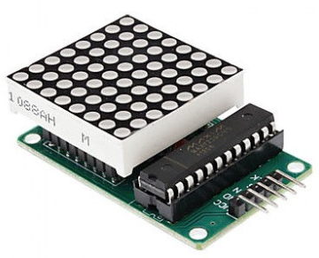
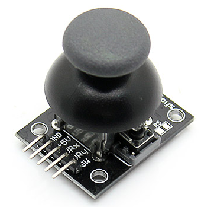
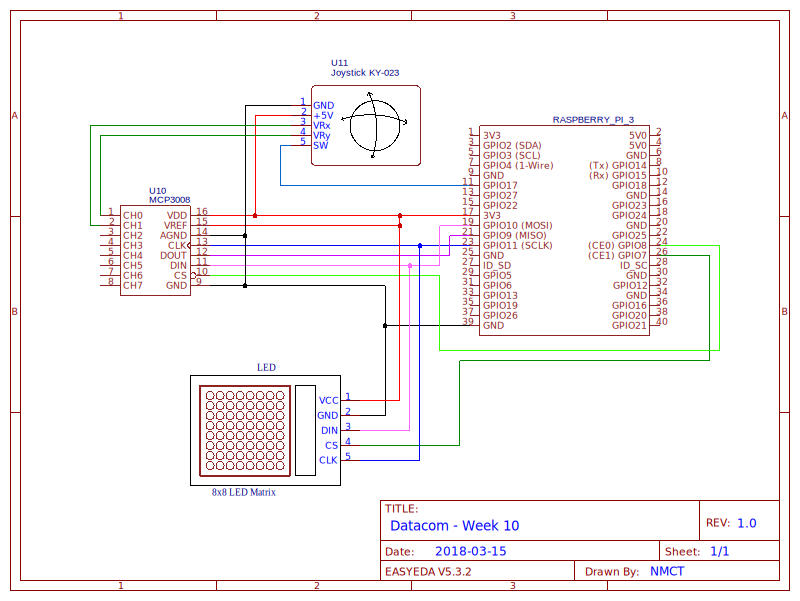

# Week 10: SPI LED Matrix &amp; analog joystick
## Inleiding
We herhalen deze week het SPI protocol a.d.h.v. de MAX7219 LED driver en de MCP3008 van week 5.
### Doelstellingen 
- Herhaling SPI protocol

### Voorkennis
- Vorige practica:
    - SPI
    - MPC3008 ADC

---

# MAX7219
De MAX7219 is een driver-IC voor het aansturen van maximaal 8 7-segmentdisplays via de SPI-interface. De chip heeft 
daarvoor 8 registers die telkens ofwel een BCD-gecodeerd cijfer kunnen opnemen, of een 8-bit waarde die overeenkomt 
met de segmenten. Zowel het decoderen van de BCDs als het multiplexen van de 8 displays neemt de chip volledig voor zijn 
rekening.

Wij zullen deze chip echter niet gebruiken voor het aansturen van 7-segmentdisplays, wel voor een 
8x8 LED-matrix. In jullie kit zit namelijk een module die zo'n matrix combineert met de MAX7219. 
Elk 'cijfer' komt dan overeen met een rij van de matrix, en de 'segmenten' zijn de afzonderlijke LEDs in die rij.
    
|  |
|:--:|
| *MAX7219 LED Matrix module* |

De module heeft naast voeding en massa maar 3 aansluitingen i.p.v. de gebruikelijke 4 voor SPI: naar de registers 
van de MAX7219 kan namelijk enkel geschreven worden, de MISO-pin is dus niet nodig. Aan de andere kant worden dezelfde 
pins weer naar buiten gebracht, op die manier kunnen meerdere modules aan elkaar gekoppeld worden. 

## Registers 
De MAX7219 beschikt over 14 registers:
- **0x0** is het No-Op(eration) register, dat enkel nodig is wanneer je meerdere modules achter elkaar hangt.
- **0x1-0x8** bevatten de data voor de 8 cijfers, of in ons geval dus rijen van de matrix
- **0x9** is het "Decode Mode"-register, waarmee ingesteld kan worden of (en hoe) de 8 registers gedecodeerd moeten worden. 
Het datasheet bevat 2 codetabellen voor verschillende uitbreidingen van het BCD-formaat. Wij gebruiken echter geen BCDs 
en laten dit register op 0 staan
- **0xA** (Intensity) kan gebruikt worden om de intensiteit van de LEDs te regelen in 16 stappen (van 0 tot 0xf)
- **0xB** (Scan limit) stelt in hoeveel cijfers (0-7 komt overeen met 1-8 displays) er zijn aangesloten. Wij zullen dit
register op 7 moeten zetten gezien de matrix 8 rijen heeft.
- **0xC** (Shutdown) moet een 1 als LSB hebben om de uitgangen te activeren
- **0xF** (Display test) tenslotte kan je gebruiken om de displays/matrix te testen, als je hier een 1 in schrijft
zouden alle segmenten/LEDs moeten oplichten.

## Gebruik
De SPI-bus van de Raspberry Pi is sneller dan de MAX7219 kan verwerken, eerst en vooral moet je dus de snelheid daarvan
beperken tot bv. 100kHz m.b.v. de property `max_speed_hz`. Vervolgens kan je eens een 1 in register 0xF schrijven om
te testen, daarop zouden alle LEDs moeten gaan branden. Zet er vervolgens weer een 0 in voor je het display kan gebruiken. 

Vervolgens moet je de chip instellen: zet het `Scan Limit` register op 7 zodat alle 8 rijen kunnen worden gebruikt. De 
intensiteit kan je best op maximum zetten. Vervolgens moet je nog een 1 zetten in het `Shutdown`-register en dan kan je 
de display beginnen gebruiken door per rij een overeenkomstige byte naar het juiste register (0x1-0x8) te schrijven.

Ter herhaling het gebruik van de SPI-library:
```python
from spidev import SpiDev
spi = SpiDev()
spi.open(bus, device)                   # Bus is 0, device is de gekozen CE-pin (0 of 1)
spi.max_speed_hz = ...                  # Klokfrequentie instellen
spi.writebytes([register, value])       # Waarde naar register schrijven
```

# Analoge Joystick 
In jullie kit zit ook een analoge joystick zoals je die misschien kent van een PlayStation-controller. 

|  |
|:--:|
| *Analog joystick module* |
---

De joystick werkt in feite als 2 potentiometers, eentje voor de X-as en een voor de Y-as. Bovendien kan je op de knop 
drukken, wat gewoon werkt als een drukknop zoals je die kent. 

## Aansluiting en gebruik
Naast voeding en massa heeft de module uitgangspins voor X- en Y-as en de drukknop (SW). Als voedingsspanning kan je 
gewoon de 3.3V nemen, ook al staat er 5V op de module.

Gezien X en Y een analoge waarde leveren, moet je die aansluiten op een analoge pin. 
Je zal dus de opnieuw de MCP3008 van week 5 moeten aansluiten en deze twee pins verbinden met ingangen daarvan. 
De SPI-bus van de ADC verbind je gewoon bij op de MISO/MOSI/SCK pins, maar gebruik uiteraard wel de andere CE-pin!

In rust zou je dan op beide ingangen ca. 512 moeten meten (de helft van het maximale bereik), door de joystick te 
bewegen varieert de spanning op de pins tussen 0 en 3.3V en de meetwaarde bijgevolg tussen 0 en 1023. 

De knop moet je rechtstreeks met de RPi verbinden aan een GPIO-pin die je configureert als 
**input met pull-up weerstand**.

# Opdracht 
1. Schakeling 
 - Verbind de MAX7219/LED-matrix en MCP3008 via SPI met de RPi
 - Sluit de X- en Y-uitgangen met CH0 en CH1 van de ADC en de knop met een GPIO-pin.
2. Test LED-matrix
 - Schrijf een 1 naar het `Display Test`-register van de MAX7219 en test of alle LEDs gaan branden. Zet er achteraf weer
 een 0 in, anders kan je de chip niet normaal gebruiken.
3. Initialisatie LED-matrix
 - Schrijf een functie om de LED-matrix te initialiseren: stel de registers `Scan Limit`, `Intensity` en `Shutdown` 
 correct in.
4. Gebruik LED-matrix
 - Maak een functie om een enkele rij naar de matrix te schrijven
 - Maak een functie die de volledige matrix instelt door 8x de vorige functie aan te roepen.
 - Bovenaan het bestand zijn een aantal "tekens" gegeven waarmee je de matrix kan testen. Je kan ook eens zelf een teken
 proberen maken. 
5. Klasse `MAX7219`
 - Hiermee zou je genoeg moeten hebben om makkelijk de klasse `MAX7219` te vervolledigen
6. MCP3008
 - De klasse `MCP3008` kan je in principe gewoon importeren uit week 5. Als je die toen niet gemaakt hebt, heb je nu
 de kans om ze af te werken.
7. Joystick
 - In de klasse AnalogJoystick moet je de properties `x` en `y` aanvullen. Bedoeling is dat die allebei een waarde 
 tussen -512 en 511 teruggeven, en 0 als de stick in rust is.
 - met de methode `on_press` kan je een callbackfunctie instellen die wordt opgeroepen wanneer op de knop gedrukt wordt
8. Demo
 - maak een functie die continu de positie van de stick inleest en op de LED-matrix een pijl toont in de overeenkomstige
 richting. Matrices voor de pijlen zijn gegeven bovenaan het bestand. Begin best eerst met boven/onder/links/rechts, en 
 breid dan uit met de links boven/rechts boven/...
 - door op de knop te drukken kan je het display aan- en uitzetten
9. CHALLENGE
 - maak een applicatie waarmee je kan tekenen op de matrix: met de joystick kan je navigeren op de LED-matrix, door op de 
 joystick te drukken zet je die LED aan
 - TIP: gezien je de registers van de MAX7219 niet kan uitlezen, zal je de huidige toestand moeten bijhouden in je 
 programma
 - Uitbreiding: zorg dat je met een tweede druk op de knop een brandende LED weer kan uitzetten ook
 
# Schakelschema



